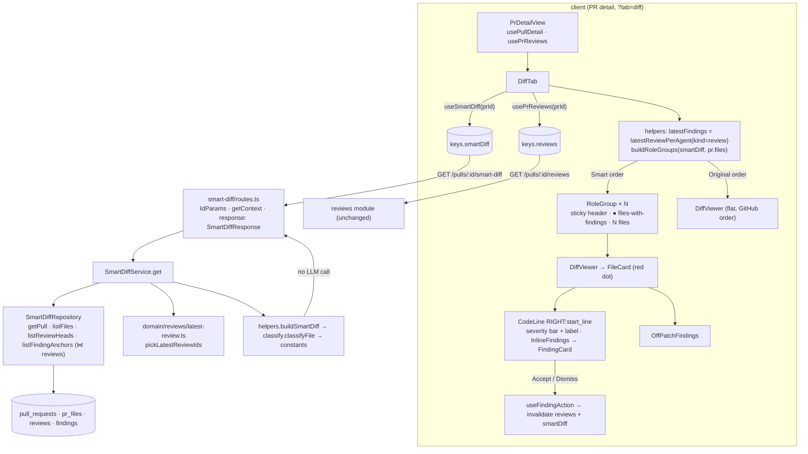

# Smart Diff — Development Plan

Date: 2026-09-26 · Branch: feature/l03-smart-diff (from feature/l03-intent-layer) · Status: draft

## Goal
The **Files changed** tab of a PR orders files the way a reviewer should read them:
core → tests → wiring → docs → boilerplate. Each group has a colored header with a
label, a short description, a count of files with findings and a count of files.
Review findings appear inside the diff: a red dot on the file card, a severity bar
and label on the line, and an inline finding card (Accept / Dismiss) under the
line. A segmented toggle switches back to GitHub's original order. The grouping is
a deterministic path classifier, so it makes no model call and works before the
first review.

## Context
- Request: user-approved "Smart Diff" design. All scope decisions (1–17 in the request) are final.
- Pipeline after this plan: implementer waves → `architecture-reviewer` ∥ `plan-verifier` → `doc-writer` → `engineering-insights` capture → user runs `/pr-self-review`.
- INSIGHTS entries that apply:
  - root · "Which reviews does the PR-list FINDINGS column count? is defined TWICE" (`pickLatestReviewIds` ↔ `latestReviewPerAgent`). The route reuses the server function and the client reuses the client twin. Neither rule changes, and there is no third definition (T002, T010, T011).
  - root · "`diff -r` over the two `vendor/shared` copies is NOT a drift gate". Diff only `brief.ts` (T001).
  - root · "`typecheck` in `server/` never type-checks `test/`". Every server task that writes a test also type-checks the tests with a scratch tsconfig (see Global constraints).
  - root · "pnpm 12.4.2 rejects `-s`". Always use `pnpm run <script>`.
  - root · "server typecheck fails inside `../reviewer-core` when reviewer-core has no node_modules". Run `npm install` in `reviewer-core/` before trusting a server typecheck.
  - server · "`findings` is the ONE domain table with no `workspace_id`". Finding reads join `reviews` and scope on `reviews.workspace_id` (T004).
  - server · "A NEW module that needs another module's SERVICE trips `no-circular`" and "Copying `import type {XRow} from './repository.js'` into helpers trips `no-circular`". `SmartDiffService` takes narrow `SmartDiffDeps`, is built in its own `routes.ts`, and never touches `container.ts`. `helpers.ts` declares local structural input types (T011).
  - server · "Half the modules do NOT follow the documented anatomy". The new module is routes → service → repository (T004, T011).
  - server · "A new enrichment step in `executeRuns` makes REAL network and LLM calls in `reviews.it.test.ts`". Not triggered: smart-diff adds nothing to `executeRuns`. The integration test builds the app with throwing LLM/GitHub doubles, so any accidental model call fails loudly (T014).
  - server · "`pnpm exec vitest run .it.test` is flaky in a sandboxed shell". Use `TESTCONTAINERS_RYUK_DISABLED=true` and retry on `CONNECT_TIMEOUT` (T014).
  - server · "seed() skips the whole PR block once PR #482 exists". Seed edits are verified only on a fresh DB (hermetic e2e stack or testcontainers) (T005, T017).
  - client · "Re-exporting a shared helper through a page-local `helpers.ts` breaks the dev server". `FindingCard` moves with **no** re-export shim, and every import site is updated (T006).
  - client · "Moving a component folder breaks `vi.mock(\"../../…\")`". Mocks use `@/…` aliases. Grep `vi.mock\("\.` before and after the move (T006).
  - client · "`messages/*.json` … use `@messages/…`" (all client tests).
  - client · "Mixing the `border` shorthand with a `borderColor` override is a runtime error". Every variant style (line bar, group header, segmented toggle) is all-longhand (T012, T013).
  - client · "`<SeverityBadge compact>` drops the text label". The line label carries the severity in words (T012).
  - client · "PR-detail components are nested by consumer … a constant needed by a route helper AND a nested component goes to `src/lib/`". `SEVERITY_ORDER` is reused from `client/src/lib/severity.ts` (T009).
  - client · "`IconName` has 'Edit' not 'Pencil'" and "`Skeleton` has no `lines` prop" (T012, T013).
  - client · "Visiting `/repos/:id` does NOT make that repo active" and server · "Deleting a PR's runs does NOT put it back to Needs review". The demo scenario opens the test PR through `?status=all` (T020).
  - e2e CLAUDE.md · deterministic locators only, flows are read-only, and "you can assert presence, never absence" (`e2e/docs/flow-authoring.md`). Collapsed state is asserted through an accessible name that differs by state (T013, T017).
- Spec invariants that apply:
  - `server/specs/review-flow.md` › "lifetime cost vs latest-per-agent findings". Smart-diff counts findings from each agent's latest `kind='review'` review, like the PR-list FINDINGS column.
  - `client/specs/pages.md` › `?tab=diff` is the Files changed tab. **No new query parameter** is added (the Smart/Original choice is component state).
  - `client/docs/ui-architecture.md` › Cache keys. Keys come only from `keys.ts`, and the new key gets a row in the table (T018).
  - `.claude/skills/pr-self-review/references/coupled-files.md` › `pickLatestReviewIds` ↔ `latestReviewPerAgent`. Both sides are touched in one task (T002).
- Closest existing features followed:
  - `server/src/modules/intent/` (new module shape: routes → service with narrow deps → repository; `IdParams` + `getContext`).
  - `server/src/modules/pulls/routes.ts` FINDINGS rollup (latest-review query, findings ⋈ reviews tenancy join).
  - `client/src/lib/hooks/intent.ts` (query hook shape), `client/src/components/findings-preview/` (a shared component promoted out of a route).
  - `client/src/components/diff-viewer/comments.ts` (`lineKey` / `keysForLine` / `partitionThreads`) and `OutdatedComments` (the off-patch block).

## Scope
- In:
  - Pure `classifyFile(path)` with patterns and `ROLE_ORDER` in one `constants.ts`, plus a path → role table test.
  - `SmartDiffRole` widened to five roles in both `brief.ts` copies.
  - `GET /pulls/:id/smart-diff`, validated by the `SmartDiff` contract, with no LLM call.
  - Shared `FindingCard` in `client/src/components/finding-card`.
  - DiffTab header with the Smart order / Original order toggle.
  - Role groups: sticky, collapsible, docs and boilerplate collapsed by default, with a findings counter.
  - File-card red dot.
  - Inline finding cards with a severity bar and label, Accept / Dismiss, and an off-patch block.
  - One show/hide toggle for GitHub comments and findings.
  - The "review not run yet" empty state.
  - Live update after a run.
  - i18n keys.
  - A seed extension plus e2e flow 08.
  - Specs and docs.
  - Non-code: the test-PR branch (T019) and the demo scenario (T020). Neither is committed to `feature/l03-smart-diff`.
- Out:
  - `pseudocode_summary`: the field stays in the contract and the route omits it.
  - Real `split_suggestion` logic: always `{too_big:false, total_lines, proposed_splits:[]}`.
  - Any LLM-based classification.
  - A `?order=` URL parameter.
  - Findings anchored on deleted (LEFT-side) lines: findings bind to `start_line` on the RIGHT side only (decision 5/11).
  - Moving `classifyFile` to `src/domain` for L08 (see Risks).
  - Any change to `pickLatestReviewIds` / `latestReviewPerAgent` behaviour.
  - Edits under `client/src/vendor/ui/**`.

## Design

**Rings and folders (onion-architecture §2/§4, frontend-ui-architecture §2/§3):**

| Piece | Path | Ring / layer | Why |
|---|---|---|---|
| `SmartDiffRole` (5 values) | `server/src/vendor/shared/contracts/brief.ts` + client copy | contracts (core) | The client reads the role, so it is a contract and both copies change (§4 row 2). |
| `pickLatestReviewIds` (moved, unchanged) | `server/src/domain/reviews/latest-review.ts` (new) | domain (`domain-is-pure`) | Smart-diff needs it. Importing `modules/pulls/status.ts` from `modules/smart-diff` is `no-cross-module-imports`. Onion §3: "New pure code shared across modules goes to `src/domain/<topic>/`". It is a move, not a third definition. |
| Role patterns, precedence, `ROLE_ORDER` | `server/src/modules/smart-diff/constants.ts` (new) | domain | Decision 1: one constants file. Regexes only, no dependency. |
| `classifyFile(path)` | `server/src/modules/smart-diff/classify.ts` (new) | domain | Pure. It imports only `./constants.js` and a type from `@devdigest/shared`, so it can be lifted out standalone later. |
| `buildSmartDiff(files, anchors)` | `server/src/modules/smart-diff/helpers.ts` (new) | domain | Grouping, ordering, `finding_lines` and totals are pure. It is unit-tested without a DB (§8). |
| `SmartDiffRepository` | `server/src/modules/smart-diff/repository.ts` (new) | infrastructure | Drizzle only here. Workspace-scoped. Findings are reached through the `reviews` join. |
| `SmartDiffService.get` | `server/src/modules/smart-diff/service.ts` (new) | application | read → pure decision → return. Narrow `SmartDiffDeps { repo }`, never `Container`. |
| Route | `server/src/modules/smart-diff/routes.ts` (new) + `modules/index.ts` | presentation / composition | Validate → `getContext` → one service call. The response schema is the `SmartDiffResponse` contract. The plugin builds the service once (§5 Presentation), so `container.ts` is untouched. |
| `FindingCard` | `client/src/components/finding-card/` (moved) | shared | The second consumer (diff-viewer) appeared, so it is promoted (principle 2). Shared → shared imports only. |
| Finding-in-diff pure logic | `client/src/components/diff-viewer/findings.ts` (new) | shared, tier 1 | Twin of `comments.ts`. It reuses `lineKey`. |
| Inline finding components | `client/src/components/diff-viewer/{InlineFindings,OffPatchFindings}/` (new) | shared, view | Used only by `FileCard` / `CodeLine` inside the viewer. |
| `useSmartDiff`, `keys.smartDiff`, invalidation | `client/src/lib/hooks/{smart-diff,keys,reviews}.ts` | tiers 2/3 | All data goes through `lib/hooks`. |
| Grouping and counting helpers, role constants | `…/_components/DiffTab/{helpers,constants}.ts` (new) | route feature, tier 1 | One consumer (DiffTab). |
| `SmartDiffHeader`, `RoleGroup` | `…/_components/DiffTab/_components/` (new) | route feature, view | Used only by DiffTab. |

`…/_components/` means `client/src/app/(shell)/repos/[repoId]/pulls/[number]/_components/` throughout.

**Data rules:**
- Role precedence (first match wins; paths are repo-relative with `/`; "basename" is the last segment):
  1. **boilerplate**:
     - basename `*.lock`, `pnpm-lock.yaml`, `package-lock.json`, `yarn.lock`, `*.snap`, `*.min.js`, or containing `.generated.`;
     - path starting with `dist/` or `build/`;
     - any `__snapshots__/` segment.
  2. **tests**:
     - basename ending in `.test.ts`, `.test.tsx`, `.it.test.ts` or `.spec.ts`;
     - any `test/`, `tests/` or `__tests__/` segment;
     - path starting with `e2e/`.
  3. **wiring**:
     - basename `index.ts` or `index.js`;
     - basename containing `.config.`;
     - `tsconfig*.json`, `.eslintrc*`, `.env*`, `docker-compose*.yml`;
     - path starting with `.github/` or `.claude/`.
  4. **docs**:
     - basename ending in `.md`, or starting with `README`, `CHANGELOG` or `LICENSE`;
     - path starting with `docs/`.
  5. **core**: everything else. This includes `package.json` (it is in no list).
- `ROLE_ORDER = ['core','tests','wiring','docs','boilerplate']` is the display order and is separate from the precedence.
- Groups follow `ROLE_ORDER`, and **empty groups are omitted**. Inside a group, files keep the order in which the PR's files were read, which is GitHub order.
- `finding_lines` for a file:
  - sorted, unique `start_line` values;
  - only non-dismissed findings count (accepted ones count);
  - only findings from each agent's latest `kind='review'` review count (`pickLatestReviewIds`).
- `split_suggestion = { too_big: false, total_lines: Σ(additions + deletions), proposed_splits: [] }`.
- Client counters, dots and inline cards all come from **one** source:
  - `usePrReviews(prId)`, keep only `kind === 'review'` reviews, then `latestReviewPerAgent`, then flatten the findings. This is the same input shape the server gives `pickLatestReviewIds`.
  - Roles and group order come from `useSmartDiff`.
  - The group counter "● N" is the number of files in the group with ≥1 non-dismissed finding, from the same client findings.
  - Why one source: Accept / Dismiss invalidates `reviews` and `smartDiff` together. Deriving the dot and the counter from the same list means they can never disagree mid-refetch.
  - `finding_lines` is still served and tested as the server twin, for API consumers and L08.
- Within a group, the client renders files in `pr.files` order (GitHub order). A file missing from the smart-diff response, which can happen during a refresh race, falls back to `core`, so no file is ever dropped.
- Show/hide: one `showComments` state gates GitHub threads, inline finding cards, line bars and labels, and the off-patch findings block.
  - Its initial value is `null`, meaning "default". The effective value is `showComments ?? hasOpenFindings`: findings show by default once a review exists, and a PR with no review keeps today's hidden-comments default.
  - The toggle button renders when `commentCount + openFindingCount > 0`.
  - The file dot and the group counter are never hidden.
- Empty state: when there is no `kind='review'` review, the group headers show the i18n "review not run yet" hint instead of "● 0".
- Live update:
  - `useInvalidateReviewResults(prId)` invalidates `keys.reviews` and `keys.smartDiff`.
  - It is called from `onRunDone` and when `reviewRunning` flips from true to false in `PrDetailView`. The flip covers a run that ends while the Files changed tab is open, when `FindingsTab`, which owns `onRunDone`, is unmounted.
  - `useRunReview`, `useFindingAction`, `useDeleteRun` and `useDeleteReview` also invalidate `keys.smartDiff`.



### Contracts
`server/src/vendor/shared/contracts/brief.ts` and `client/src/vendor/shared/contracts/brief.ts` are identical today (`diff -q` is silent), and both change the same way:

```ts
export const SmartDiffRole = z.enum(['core', 'tests', 'wiring', 'docs', 'boilerplate']);
```

`SmartDiffFile`, `SmartDiffGroup`, `SmartDiff` and `SmartDiffResponse` (`review-api.ts`) are unchanged. `review-api.ts` is not edited. After the change, `diff -q` on `brief.ts` must print nothing.

### Database
None. There are no schema changes and no migration. `server/src/db/seed.ts` gains four `pr_files` rows for PR #482 (T005). That is seed data, not schema.

## Global constraints
- Zod 3 only. No `zod/v4`, `zod/mini` or `z.toJSONSchema`.
- No do-not-touch paths: nothing under `server/src/db/migrations/**`, `client/src/vendor/ui/**`, `client/.next/**` or `e2e/test-results/**`. `SEV` / `SeverityBadge` are used, never edited.
- Tests follow `TESTING.md`: typological, one happy path plus the edge that matters, hermetic. DB-backed tests are `*.it.test.ts`.
- `cd server && pnpm run arch:check` stays green, and the baseline never grows.
- **Server test type-check** (root INSIGHTS). After writing server tests, create `<scratch>/tsconfig.tests.json`:
  - `{"extends": "<abs>/server/tsconfig.json", "compilerOptions": {"noEmit": true, "typeRoots": ["<abs>/server/node_modules/@types"]}, "include": ["<abs>/server/src/**/*.ts", "<abs>/server/test/**/*.ts"]}`
  - then run `cd server && npx tsc -p <scratch>/tsconfig.tests.json`.
  - Pre-existing errors in untouched files are reported, not fixed.
- The client `typecheck` already includes test files (`client/tsconfig.json` › `include: **/*.ts(x)`).
- All user-facing strings go through next-intl in `client/messages/en/prReview.json` › `smartDiff.*`. `client/messages/en/prReview.json` has exactly one owner (T008).
- Grouping never calls a model: no import of `LLMProvider`, `container.llm` or `reviewer-core` in `modules/smart-diff/**`.
- **Commits:** one commit per task, made by the main session after the wave:
  - check `git branch --show-current` first;
  - stage the task's *Files* by explicit path (`git add <path> …`), never `-a` and never `.`;
  - for `git mv` in T006, stage both the old and the new paths;
  - use a Conventional-Commit message, e.g. `feat(smart-diff): …`, `refactor(client): …`, `test(smart-diff): …`, `docs(smart-diff): …`.
- T019 and T020 never produce a commit on `feature/l03-smart-diff`.

## Tasks

### Wave 0 — foundation (sequential)

#### T001 — Widen `SmartDiffRole` to five roles (both contract copies)
- Area: backend + frontend (contracts)
- Agent: implementer
- Depends on: —
- Files (exclusive):
  - `server/src/vendor/shared/contracts/brief.ts` (modified)
  - `client/src/vendor/shared/contracts/brief.ts` (modified)
  - `server/test/contracts.test.ts` (modified)
- Skills:
  - `zod` → schema-use-enums, type-use-z-infer (Zod 3 caveat);
  - `typescript-expert` → Code Review Checklist (type safety);
  - routing.md › Contracts.
- Steps:
  1. Test first: in the existing `SmartDiff (data.jsx DIFF)` case of `server/test/contracts.test.ts`, add groups with roles `tests` and `docs` that parse, and assert that `role: 'generated'` is rejected.
  2. Change `SmartDiffRole` in both copies to `['core','tests','wiring','docs','boilerplate']`. Nothing else in either file changes.
- Acceptance criteria:
  - `diff -q server/src/vendor/shared/contracts/brief.ts client/src/vendor/shared/contracts/brief.ts` prints nothing. (P2 contract + both enums)
  - `rg -n "SmartDiffRole" server/src client/src` shows no exhaustive `switch` / `Record<SmartDiffRole,…>` left incomplete.
- Verify:
  - `cd server && pnpm run typecheck && pnpm exec vitest run test/contracts.test.ts`
  - `cd client && pnpm run typecheck`
  - `cd reviewer-core && npm run typecheck`
  - `diff -q server/src/vendor/shared/contracts/brief.ts client/src/vendor/shared/contracts/brief.ts`
- Constraints: root INSIGHTS "diff only the touched files". Never `diff -r` the directories.

### Wave 1 — parallel

#### T002 [P] — Move `pickLatestReviewIds` to `src/domain` (coupled pair touched together)
- Area: backend (+ one client doc comment for the coupled twin)
- Agent: implementer
- Depends on: T001
- Files (exclusive):
  - `server/src/domain/reviews/latest-review.ts` (new: the function and its doc comment, moved **verbatim**)
  - `server/src/modules/pulls/status.ts` (modified: function removed; the file keeps its other helpers)
  - `server/src/modules/pulls/routes.ts` (modified: import from `../../domain/reviews/latest-review.js`)
  - `server/test/pulls-status.test.ts` (modified: import `pickLatestReviewIds` from the new path; test bodies unchanged)
  - `.claude/skills/pr-self-review/references/coupled-files.md` (modified: pair line points at `server/src/domain/reviews/latest-review.ts`)
  - `client/src/components/findings-preview/helpers.ts` (modified: **doc comment only** on `latestReviewPerAgent`, naming the new server path; no code change)
- Skills:
  - `onion-architecture` → §2, §3 (pure shared code → `src/domain`), §9 (`domain-is-pure`), §11;
  - `typescript-expert` → Code Review Checklist;
  - `frontend-ui-architecture` → §6 (for the comment-only client edit).
- Steps:
  1. Create `latest-review.ts` with the function body byte-identical. It imports nothing but types from `@devdigest/shared` (or nothing at all).
  2. Delete it from `status.ts`. Do **not** leave a re-export (update call sites instead, per onion §6 and frontend §6).
  3. Update the route and test imports. `rg -n "pickLatestReviewIds" server/src server/test` must list only the new file, `pulls/routes.ts` and the test.
  4. Update the coupled-files pair line (keep its exact line format) and the client doc comment.
- Acceptance criteria:
  - `server/test/pulls-status.test.ts` passes unchanged in assertions.
  - `arch:check` is green with no new baseline entry.
  - The coupled-files line still parses (format per that file's header).
- Verify:
  - `cd server && pnpm run typecheck && pnpm run arch:check && pnpm exec vitest run test/pulls-status.test.ts`
  - `cd client && pnpm run typecheck`
- Constraints:
  - Root INSIGHTS: the rule is not changed on either side. This is a move, not a redefinition.
  - `domain-is-pure`: no fastify, drizzle or module import.

#### T003 [P] — `classifyFile` + role constants + path→role table test (test-first)
- Area: backend
- Agent: implementer
- Depends on: T001
- Files (exclusive):
  - `server/src/modules/smart-diff/constants.ts` (new)
  - `server/src/modules/smart-diff/classify.ts` (new)
  - `server/test/smart-diff-classify.test.ts` (new)
- Skills:
  - `onion-architecture` → §4, §5 Domain, §8;
  - `security` → Framework Security Quirks (ReDoS: anchored, linear regexes only);
  - `typescript-expert` → Code Review Checklist (`as const`, `satisfies`).
- Steps:
  1. **Test first:** write `it.each` over a `[path, role]` table. It covers every pattern at least once and includes:
     - `pnpm-lock.yaml`, `server/pnpm-lock.yaml`, `Cargo.lock`, `package-lock.json`, `yarn.lock` → boilerplate;
     - `dist/app.js` and `build/x.js` → boilerplate, but `client/dist/app.js` → core (root-anchored, recorded as intentional);
     - `src/__tests__/__snapshots__/x.snap` → **boilerplate** (contested; the comment records that boilerplate precedes tests);
     - `api.generated.ts` and `vendor/jquery.min.js` → boilerplate;
     - `src/a.test.ts`, `src/a.test.tsx`, `server/test/reviews.it.test.ts`, `src/a.spec.ts`, `server/test/helpers/pg.ts`, `tests/x.py`, `src/__tests__/a.ts`, `e2e/specs/05-pr-diff.flow.json` → tests;
     - `e2e/README.md` → **tests** (contested; the comment records "keep the starter order: tests precede docs");
     - `src/index.ts`, `lib/index.js`, `vitest.config.ts`, `next.config.mjs`, `tsconfig.json`, `tsconfig.build.json`, `.eslintrc.cjs`, `.env.example`, `docker-compose.yml`, `.github/workflows/ci.yml` → wiring;
     - `.claude/skills/security/SKILL.md` → **wiring** (contested; the comment records "`.claude/**` precedes docs");
     - `README.md`, `server/README.md`, `CHANGELOG.md`, `LICENSE`, `docs/plans/x.md`, `server/specs/skills.md` → docs;
     - `src/modules/pulls/routes.ts`, `package.json`, `src/config.ts`, `Makefile` → core.
  2. `constants.ts`:
     - `ROLE_ORDER` (`as const satisfies readonly SmartDiffRole[]`);
     - `ROLE_RULES: readonly { role: SmartDiffRole; test: (path: string, base: string) => boolean }[]` in precedence order boilerplate → tests → wiring → docs, with the regexes from Design › Data rules;
     - a doc comment stating first-match-wins and that core is the fallback.
  3. `classify.ts`:
     - `export function classifyFile(path: string): SmartDiffRole`;
     - normalise `\` to `/` and strip a leading `./`;
     - compute the basename;
     - return the first matching rule's role, else `'core'`.
     - It imports only `./constants.js` and `type { SmartDiffRole }` from `@devdigest/shared`.
- Acceptance criteria:
  - The table test passes, and the three contested cases carry a comment with the decision. (P2 constants file + table test)
  - `classify.ts` has no import beyond `./constants.js` and the shared type, so it has no HTTP or DB import.
- Verify:
  - `cd server && pnpm run typecheck && pnpm run arch:check && pnpm exec vitest run test/smart-diff-classify.test.ts`
  - server test type-check (Global constraints).
- Constraints: decision 2 precedence is final. Do not "fix" `package.json` → core or `client/dist/**` → core.

#### T004 [P] — `SmartDiffRepository`
- Area: backend
- Agent: implementer
- Depends on: T001
- Files (exclusive):
  - `server/src/modules/smart-diff/repository.ts` (new)
- Skills:
  - `drizzle-orm-patterns` → references/queries-joins-aggregations.md;
  - `onion-architecture` → §5 Infrastructure, §6;
  - `postgresql-table-design` → Indexing (read only; no index is added);
  - `security` → A01 (tenancy);
  - `typescript-expert` → Code Review Checklist.
- Steps:
  1. `getPull(workspaceId, prId)` → `{ id } | undefined`, scoped on `pull_requests.workspace_id`.
  2. `listFiles(prId)` → `{ path, additions, deletions }[]`, selected from `pr_files` exactly as `pulls/routes.ts` does (same unordered select, which yields the stored GitHub order). A doc comment says: call only after `getPull` proved the workspace.
  3. `listReviewHeads(workspaceId, prId)` → `{ id, prId, agentId }[]` from `reviews`:
     - where `pr_id = prId AND workspace_id = workspaceId AND kind = 'review'`;
     - `orderBy(desc(createdAt))`, because `pickLatestReviewIds` requires newest-first.
  4. `listFindingAnchors(workspaceId, reviewIds)` → `{ file, startLine, dismissedAt }[]`:
     - `findings` `innerJoin` `reviews` on `reviews.id = findings.review_id`;
     - where `inArray(findings.reviewId, reviewIds) AND reviews.workspace_id = workspaceId`;
     - return `[]` without querying when `reviewIds` is empty.
  5. Export the return types. Do not import `helpers.ts`.
- Acceptance criteria:
  - Every read of `reviews` / `findings` is scoped by workspace, and findings only through the join.
  - Reads only, so no transaction is needed.
- Verify: `cd server && pnpm run typecheck && pnpm run arch:check`
- Constraints: server INSIGHTS "findings has no workspace_id: the join IS the tenancy boundary".

#### T005 [P] — Seed PR #482 with one file per non-core role (for e2e and a pre-review demo)
- Area: backend (seed data)
- Agent: implementer
- Depends on: —
- Files (exclusive):
  - `server/src/db/seed.ts` (modified)
- Skills: `drizzle-orm-patterns` → references/common-patterns.md (batch insert); `onion-architecture` → §3 (nothing imports seed); TESTING.md.
- Steps:
  1. In the PR #482 `pr_files` insert, append four rows with small realistic `patch` strings (valid unified-diff hunks):
     - `src/middleware/ratelimit.test.ts` (tests);
     - `.env.example` (wiring);
     - `docs/rate-limiting.md` (docs);
     - `pnpm-lock.yaml` (boilerplate).
     Keep the four existing rows first and unchanged. The seeded `findings` stay on their current files.
  2. Update the `// pr_files (subset)` comment. `filesCount: 9` stays (still a subset).
- Acceptance criteria:
  - On a fresh DB, PR #482 has 8 `pr_files` rows covering all five roles.
  - Flow 05 (`src/config.ts` visible) is unaffected.
- Verify:
  - `cd server && pnpm run typecheck`
  - `cd server && TESTCONTAINERS_RYUK_DISABLED=true pnpm exec vitest run test/pulls-findings.it.test.ts` (seed runs on a fresh DB; needs Docker)
- Constraints:
  - server INSIGHTS "seed() skips the PR block once PR #482 exists": verify only on a fresh DB, never judge by the dev DB.
  - e2e coverage-spec: seeded content is a contract with the flows (docs updated in T018).

#### T006 [P] — Promote `FindingCard` to `client/src/components/finding-card`
- Area: frontend
- Agent: implementer
- Depends on: T001
- Files (exclusive):
  - `…/FindingsTab/_components/ReviewRunAccordion/_components/FindingsPanel/_components/FindingCard/{FindingCard.tsx,FindingCard.test.tsx,constants.ts,styles.ts,index.ts}` (deleted via `git mv`)
  - `client/src/components/finding-card/{FindingCard.tsx,FindingCard.test.tsx,constants.ts,styles.ts,index.ts}` (new via `git mv`)
  - `…/FindingsTab/_components/ReviewRunAccordion/_components/FindingsPanel/FindingsPanel.tsx` (modified: `import { FindingCard } from "@/components/finding-card"`)
  - `…/FindingsTab/_components/ReviewRunAccordion/_components/FindingsPanel/FindingsPanel.test.tsx` (modified **only if** a mock or import path points at the old folder)
- Skills:
  - `frontend-ui-architecture` → §2, §3, §5, §6 (promote on the second consumer; update every import; no shim), §8;
  - `react-testing-library` → Mocking Strategies (alias paths);
  - `next-best-practices` → Directives (`"use client"` stays on `FindingCard.tsx`).
- Steps:
  1. Before moving: `rg -n 'vi.mock\("\.|FindingCard' client/src`. Record every hit.
  2. `git mv` the five files. `FindingCard.tsx` already imports through `@/…` aliases and `./constants` / `./styles`, so the relative sibling imports keep working.
  3. Update `FindingsPanel.tsx`. Leave nothing at the old path: **no re-export shim** (client INSIGHTS).
  4. After moving: repeat the grep. No hit may reference `_components/FindingCard`.
- Acceptance criteria:
  - `FindingCard.test.tsx` and `FindingsPanel.test.tsx` pass.
  - The old folder does not exist.
  - Behaviour and props are unchanged. (Decision 6)
- Verify: `cd client && pnpm run typecheck && pnpm exec vitest run src/components/finding-card "src/app/(shell)/repos/[repoId]/pulls/[number]/_components/FindingsTab"`
- Constraints:
  - client INSIGHTS "re-export shim breaks the dev server" and "`vi.mock` relative paths go stale".
  - If `pnpm typecheck` reports stale `.next/types`, apply the INSIGHTS fix (`rm -rf .next/types && pnpm exec next typegen`). Never hand-edit `.next/**`.

#### T007 [P] — `useSmartDiff`, `keys.smartDiff` and review-result invalidation
- Area: frontend
- Agent: implementer
- Depends on: T001
- Files (exclusive):
  - `client/src/lib/hooks/keys.ts` (modified: `smartDiff: (prId: Id) => ["smart-diff", prId] as const`)
  - `client/src/lib/hooks/smart-diff.ts` (new)
  - `client/src/lib/hooks/index.ts` (modified: `export * from "./smart-diff"`)
  - `client/src/lib/hooks/reviews.ts` (modified)
- Skills:
  - `frontend-ui-architecture` → §3, §4, §6, §8;
  - `react-best-practices` → Data Fetching, Hooks (CRITICAL/HIGH);
  - `client/docs/ui-architecture.md` (Cache keys, error-UX);
  - `typescript-expert` → Code Review Checklist.
- Steps:
  1. `useSmartDiff(prId)` → `useQuery({ queryKey: keys.smartDiff(prId), queryFn: () => api.get<SmartDiffResponse>(`/pulls/${prId}/smart-diff`), enabled: !!prId })`. The type comes from `@devdigest/shared`.
  2. In `reviews.ts`, add `useInvalidateReviewResults(prId)`. It returns a function that invalidates `keys.reviews(prId)` and `keys.smartDiff(prId)`, and is a no-op without a prId (same shape as `useInvalidatePrRuns`).
  3. Also invalidate `keys.smartDiff(prId)` in the `onSuccess` of `useRunReview`, `useFindingAction` (when `prId` is passed), `useDeleteRun` and `useDeleteReview`.
- Acceptance criteria:
  - No `queryKey` literal.
  - Existing hooks keep their current invalidations. The smart-diff key is only added. (P3 live update, part 1)
- Verify: `cd client && pnpm run typecheck && pnpm test`
- Constraints: `docs/ui-architecture.md` "never write a `queryKey: [...]` literal".

#### T008 [P] — i18n keys (`prReview.json` › `smartDiff`)
- Area: frontend
- Agent: implementer
- Depends on: —
- Files (exclusive):
  - `client/messages/en/prReview.json` (modified; sole owner in this plan)
- Skills: routing.md › `client/messages/**/*.json`; root CLAUDE.md › Language.
- Steps: keep the existing `smartDiff` keys. Add:
  - labels:
    - `testsLabel` "Tests"
    - `docsLabel` "Docs"
  - `roleDescription.{core,tests,wiring,docs,boilerplate}`:
    - core: "The substance of the change — review closely"
    - tests: "Proves the core works — check what is asserted"
    - wiring: "Hooks the core into the app"
    - docs: "Explains the change — read for intent"
    - boilerplate: "Generated / mechanical — skim"
  - header:
    - `headerLabel` "Reviewer-ordered diff"
    - `headerStats` "{files} files · +{additions} −{deletions}"
    - `orderSmart` "Smart order"
    - `orderOriginal` "Original order"
    - `orderToggleLabel` "Diff order"
  - group header and file dot:
    - `groupFindings` "{count, plural, one {# file with findings} other {# files with findings}}" (accessible name of "● N")
    - `expandGroup` "Expand {role} group"
    - `collapseGroup` "Collapse {role} group"
    - `fileHasFindings` "This file has review findings"
  - `reviewNotRunYet` "Review not run yet"
  - comment toggle:
    - `showFindingsAndComments` "Show comments & findings"
    - `hideFindingsAndComments` "Hide comments & findings"
  - `offPatchTitle` "{count, plural, one {# finding} other {# findings}} outside the changed lines"
  - `severityLine.{CRITICAL,WARNING,SUGGESTION}`: "blocker" / "warning" / "suggestion"
- Acceptance criteria:
  - Valid JSON (`jq . client/messages/en/prReview.json`).
  - ICU plurals parse.
  - No existing key is renamed or removed. (P3 i18n)
- Verify: `jq -e '.smartDiff.roleDescription.boilerplate and .smartDiff.severityLine.CRITICAL' client/messages/en/prReview.json && cd client && pnpm test`
- Constraints: client CLAUDE.md, "no hardcoded strings". Other namespaces are not touched.

#### T009 [P] — Diff-viewer findings logic (pure) + unit test
- Area: frontend
- Agent: implementer
- Depends on: T001
- Files (exclusive):
  - `client/src/components/diff-viewer/findings.ts` (new)
  - `client/src/components/diff-viewer/findings.test.ts` (new)
- Skills:
  - `frontend-ui-architecture` → §3 (tier 1 helper beside `comments.ts`), §4;
  - `react-testing-library` → What to Test (pure utilities);
  - `typescript-expert` → Code Review Checklist.
- Steps:
  1. `DiffFindingApi`:
     ```ts
     interface DiffFindingApi {
       findings: FindingRecord[];
       onAction: (f: FindingRecord, action: FindingActionKind) => void;
       pending: boolean;
       repoFullName?: string | null;
       headSha?: string | null;
     }
     ```
  2. `isOpenFinding(f)` returns `!f.dismissed_at`.
  3. `findingLineKey(f)` returns `lineKey("RIGHT", f.start_line)`, reusing `lineKey` from `./comments`.
  4. `partitionFindings(fileFindings, renderedKeys)` → `{ matched: Map<string, FindingRecord[]>; offPatch: FindingRecord[] }`, mirroring `partitionThreads`.
  5. `topSeverity(findings)`:
     - returns the most severe **open** finding's severity via `SEVERITY_ORDER` from `@/lib/severity`;
     - returns `null` when all are dismissed.
  6. `SEVERITY_LINE_KEY: Record<"CRITICAL"|"WARNING"|"SUGGESTION", string>` holds the i18n sub-keys.
  7. Tests (one `describe`):
     - partition puts `start_line` 12 under `RIGHT:12` when rendered, and in `offPatch` when not;
     - `topSeverity` ignores dismissed findings and returns CRITICAL over WARNING.
- Acceptance criteria:
  - No React import in `findings.ts`.
  - Tests pass.
- Verify: `cd client && pnpm run typecheck && pnpm exec vitest run src/components/diff-viewer/findings.test.ts`

#### T010 [P] — DiffTab grouping helpers and role constants + unit test
- Area: frontend
- Agent: implementer
- Depends on: T001
- Files (exclusive):
  - `…/_components/DiffTab/helpers.ts` (new)
  - `…/_components/DiffTab/constants.ts` (new)
  - `…/_components/DiffTab/helpers.test.ts` (new)
- Skills:
  - `frontend-ui-architecture` → §3, §4, §6;
  - `react-testing-library` → What to Test;
  - `typescript-expert` → Code Review Checklist.
- Steps:
  1. `constants.ts`:
     - `ROLE_COLOR: Record<SmartDiffRole, string>`: core `var(--accent)`, tests `var(--ok)`, wiring `var(--info)`, docs `var(--sugg)`, boilerplate `var(--text-muted)`;
     - `COLLAPSED_BY_DEFAULT: ReadonlySet<SmartDiffRole>` = `docs`, `boilerplate`;
     - `ROLE_LABEL_KEY: Record<SmartDiffRole, string>` → `smartDiff.coreLabel` etc.
  2. `helpers.ts`:
     - `latestFindings(reviews: ReviewRecord[])` = `latestReviewPerAgent(reviews.filter(r => r.kind === 'review')).flatMap(r => r.findings)`. It imports `latestReviewPerAgent` from `@/components/findings-preview/helpers` and **does not** redefine it.
     - `hasAnyReview(reviews)`.
     - `findingsByPath(findings)` → `Map<string, FindingRecord[]>`.
     - `buildRoleGroups(smartDiff: SmartDiffResponse | undefined, files: PrFile[], byPath)` → `{ role, files: PrFile[], filesWithFindings: number }[]`:
       - roles in the order of `smartDiff.groups`;
       - files in `files` (GitHub) order;
       - a path missing from the response goes to `core`, and a `core` group is created if absent;
       - empty groups are omitted;
       - `filesWithFindings` counts files with ≥1 open finding.
     - `diffTotals(files)` → `{ files, additions, deletions }`.
  3. Tests:
     - happy path: five roles, files interleaved in GitHub order → groups in response order, files in GitHub order, counter counts files (two findings in one file = 1);
     - edge 1: a dismissed-only file does not count, and an unknown path lands in core;
     - edge 2: `latestFindings` drops an agent's older review and `kind: 'summary'` reviews.
- Acceptance criteria:
  - No React import in `helpers.ts`.
  - No third "latest review" definition (`rg -n "created_at" …/DiffTab/helpers.ts` is empty).
- Verify: `cd client && pnpm run typecheck && pnpm exec vitest run "src/app/(shell)/repos/[repoId]/pulls/[number]/_components/DiffTab/helpers.test.ts"`
- Constraints: root INSIGHTS "latest review per agent is defined twice". Reuse it, never re-implement it.

### Wave 2 — parallel

#### T011 [P] — `buildSmartDiff` + `SmartDiffService` + `GET /pulls/:id/smart-diff` + unit test
- Area: backend
- Agent: implementer
- Depends on: T002, T003, T004
- Files (exclusive):
  - `server/src/modules/smart-diff/helpers.ts` (new)
  - `server/src/modules/smart-diff/service.ts` (new)
  - `server/src/modules/smart-diff/routes.ts` (new)
  - `server/src/modules/index.ts` (modified: one import, one entry `smartDiff`)
  - `server/test/smart-diff-helpers.test.ts` (new)
- Skills:
  - `onion-architecture` → §3, §5 (all rings), §7, §8, §11;
  - `fastify-best-practices` → rules/routes.md, rules/schemas.md, rules/serialization.md, rules/error-handling.md, rules/plugins.md;
  - `zod` → parse-avoid-double-validation (Zod 3 caveat);
  - `security` → A01 (tenancy, IDOR), A05;
  - `typescript-expert` → Code Review Checklist.
- Steps:
  1. `helpers.ts` (pure):
     - `buildSmartDiff(files: SmartDiffFileInput[], anchors: FindingAnchorInput[]): SmartDiff`, with **local structural** input types (`{path, additions, deletions}` and `{file, startLine, dismissedAt: Date | null}`), not imported from `repository.ts`;
     - classify each file with `classifyFile`;
     - bucket the files while keeping input order;
     - emit groups in `ROLE_ORDER`, skipping empty ones;
     - `finding_lines` = sorted unique `startLine` of anchors with `dismissedAt == null` whose `file === path`;
     - `split_suggestion` per Design;
     - `pseudocode_summary` is omitted.
  2. `service.ts`:
     - `interface SmartDiffDeps { repo: Pick<SmartDiffRepository, 'getPull'|'listFiles'|'listReviewHeads'|'listFindingAnchors'> }` (type-only import of the repository);
     - `class SmartDiffService { get(workspaceId, prId): Promise<SmartDiff> }`, which:
       - calls `getPull` and throws `NotFoundError('Pull request not found')` when it is missing;
       - runs `listFiles` and `listReviewHeads` in parallel;
       - picks ids with `pickLatestReviewIds` from `../../domain/reviews/latest-review.js`;
       - calls `listFindingAnchors`;
       - returns `buildSmartDiff(...)`.
     - No `Container`, no LLM.
  3. `routes.ts`:
     - build `const service = new SmartDiffService({ repo: new SmartDiffRepository(app.container.db) })` once per plugin;
     - `app.get('/pulls/:id/smart-diff', { schema: { params: IdParams, response: { 200: SmartDiffResponse } } }, …)`;
     - the handler does `getContext` → `service.get` and returns.
     - Header comment: endpoint, "deterministic, no model call, works before the first review".
  4. Register the plugin in `modules/index.ts`.
  5. `server/test/smart-diff-helpers.test.ts`:
     - happy path: seven files across five roles in mixed order → five groups in `ROLE_ORDER`, per-group input order kept, `total_lines` summed, and the result `SmartDiff.parse`s;
     - edge 1: only core + docs files → exactly two groups;
     - edge 2: anchors `[12, 5, 12, dismissed 7, other-file 3]` → `finding_lines [5, 12]`.
- Acceptance criteria:
  - The response is validated by the contract via the zod serializer, with no extra `.parse` in the handler. (P2 contract validation)
  - `modules/smart-diff/**` imports no `LLMProvider`, `reviewer-core` or container. (P2 no model call)
  - `arch:check` is green: no `no-cross-module-imports`, no `no-circular`, no `routes-do-not-touch-the-db`.
- Verify:
  - `cd server && pnpm run typecheck && pnpm run arch:check && pnpm exec vitest run test/smart-diff-helpers.test.ts test/smart-diff-classify.test.ts test/pulls-status.test.ts`
  - server test type-check (Global constraints).
- Constraints:
  - server CLAUDE.md: schema-first validation, register in `modules/index.ts`.
  - server INSIGHTS: no container facade for this service; local row-like types in helpers.

#### T012 [P] — Inline findings in the diff viewer (dot, line bar + label, inline cards, off-patch block)
- Area: frontend
- Agent: implementer
- Depends on: T006, T008, T009
- Files (exclusive):
  - `client/src/components/diff-viewer/FileCard/FileCard.tsx` (modified)
  - `client/src/components/diff-viewer/CodeLine/CodeLine.tsx` (modified)
  - `client/src/components/diff-viewer/DiffViewer/DiffViewer.tsx` (modified: optional `findings?: DiffFindingApi` passed to each `FileCard`; key by `f.path`, not index)
  - `client/src/components/diff-viewer/styles.ts` (modified: `findingDot`, `lineBar(color)`, `lineLabel(color)`)
  - `client/src/components/diff-viewer/index.ts` (modified: `export type { DiffFindingApi } from "./findings"`)
  - `client/src/components/diff-viewer/InlineFindings/{InlineFindings.tsx,index.ts}` (new)
  - `client/src/components/diff-viewer/OffPatchFindings/{OffPatchFindings.tsx,index.ts}` (new)
- Skills:
  - `frontend-ui-architecture` → §3, §5, §6, §8;
  - `react-best-practices` → CRITICAL/HIGH (derive don't store, keys, conditional rendering, accessibility);
  - `next-best-practices` → Directives;
  - `security` → Framework Security Quirks (finding text renders through `Markdown` / JSX only; no `dangerouslySetInnerHTML`).
- Steps:
  1. `FileCard` gains `findings?: DiffFindingApi`:
     - filter to `f.file === file.path`;
     - `partitionFindings` against the same `renderedKeys` it already builds for threads (one `useMemo`, no new state);
     - render a red dot (`var(--crit)`, `role="img"`, `aria-label={t("smartDiff.fileHasFindings")}`) next to the path when any open finding exists. It is separate from the `MessageSquare` counter and carries no number;
     - pass per-line findings to `CodeLine`;
     - render `<OffPatchFindings>` after the lines when `showComments` is on.
  2. `CodeLine` gains `findings: FindingRecord[]` and `findingApi?: DiffFindingApi`, and only when `commenting?.showComments` is on:
     - with `topSeverity(findings) != null`: add a 3px left bar (all-longhand `borderLeftWidth` / `borderLeftStyle` / `borderLeftColor` from `SEV[sev].c`), and a right-aligned label `t("smartDiff.severityLine.<SEV>")` in that colour;
     - under the line (after GitHub threads): `<InlineFindings>`.
  3. `InlineFindings`:
     - renders each finding with the shared `FindingCard` from `@/components/finding-card`, passing `defaultExpanded`, `onAction={(a) => api.onAction(f, a)}`, `pending={api.pending}`, `repoFullName`, `headSha`;
     - dismissed findings render muted (FindingCard already does this);
     - the FindingCard header click already collapses the card to one line (verify only; FindingCard is not edited in this task).
  4. `OffPatchFindings` mirrors `OutdatedComments`: `cs.outdatedWrap`, title `t("smartDiff.offPatchTitle", {count})`, and a list of `FindingCard`s.
  5. Without `findings` passed, output is identical to today (Original order and other callers).
- Acceptance criteria:
  - A finding on `start_line` N renders under the RIGHT-side line N with a severity bar and a worded label. (P1 inline comment · P2 severity bar + label)
  - A finding whose line is not in the patch renders in the off-patch block at the end of the file. (P2 off-patch block)
  - The file dot shows only for open findings. (P1 file dot)
- Verify: `cd client && pnpm run typecheck && pnpm test`
- Constraints:
  - client INSIGHTS: border longhand; compact SeverityBadge needs words.
  - `@devdigest/ui` is used, never edited.

### Wave 3 — parallel

#### T013 [P] — DiffTab: header, Smart/Original toggle, role groups, empty state, live update
- Area: frontend
- Agent: implementer
- Depends on: T007, T008, T010, T012
- Files (exclusive):
  - `…/_components/DiffTab/DiffTab.tsx` (modified)
  - `…/_components/DiffTab/styles.ts` (new)
  - `…/_components/DiffTab/_components/SmartDiffHeader/{SmartDiffHeader.tsx,index.ts}` (new)
  - `…/_components/DiffTab/_components/RoleGroup/{RoleGroup.tsx,index.ts}` (new)
  - `…/_components/PrDetailView/PrDetailView.tsx` (modified)
- Skills:
  - `frontend-ui-architecture` → §2, §4, §5, §6, §7, §8;
  - `react-best-practices` → CRITICAL/HIGH (derive don't store, useEffect only for external sync, keys, accessibility);
  - `next-best-practices` → Directives, RSC Boundaries;
  - `security` → A01 (no client-side trust assumptions; read only).
- Steps:
  1. `DiffTab` props gain `repoFullName`, `headSha`. It calls:
     - `useSmartDiff(prId)`, `usePrReviews(prId)`, `useFindingAction()`;
     - `usePrComments` / `useCreatePrComment` as today.
     It derives `latestFindings`, `byPath`, `groups = buildRoleGroups(...)`, `totals`, `openFindingCount` and `reviewed = hasAnyReview(...)` during render (no state mirroring).
  2. State:
     - `order: "smart" | "original"` (default `"smart"`);
     - `showComments: boolean | null` (default `null`), with effective value `showComments ?? openFindingCount > 0`.
     `onSubmit` of a posted comment keeps calling `setShowComments(true)`.
  3. `SmartDiffHeader` (presentational):
     - "Reviewer-ordered diff" label;
     - `headerStats`;
     - a two-button segmented toggle with `role="group"` + `aria-label={orderToggleLabel}` and each button carrying `aria-pressed`;
     - the show/hide button on the right, rendered when `commentCount + openFindingCount > 0` (label via `show/hideFindingsAndComments`).
  4. Smart order renders one `RoleGroup` per group. Original order renders today's flat `<DiffViewer files={files} …/>`. Both pass `commenting` and `findings: DiffFindingApi` (with `onAction` → `action.mutate({ findingId, action, prId })` and `pending: action.isPending`).
  5. `RoleGroup`:
     - the header is a `<button>` with `aria-expanded` and `aria-label={t(open ? "smartDiff.collapseGroup" : "smartDiff.expandGroup", { role: label })}`;
     - `position: sticky; top: 0; zIndex` with an opaque background;
     - the header shows a coloured square (`ROLE_COLOR`), the role label, the role description and, on the right, "● N" (red dot, `aria-label` = `groupFindings`) or `reviewNotRunYet` when `!reviewed`, then `filesCount`;
     - the body is `<DiffViewer files={group.files} …/>`, so each `FileCard` keeps its own `AUTO_EXPAND_MAX_LINES` rule;
     - open state is local: initial `!COLLAPSED_BY_DEFAULT.has(role)`.
  6. `PrDetailView`:
     - pass `repoFullName` and `headSha` to `DiffTab`;
     - replace the `refetchReviews()` in `onRunDone` with `invalidateReviewResults()` (`useInvalidateReviewResults`);
     - add one effect that calls `invalidateReviewResults()` when `reviewRunning` changes from `true` to `false` (previous value kept in a `useRef`). It is a sync with server-sourced run state, documented in a one-line comment.
- Acceptance criteria:
  - Smart order shows groups in core → tests → wiring → docs → boilerplate order with labels, descriptions and "N files". (P1 five groups ordered with labels + counts)
  - A lock file sits in Boilerplate. (P1 lock → boilerplate)
  - Docs and Boilerplate start collapsed. (P1)
  - "● N" counts files with open findings. (P1 group findings counter)
  - The toggle switches to the flat GitHub-order list and back. (P1 Original order toggle)
  - Group headers stay visible while scrolling their group. (P3 sticky)
  - With no review: "Review not run yet" instead of "● 0". (P3 empty state)
  - After a run completes, or after Accept / Dismiss, dots and counters update without a reload. (P3 live update · P2 accept/dismiss)
  - One toggle hides and shows GitHub comments and findings, and it appears even when only findings exist. (P2 hide via same toggle)
- Verify: `cd client && pnpm run typecheck && pnpm test`
- Constraints:
  - client CLAUDE.md (pages thin, hooks only via `lib/hooks`, no `fetch`);
  - client INSIGHTS (border longhand, `IconName` quirks);
  - `specs/pages.md`: no new URL param.

#### T014 [P] — Tests: smart-diff route (integration)
- Area: backend
- Agent: test-writer
- Depends on: T005, T011
- Files (exclusive): `server/test/smart-diff.it.test.ts` (new)
- Skills: `TESTING.md`; `onion-architecture` → §8; `fastify-best-practices` → rules/testing.md.
- Steps: `startPg` + `seed`, then build the app with `overrides.llm` for every provider as a double whose methods **throw**, and a `github` double that throws. Insert a repo, PR, `pr_files`, agents, reviews and findings directly (the `pulls-findings.it.test.ts` shape, with an increasing `createdAt` clock).
  1. **Pre-review, no model:** a PR with one file per role and no reviews → `GET /pulls/:id/smart-diff` returns 200:
     - five groups in `ROLE_ORDER`;
     - the lock file under `boilerplate`;
     - every `finding_lines` is `[]`;
     - `split_suggestion` is `{too_big:false,total_lines:Σ,proposed_splits:[]}`;
     - the throwing LLM double was never reached (the request succeeded). (P2 no model call, works pre-review)
  2. **Latest per agent + dismissed:**
     - agent A has an old review with a finding on line 3 and a new review with findings on lines 9 and 9 (duplicate) plus a dismissed one on line 4;
     - agent B has a finding on line 1;
     - expected `finding_lines`: `[1, 9]`.
  3. **Empty groups omitted:** a PR with only `src/a.ts` + `README.md` → exactly `core`, `docs`.
  4. **Tenancy:** a PR of another workspace → 404. A non-uuid id → 422.
- Acceptance criteria: after the helper assertions, a direct `SmartDiff.parse(res.json())` succeeds. (P2 contract validation)
- Verify: `cd server && TESTCONTAINERS_RYUK_DISABLED=true pnpm exec vitest run test/smart-diff.it.test.ts`, plus the server test type-check.
- Constraints: server INSIGHTS on testcontainers flakiness (retry on `CONNECT_TIMEOUT`) and "insert rows directly, don't run a review".

#### T015 [P] — Tests: FileCard with findings
- Area: frontend
- Agent: test-writer
- Depends on: T012
- Files (exclusive): `client/src/components/diff-viewer/FileCard/FileCard.test.tsx` (new)
- Skills: `react-testing-library` → Query Priority, Async Testing, Mocking Strategies, Anti-Patterns; `TESTING.md`.
- Steps: render `FileCard` inside `NextIntlClientProvider` with `{ shell, prReview }` from `@messages/en/shell.json` and `@messages/en/prReview.json`, with a two-hunk patch.
  1. Happy path, `showComments` on:
     - the red dot (by its accessible name) is visible;
     - the CRITICAL finding on a patch line renders its title, the "blocker" label and the rationale;
     - clicking **Accept** calls `onAction(finding, "accept")`;
     - an off-patch finding renders under the off-patch title.
  2. Edge: with `showComments` off, finding titles are absent and the dot is still present. With only a dismissed finding, the dot is absent.
- Verify: `cd client && pnpm exec vitest run src/components/diff-viewer/FileCard/FileCard.test.tsx && pnpm run typecheck`

### Wave 4 — parallel

#### T016 [P] — Tests: DiffTab (Smart / Original, groups, empty state)
- Area: frontend
- Agent: test-writer
- Depends on: T013
- Files (exclusive): `…/_components/DiffTab/DiffTab.test.tsx` (new)
- Skills: `react-testing-library` → Query Priority, Async Testing, Mocking Strategies, Anti-Patterns; `TESTING.md`.
- Steps: `vi.mock("@/lib/hooks/reviews", …)` and `vi.mock("@/lib/hooks/smart-diff", …)` (alias paths only), plus the real message bundles.
  1. Happy path:
     - group header buttons appear in order Core, Tests, Wiring, Docs, Boilerplate (`getAllByRole("button", { name: /group/ })`);
     - Docs and Boilerplate have `aria-expanded="false"`;
     - Core shows "1 file with findings";
     - switching to **Original order** hides the group headers and lists files in GitHub order;
     - switching back restores them.
  2. Edge: reviews `[]` → "Review not run yet" is shown and no "files with findings" text.
- Verify: `cd client && pnpm exec vitest run "src/app/(shell)/repos/[repoId]/pulls/[number]/_components/DiffTab" && pnpm run typecheck`

#### T017 [P] — e2e flow 08: Smart Diff groups and order toggle
- Area: frontend (e2e)
- Agent: implementer
- Depends on: T005, T013
- Files (exclusive): `e2e/specs/08-smart-diff.flow.json` (new)
- Skills: `e2e/CLAUDE.md`; `e2e/docs/flow-authoring.md`; `TESTING.md`.
- Steps (deterministic locators only; read-only; no `chat`):
  1. Open `{BASE}/` → `wait --url /pulls` → click the PR #482 row → `wait --url /pulls/482` → `wait --load networkidle` → click the **Files changed** button → `wait --url tab=diff`.
  2. `wait --text "Reviewer-ordered diff"`, then `wait --text` for each label: "Core", "Tests", "Wiring", "Docs", "Boilerplate", and "The substance of the change — review closely".
  3. **Collapsed state:** `find role button click --name "Expand Boilerplate group"` succeeds only while it is collapsed. Then `wait --text "pnpm-lock.yaml"` (the lock file is visible after expanding), and `find role button --name "Collapse Boilerplate group"` exists.
  4. Also assert `find role button --name "Expand Docs group"` exists (Docs starts collapsed).
  5. **Toggle:** click `--name "Original order"` → `wait --text "src/config.ts"`. Click `--name "Smart order"` → `wait --text "Core"`.
  6. Group **order** is asserted in T016 (the runner can assert presence only; see flow-authoring "assert presence, never absence").
- Acceptance criteria: the flow passes on the hermetic stack, and flows 01–07 still pass.
- Verify: `./scripts/e2e.sh` (hermetic; boots a fresh seeded stack on 5433/3101/3100) and `cd e2e && npm run typecheck`
- Constraints: e2e CLAUDE.md (no model call, read-only, deterministic locators); e2e INSIGHTS (none yet).

### Wave 5 — docs (after `architecture-reviewer` PASS + `plan-verifier` VERIFIED)

#### T018 — Smart Diff spec and doc updates
- Area: docs
- Agent: doc-writer
- Depends on: T001–T017
- Files (exclusive):
  - `server/specs/smart-diff.md` (new). Invariants SD1–SDn:
    - precedence and `ROLE_ORDER`;
    - the three contested cases;
    - empty groups omitted;
    - GitHub order within a group;
    - `finding_lines` rule (latest per agent, non-dismissed, `start_line`);
    - `split_suggestion` stub;
    - no model call;
    - the tests that pin each invariant.
  - `server/specs/README.md` (modified: index entry)
  - `server/README.md` (modified: API map node for `smart-diff`)
  - `client/README.md` (modified: the PR-detail edge lists `/pulls/:id/smart-diff`)
  - `client/docs/ui-architecture.md` (modified: Cache keys row `["smart-diff", prId]`)
  - `e2e/README.md` (modified: coverage row `08-smart-diff`)
  - `e2e/docs/coverage-spec.md` (modified: flow 08, plus the seed contract for the four new PR #482 files)
- Skills: root CLAUDE.md › Language (English only); `mermaid-diagram` if a diagram is added.
- Acceptance criteria:
  - Every statement matches the shipped code.
  - Nothing duplicates an INSIGHTS entry.
- Verify: `rg -n "smart-diff|Smart Diff" server/specs server/README.md client/README.md client/docs e2e/README.md e2e/docs`

### Post-plan tasks — NOT committed to `feature/l03-smart-diff`

These run **after** the review wave and T018 are done, and the user has run `/pr-self-review`. Neither task stages or commits anything on `feature/l03-smart-diff`.

#### T019 — Test PR in the user's fork (own branch, executed after the main plan)
- Area: repo data for the demo (no DevDigest code change)
- Agent: implementer, only when the user asks. The user may also do it by hand.
- Depends on: T001–T018 merged or at least finished.
- Branch: a **separate** branch in the user's fork `feature/l03-smart-diff-test-pr` (confirmed by the user). It is based on the fork's `main` and **never** merged into or committed on `feature/l03-smart-diff`. A PR is opened from it to the fork's `main` and imported into DevDigest.
- Contents, so that all five groups appear:
  1. **boilerplate:**
     - one new small, maintained dependency in `client/` via `cd client && pnpm add <pkg>` (e.g. `pretty-bytes`, which ships its own types);
     - this changes `client/pnpm-lock.yaml` (boilerplate) and `client/package.json` (core by the precedence rules; expected);
     - do not use `server/`, whose `package.json` is `skip-worktree` (TESTING.md).
  2. **core with a planted issue:**
     - a new `client/src/lib/format-size.ts` exporting `formatSize(bytes: number | null)` that renders `null` as `prettyBytes(bytes ?? 0)`;
     - the planted issue: a missing value renders as "0 B", which violates client INSIGHTS "a missing number renders as an em dash".
     - Optionally add a second obvious issue (e.g. a negative input not guarded) so review yields ≥1 core finding.
  3. **tests:** `client/src/lib/format-size.test.ts` with a happy-path case (it passes and does not cover the planted `null` case).
  4. **wiring:** add a documented line to `client/.env.example` (or a barrel `index.ts` re-export).
  5. **docs:** `client/docs/format-size.md` (or a short `.md` note).
- Acceptance criteria:
  - The imported PR shows Core, Tests, Wiring, Docs and Boilerplate.
  - After **Run review**, ≥1 non-dismissed finding lands on a line inside `format-size.ts`'s patch.
- Constraints:
  - Stage explicit paths only.
  - No secrets.
  - The PR number is recorded for T020.

#### T020 — Demo-video scenario (the user films it manually)
- Area: demo
- Agent: main session, using `devdigest-demo` conventions and the `screencast-demo-maker:demo-scenario` format.
- Depends on: T019
- Files: `demo/smart-diff/scenario.md` and `demo/smart-diff/cues.json`, written in the working tree and **left untracked on `feature/l03-smart-diff`**. They are never staged there. If the user wants them versioned, they go on the T019 branch or a dedicated demo branch. There is no filming step: the user records it.
- Scenes (from the "Як перевірити" script):
  1. Open the test PR. Reach it via `/repos/<id>/pulls?status=all` (server INSIGHTS: a reviewed PR leaves the default filter) and set `localStorage["dd-repo"]` (client INSIGHTS).
  2. **Files changed** → five groups with labels and counters; Docs and Boilerplate collapsed.
  3. Expand **Boilerplate** → the `pnpm-lock.yaml` file card.
  4. **Run review**. `devdigest-demo` allows it only with a pre-roll that deletes the demo's review runs through the API first.
  5. Back to **Files changed** → the group "● N" counter and the file red dot.
  6. Expand the core file → the inline finding under its line (severity bar, "blocker"/"warning" label, rationale, Accept/Dismiss).
  7. Toggle **Original order** and back.
  8. Closing sentence: grouping is a deterministic path classifier (`classifyFile` over fixed patterns), so it calls no model, costs nothing and works before the first review.
- Constraints:
  - `devdigest-demo` "Never click" list.
  - Narration in Ukrainian; filenames and code in English.
  - Every number quoted is checked against the running app (the demo-scenario reality check).

## Review wave (main session, after Wave 4)

1. `pnpm run typecheck && pnpm test` in `server/` and `client/`, `npm run typecheck` in `reviewer-core/` and `e2e/`, `pnpm run arch:check` in `server/`, and `diff -q` on `brief.ts`.
2. Run `architecture-reviewer` (scope: base `main`) **∥** `plan-verifier` (this plan) in one message. Both are read-only.
3. `architecture-reviewer` CRITICAL/MAJOR findings and `plan-verifier` PARTIAL / NOT MET items become fix tasks for `implementer`. Re-dispatch, re-verify and re-run both until PASS / VERIFIED. `UNVERIFIABLE` items are resolved by the main session.
4. Run `doc-writer` for T018.
5. Capture insights with the `engineering-insights` skill for `server/`, `client/`, `e2e/` and root. Append only entries that pass the gate, or say that none qualified.
6. The user runs `/pr-self-review`. Nothing is pushed or opened as a PR on a BLOCKED verdict.
7. The PR description lists the subagents used (planner, implementer, test-writer, architecture-reviewer, plan-verifier, doc-writer) and the plan-verifier findings with how each was resolved.
8. Then T019 → T020 (post-plan, off-branch).

## Acceptance criteria map

| Priority | Criterion | Tasks | Evidence |
|---|---|---|---|
| P1 | 5 groups in order with labels and counts | T003, T011, T013 | T014 case 1, T016 happy path, flow 08 step 2 |
| P1 | Lock file → boilerplate | T003, T005 | T003 table, T014 case 1, flow 08 step 3 |
| P1 | Docs and boilerplate collapsed by default | T010, T013 | T016 `aria-expanded`, flow 08 steps 3–4 |
| P1 | Group findings counter (files, not findings) | T010, T013 | T010 test, T016 |
| P1 | File dot | T012 | T015 |
| P1 | Inline comment with severity, title, rationale | T012 | T015 |
| P1 | Original-order toggle | T013 | T016, flow 08 step 5 |
| P1 | PR + video | T019, T020, Review wave step 7 | user-run |
| P2 | Constants file + table test | T003 | `smart-diff-classify.test.ts` |
| P2 | Contract validation + both enums | T001, T011, T014 | `diff -q`, response schema, `SmartDiff.parse` in T014 |
| P2 | No model call, works pre-review | T011, T014 | throwing LLM double, T014 case 1 |
| P2 | Severity bar + label | T009, T012 | T015 ("blocker") |
| P2 | Accept/dismiss really work | T007, T012, T013 | T015 `onAction`; invalidation of `reviews` + `smartDiff` |
| P2 | Off-patch findings block | T009, T012 | T009 test, T015 |
| P2 | Hidden via the same toggle | T012, T013 | T015 edge |
| P2 | PR description lists subagents + plan-verifier findings | Review wave step 7 | PR body |
| P3 | Sticky group header | T013 | manual / demo scene 2 |
| P3 | Collapsible inline comment | T012 (FindingCard header) | T015 / manual |
| P3 | Empty state | T010, T013 | T016 edge |
| P3 | Live update | T007, T013 | invalidation code; demo scene 5 |
| P3 | i18n | T008 | all labels via `smartDiff.*`; tests load the real bundle |

## Ownership check

| File | Task |
|---|---|
| `server/src/vendor/shared/contracts/brief.ts`, `client/src/vendor/shared/contracts/brief.ts`, `server/test/contracts.test.ts` | T001 |
| `server/src/domain/reviews/latest-review.ts`, `server/src/modules/pulls/{status,routes}.ts`, `server/test/pulls-status.test.ts`, `.claude/skills/pr-self-review/references/coupled-files.md`, `client/src/components/findings-preview/helpers.ts` | T002 |
| `server/src/modules/smart-diff/{constants,classify}.ts`, `server/test/smart-diff-classify.test.ts` | T003 |
| `server/src/modules/smart-diff/repository.ts` | T004 |
| `server/src/db/seed.ts` | T005 |
| `…/FindingsPanel/_components/FindingCard/*` → `client/src/components/finding-card/*`, `…/FindingsPanel/FindingsPanel.tsx`, `…/FindingsPanel/FindingsPanel.test.tsx` | T006 |
| `client/src/lib/hooks/{keys,smart-diff,index,reviews}.ts` | T007 |
| `client/messages/en/prReview.json` | T008 |
| `client/src/components/diff-viewer/findings{,.test}.ts` | T009 |
| `…/DiffTab/{helpers,constants,helpers.test}.ts` | T010 |
| `server/src/modules/smart-diff/{helpers,service,routes}.ts`, `server/src/modules/index.ts`, `server/test/smart-diff-helpers.test.ts` | T011 |
| `client/src/components/diff-viewer/{FileCard/FileCard.tsx,CodeLine/CodeLine.tsx,DiffViewer/DiffViewer.tsx,styles.ts,index.ts}`, `…/diff-viewer/{InlineFindings,OffPatchFindings}/*` | T012 |
| `…/DiffTab/DiffTab.tsx`, `…/DiffTab/styles.ts`, `…/DiffTab/_components/{SmartDiffHeader,RoleGroup}/*`, `…/PrDetailView/PrDetailView.tsx` | T013 |
| `server/test/smart-diff.it.test.ts` | T014 |
| `client/src/components/diff-viewer/FileCard/FileCard.test.tsx` | T015 |
| `…/DiffTab/DiffTab.test.tsx` | T016 |
| `e2e/specs/08-smart-diff.flow.json` | T017 |
| docs/specs listed in T018 | T018 |
| test-PR branch files (off-branch) | T019 |
| `demo/smart-diff/{scenario.md,cues.json}` (untracked here) | T020 |

Waves:
- W0: T001.
- W1: T002–T010.
- W2: T011, T012.
- W3: T013, T014, T015.
- W4: T016, T017.
- W5: T018.

Within each wave no file appears twice. The singletons each have exactly one owner:
- `client/messages/en/prReview.json` → T008;
- the coupled pair plus `coupled-files.md` → T002;
- the `brief.ts` contract pair → T001;
- `server/src/db/seed.ts` → T005.

No lockfile or `package.json` changes on this branch (T019's are off-branch). No task edits a do-not-touch path.

## Risks
- **Cross-module import of `pickLatestReviewIds`:** `modules/smart-diff` → `modules/pulls/status.ts` would fail `no-cross-module-imports`.
  - Mitigation: T002 moves it verbatim to `src/domain/reviews/` and updates both coupled-files references in the same commit.
  - `precheck.sh` may still report the pair as MAJOR because the client side has only a comment change. The reviewer confirms that the rule is unchanged.
- **L08 reuse of `classifyFile`:** a future import from `modules/reviews/run-executor.ts` into `modules/smart-diff/` would itself be `no-cross-module-imports`.
  - Mitigation: `classify.ts` and `constants.ts` import nothing but each other and a shared type, so L08 can move them to `src/domain/smart-diff/` (or reviewer-core) with a path-only change.
- **No ordinal column in `pr_files`:** "GitHub order" relies on the stored read order.
  - Mitigation: the client orders files by `pr.files` (the same source the Original order uses), so both views agree even if Postgres returns rows differently.
- **Race with the PR-detail refresh:** `GET /pulls/:id` deletes and reinserts `pr_files` in separate statements (server INSIGHTS, no transaction).
  - Mitigation: DiffTab mounts only after the detail has loaded, and a file missing from the smart-diff response falls back to `core` (T010), so no file disappears.
- **Default toggle change:** findings show by default once a review exists, and this also reveals GitHub comments on reviewed PRs.
  - Mitigation: a PR with no review keeps today's hidden default. See Open questions.
- **Seed change reaches every fresh DB:** flows 02/04/05 assert only titles, counts and `src/config.ts`, and none of them counts files.
  - Mitigation: T017 re-runs all flows on the hermetic stack. T005 verifies on a fresh testcontainers DB.
- **Response serialization throws on a contract mismatch (500):** intended, since that is the contract gate. T014 exercises the full path.
- **Sticky headers inside the app shell's scroll container:** `top: 0` may sit under a sticky PR header.
  - Mitigation: the implementer checks it in the running app and adjusts only the `top` offset in `DiffTab/styles.ts`.

## Resolved questions
- Default of the single show/hide toggle: confirmed by the user — show findings and comments by default when the PR has open findings; keep today's hidden default otherwise (as T013 specifies).
- Branch name for the T019 test PR: confirmed by the user — `feature/l03-smart-diff-test-pr`.
- Header file count (after review): confirmed by the user — the diff header keeps `files.length`, and the seed PR #482 row is aligned with its file rows (`filesCount: 8`, `additions: 146`, `deletions: 8`) so the tab count and the header agree. This supersedes T005 step 2's "`filesCount: 9` stays".
- Show/hide control (after review): confirmed by the user — keep the single "Show/Hide comments & findings" toggle without a count; the old "Show comments (N)" button is not restored.
