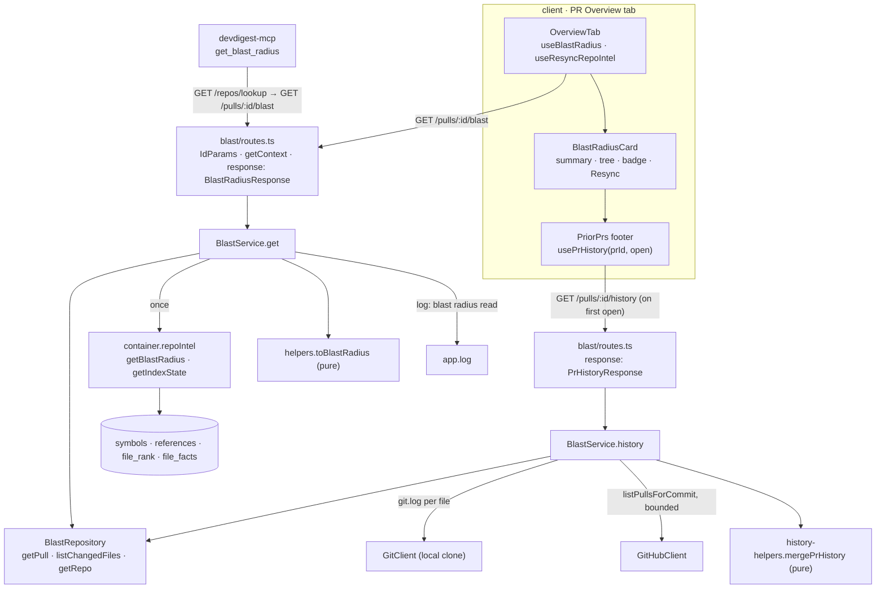

# Blast Radius — Development Plan

Date: 2026-09-30 · Branch: `feature/l04-blast-radius` · Status: done

## Goal
A reviewer opening a PR's **Overview** tab sees a **Blast radius** card next to the
intent card. For every symbol declared in the PR's changed files, the card lists who
calls it (`file:line`, linked to GitHub at the indexed commit) and which HTTP
endpoints and crons sit in those callers' files. It also shows honest degradation
(badge, reason and a **Resync index** button) and a collapsible **Prior PRs touching
these files** footer. The map is a read of the index that `repo-intel` built at clone
time: no model call and no re-parse. Claude Code gets the same map through the
`get_blast_radius` MCP tool.

## Context
- Request: implement `server/specs/blast-radius.md` (L04 homework) in full: P1 + P2 +
  the P3 items collapsible tree, crons apart from endpoints, rank order, resync button,
  i18n and Prior PRs. The Graph view is out of scope.
- Source of truth: `server/specs/blast-radius.md` (BR1–BR13, Facade fix, PH1–PH7,
  Contract, API, Server module layout, Client, MCP, Tests, Acceptance criteria). Every
  item is mapped to a task in the *Traceability* table.
- Pipeline: P0 commit → W0 → W1 → W2 → W3 → W4 → review wave (`architecture-reviewer`
  ∥ `plan-verifier`) → W6 docs (`doc-writer`) → `engineering-insights` capture → the
  user runs `/pr-self-review`.
- INSIGHTS entries that apply:
  - root · 2026-09-19 "`diff -r` over the two `vendor/shared` copies is NOT a drift
    gate". Diff only `review-api.ts` and `brief.ts` (T001). `adapters.ts` has already
    drifted, so its gate is a grep, not `diff -q` (T002).
  - root · 2026-09-29 "`rg` is not installed". Every gate in this plan uses `grep -rnE`.
  - root · 2026-09-26 "`typecheck` in `server/` never type-checks `test/`". Every server
    task that writes or edits a test also runs the scratch-tsconfig test type-check
    (Global constraints). This matters for T002: `ThrowingGitHubClient implements
    GitHubClient` in `server/test/smart-diff.it.test.ts` stops compiling once the port
    grows.
  - root · 2026-09-21 "server typecheck fails inside `../reviewer-core`" (run
    `npm install` in `reviewer-core/` first) and "pnpm 12.4.2 rejects `-s`" (always
    `pnpm run <script>`).
  - server · 2026-09-22 "A NEW module that needs another module's SERVICE trips
    `no-circular`". `BlastService` takes narrow deps and is built in its own
    `routes.ts`. `container.ts` is not touched (T010).
  - server · 2026-09-22 "Copying `import type {XRow} from './repository.js'` into
    helpers trips `no-circular`". `helpers.ts` and `history-helpers.ts` declare their
    input shapes locally or in `blast/types.ts`, never from `repository.ts`
    (T004, T005).
  - server · 2026-09-21 "Half the modules do NOT follow the documented anatomy". The
    new module is routes → service → repository (T006, T010).
  - server · 2026-09-26 "A new enrichment step in `executeRuns` makes REAL network and
    LLM calls". Not triggered: blast adds nothing to `executeRuns`. The integration
    test builds the app with throwing LLM doubles anyway (T012).
  - server · 2026-09-22 "`pnpm exec vitest run .it.test` is flaky in a sandboxed
    shell". Use `TESTCONTAINERS_RYUK_DISABLED=true` and retry on `CONNECT_TIMEOUT` (T012).
  - client · 2026-09-21 "`messages/*.json` … use `@messages/…`" (T011, T013).
  - client · 2026-09-26 "`@testing-library/user-event` is NOT installed; use
    `fireEvent`" (T011, T013).
  - client · 2026-09-21 "Moving a component folder breaks `vi.mock("../../…")`". Mock
    hooks by alias: `vi.mock("@/lib/hooks/blast", …)` (T011, T013).
  - client · 2026-09-19 "Mixing the `border` shorthand with a `borderColor` override is
    a runtime error". Every variant style (row, chip, badge) is all-longhand
    (T011, T013, T014).
  - client · 2026-09-22 "`Skeleton` has no `lines` prop" (T013).
  - client · 2026-09-19 "`<SeverityBadge compact>` drops the text label" generalises to
    every chip: endpoint and cron chips carry words, not only a colour (T013).
  - mcp · 2026-09-30 "Any pnpm command in `mcp/` silently replaces the npm install".
    T009 uses `npm` only.
  - mcp CLAUDE.md: `src/api/schemas.ts` are hand-written projections with a
    `// canonical:` comment; tool-design rules P1–P4; untrusted text never goes in
    `next` (T009).
- Spec invariants that apply: `server/specs/blast-radius.md` BR1–BR13, PH1–PH7, Facade
  fix, Contract, Client, MCP, Tests. Also `client/docs/ui-architecture.md` › Cache keys
  (keys only from `keys.ts`; new rows added in W6).
- Closest existing features followed:
  - `server/src/modules/smart-diff/` (routes → narrow-deps service → repository; pure
    helpers; `test/smart-diff.it.test.ts` with throwing LLM/GitHub doubles).
  - `server/src/modules/intent/service.ts` (structural logger dep
    `{ info(obj: unknown, msg?: string): void }`).
  - `server/src/domain/reviews/latest-review.ts` (a pure value shared across modules
    lives in `src/domain/<topic>/`).
  - `client/src/lib/hooks/intent.ts` (query hook), `OverviewTab/_components/IntentCard/`
    (presentational card + test).
  - `mcp/src/tools/get-conventions.ts` (resolve → api → compact `ok`, errors through
    `toToolError`).

## Scope
- In:
  - Contracts `BlastDegradedReason`, `BlastIndexStatus`, `BlastRadiusResponse`,
    `PrHistoryResponse` in both `review-api.ts` copies.
  - The facade fix: a per-`viaSymbol` cap in `RepoIntelService.tryPersistentBlast`.
  - A new `GitHubClient.listPullsForCommit` port method, its Octokit implementation and
    its mock.
  - A new server module `modules/blast/`, with `GET /pulls/:id/blast` and
    `GET /pulls/:id/history`.
  - Client hooks `useBlastRadius` and `usePrHistory`, the `BlastRadiusCard` (summary
    row, collapsible tree, states, degraded badge, Resync button, limit hint), the
    `PriorPrs` footer, and the Overview layout (Intent and Blast side by side,
    description below).
  - i18n keys in `client/messages/en/blast.json`.
  - A working `get_blast_radius` MCP tool.
  - Docs and spec promotion.
- Out:
  - The Graph view and the Tree/Graph toggle. The `view.*` and `graph.*` keys stay
    untouched.
  - An LLM-written summary.
  - Blast Radius in the reviewer prompt or in `PrBrief` persistence.
  - Any change to `brief.ts`.
  - Any DB schema change or migration.
  - Any change to `container.ts`.
  - An e2e flow. The spec's Tests table lists none, and the e2e seed has no indexed
    repo, so a flow would only show the degraded state.
  - Making the facade return `flag_off`. See Open questions.

## Design

### Findings from the code (recorded decisions)

1. **The spec's "type-only import of `repo-intel/types.ts`" fails `arch:check`.**
   `server/.dependency-cruiser.cjs` runs with `tsPreCompilationDeps: true`, so a
   type-only import counts. The `no-cross-module-imports` rule forbids `modules/blast/**`
   from importing anything under `modules/repo-intel/**`. The only grandfathered
   instance is `repos/service.ts → repo-intel/constants.ts`, which is in the baseline.
   A new one is forbidden, and re-baselining is forbidden. Resolution:
   - **Types.** `modules/blast/types.ts` (new) declares a local structural port
     `BlastIndexReader` with `getBlastRadius` and `getIndexState`, and with the
     structural shapes `BlastFacadeResult` and `IndexStateLike`, using only the fields
     blast reads. The degraded reason and the index status are typed with the new
     contract enums from `@devdigest/shared`. `routes.ts` passes `container.repoIntel`
     (a `RepoIntel`) into a parameter typed `BlastIndexReader`, so TypeScript checks
     structural compatibility at that assignment. Drift in the facade becomes a compile
     error in `routes.ts`, not a runtime surprise. This follows the server INSIGHTS
     2026-09-22 rule (local structural interface).
   - **The cap value.** `MAX_CALLERS_PER_SYMBOL` moves from `repo-intel/constants.ts`
     to `server/src/domain/repo-intel/limits.ts` (new), together with its JSDoc. Per
     onion §3, new pure code shared across modules goes to `src/domain/<topic>/`
     (`domain-is-pure`). Both call sites in `repo-intel/service.ts` (lines 50 and 456)
     import it from the new path, and no re-export shim is left behind (the same
     approach as `pickLatestReviewIds`). The constant is still defined exactly once,
     and `modules/blast/**` writes no number (BR6). The doc-writer updates BR6's
     wording in the spec (T015).
2. **`listChangedPaths` becomes `listChangedFiles`.** It returns
   `{ path, additions, deletions }[]`, because PH2 picks the largest files by
   `additions + deletions`. The blast path maps it to `path`. Both routes use one
   repository method, so there is one query.
3. **Prior PRs is a second method on `BlastService` (PH7, planner's call).** The
   alternative, `history.service.ts`, does not match the arch rule's APPLICATION regex
   `^src/modules/[^/]+/(service|run-executor|findings)\.ts$`. That would silently
   exempt it from `application-does-not-know-the-orm`. One `service.ts` keeps both use
   cases under the rules. The pure merge/sort/cap step lives in `history-helpers.ts`.
4. **`no_clone`** means `repos.clone_path IS NULL`, or every `git.log` call threw (the
   clone is missing on disk). A single file whose `git.log` throws is skipped.
   **`github_unavailable`** means `container.github()` threw (no token, which raises
   `ConfigError`) or every commit lookup failed. **`partial`** means some lookups failed
   and at least one succeeded. When there are no changed files or no commits, the
   response is `history: []`, `degraded: false`, `reason: null`.
5. **History caps (PH6) and concurrency.** These values are proposed here, and all of
   them live in `modules/blast/constants.ts`:
   - `HISTORY_MAX_FILES = 10`
   - `HISTORY_COMMITS_PER_FILE = 5`
   - `HISTORY_MAX_COMMIT_LOOKUPS = 20`
   - `HISTORY_MAX_ITEMS = 10`
   - `HISTORY_LOOKUP_CONCURRENCY = 4` (the "bounded concurrency" of PH3 needs a
     number, and it lives with the four caps).
6. **The summary's "symbols" count is `changed_symbols.length`.** This is the same
   number the `noDownstream` message shows. "callers" = Σ group sizes. "endpoints" and
   "crons" = unique values across all groups (BR7). Singular and plural forms are
   chosen by count (`1 cron`, `3 endpoints`). The client recomputes the same four
   counts for the i18n summary row. The server string (`buildSummary`) and the client
   counts (`blastCounts`) are therefore a coupled pair, and T013 records it in
   `coupled-files.md`.
7. **The facade fix computes `factsByFile` / `impactedEndpoints` over the kept
   callers' files only.** This is the spec's wording ("stay computed over the kept
   callers' files"). Today they are computed over all caller files before the slice.
   After the fix, they are computed after the per-symbol cap.
8. **`OverviewTab` also gains `repoId`**, in addition to the spec's `repoFullName`.
   `useResyncRepoIntel(repoId)` needs it, and `PrDetailView` has it from `useParams`.
9. **Resync invalidation uses a prefix key.** The mutation knows only `repoId`, so it
   invalidates `keys.blastAll()` (`["blast"]`), which is a new factory entry. No
   `queryKey` literal is written.
10. **`PriorPrs` lives in `BlastRadiusCard/_components/PriorPrs/`** and owns its own
    open state plus `usePrHistory(prId, open)`. Its state is pushed down to the only
    component that uses it. The card itself stays presentational: `OverviewTab` owns
    `useBlastRadius` and `useResyncRepoIntel`, as it does for the intent card.
11. **The MCP tool compacts inline** (as `get_conventions` does) and adds no `domain/`
    module, because the compaction is a field mapping and computes nothing new.

### Rings and folders

| Piece | Path | Ring | Why |
|---|---|---|---|
| `BlastDegradedReason`, `BlastIndexStatus`, `BlastRadiusResponse`, `PrHistoryResponse` | `server/src/vendor/shared/contracts/review-api.ts` + client copy | contracts | The client and the route serializer both read them (onion §4) |
| `listPullsForCommit` + `CommitPull` | `server/src/vendor/shared/adapters.ts` + client copy | ports | A new external call needs a port first (onion §3) |
| Octokit implementation | `server/src/adapters/github/octokit.ts` | infrastructure | SDK call |
| Mock | `server/src/adapters/mocks.ts` | infrastructure (test double) | Checklist: "new port → a mock" |
| `MAX_CALLERS_PER_SYMBOL` | `server/src/domain/repo-intel/limits.ts` (new) | domain | Shared by `repo-intel` and `blast` without a cross-module import (Decision 1) |
| Per-`viaSymbol` cap | `server/src/modules/repo-intel/service.ts` | application (facade) | The Facade fix |
| Local port + shapes | `server/src/modules/blast/types.ts` (new) | domain (types) | Decision 1 |
| `toBlastRadius`, `buildSummary` | `server/src/modules/blast/helpers.ts` (new) | domain | BR2–BR8, BR13, pure |
| History caps | `server/src/modules/blast/constants.ts` (new) | domain | PH6 |
| `pickHistoryFiles`, `collectCommitShas`, `mergePrHistory` | `server/src/modules/blast/history-helpers.ts` (new) | domain | PH2/PH4, pure |
| `BlastRepository` | `server/src/modules/blast/repository.ts` (new) | infrastructure | Drizzle only here; workspace-scoped |
| `BlastService.get` / `.history` | `server/src/modules/blast/service.ts` (new) | application | Narrow deps, never `Container` |
| Plugin | `server/src/modules/blast/routes.ts` (new) + `modules/index.ts` | presentation / composition | Validate → `getContext` → one service call |
| Hooks + keys | `client/src/lib/hooks/{blast,keys,index,repo-intel}.ts` | client tiers 2–3 | All data goes through `lib/hooks` |
| Card + helpers | `…/OverviewTab/_components/BlastRadiusCard/` | route feature | Only consumer is `OverviewTab` |
| Prior PRs footer | `…/BlastRadiusCard/_components/PriorPrs/` | route feature | Only consumer is the card |
| MCP projection + tool | `mcp/src/api/{schemas,client}.ts`, `mcp/src/tools/get-blast-radius.ts` | mcp api / tools | mcp layering (`mcp/CLAUDE.md`) |

`…/` means
`client/src/app/(shell)/repos/[repoId]/pulls/[number]/_components/` throughout.



### Contracts
Canonical `server/src/vendor/shared/contracts/review-api.ts` and the client copy
`client/src/vendor/shared/contracts/review-api.ts` change identically (they are
identical today). The import line becomes
`import { Intent, SmartDiff, BlastRadius, PrHistory } from './brief.js';`, and the
following is added after `SmartDiffResponse`:

```ts
export const BlastDegradedReason = z.enum([
  'flag_off', 'index_failed', 'index_partial', 'repo_too_large', 'no_data',
]);
export type BlastDegradedReason = z.infer<typeof BlastDegradedReason>;
export const BlastIndexStatus = z.enum(['full', 'partial', 'degraded', 'failed']);
export type BlastIndexStatus = z.infer<typeof BlastIndexStatus>;

export const BlastRadiusResponse = BlastRadius.extend({
  degraded: z.boolean(),
  reason: BlastDegradedReason.nullable(),
  index_status: BlastIndexStatus,
  index_sha: z.string().nullable(),
  limits: z.object({ max_callers_per_symbol: z.number().int() }),
});
export type BlastRadiusResponse = z.infer<typeof BlastRadiusResponse>;

export const PrHistoryResponse = PrHistory.extend({
  degraded: z.boolean(),
  reason: z.enum(['no_clone', 'github_unavailable', 'partial']).nullable(),
});
export type PrHistoryResponse = z.infer<typeof PrHistoryResponse>;
```

`brief.ts` is not edited. After T001, `diff -q` on `review-api.ts` and on `brief.ts`
prints nothing.

Port (T002), in both `adapters.ts` copies. The client copy carries `GitHubClient`, so
per PH3 it changes too. It has already drifted, so no `diff -q` is run on it.

```ts
/** A PR associated with a commit (GET /repos/{o}/{r}/commits/{sha}/pulls). */
export interface CommitPull {
  number: number;
  title: string;
  author: string;          // user.login, '' when absent
  mergedAt: string | null; // ISO; null = not merged
}
// in GitHubClient:
  /** PRs associated with a commit; the caller filters merged ones. */
  listPullsForCommit(repo: RepoRef, sha: string): Promise<CommitPull[]>;
```

### Database
None. There is no schema change and no migration. The module reads the
`pull_requests`, `pr_files` and `repos` tables, and repo-intel's tables through the
facade.

## Global constraints
- Zod 3 only. No `zod/v4`, `zod/mini` or `z.toJSONSchema`. Gate:
  `grep -rnE "zod/(v4|mini)|@zod/" server/src client/src mcp/src` → empty.
- No do-not-touch paths: nothing under `server/src/db/migrations/**`,
  `client/src/vendor/ui/**`, `client/.next/**` or `mcp/dist/**`.
- `cd server && pnpm run arch:check` stays green. `.dependency-cruiser-known-violations.json`
  is never regenerated (it must show no diff).
- `modules/blast/**` imports nothing from another module folder, nothing from
  `src/adapters/**`, no `LLMProvider`, no `reviewer-core` and no `Container` (BR1).
  Gate:
  `grep -rnE "modules/repo-intel|adapters/|reviewer-core|LLMProvider|platform/container" server/src/modules/blast`
  → empty.
- **Server test type-check** (root INSIGHTS 2026-09-26). After writing or editing a
  server test, create `<scratch>/tsconfig.tests.json`:
  `{"extends": "/Users/wekcook/code/dev-digest/server/tsconfig.json", "compilerOptions": {"noEmit": true, "typeRoots": ["/Users/wekcook/code/dev-digest/server/node_modules/@types"]}, "include": ["/Users/wekcook/code/dev-digest/server/src/**/*.ts", "/Users/wekcook/code/dev-digest/server/test/**/*.ts"]}`,
  then run `cd server && npx tsc -p <scratch>/tsconfig.tests.json`. Report errors in
  untouched files; do not fix them.
- The client `typecheck` already covers tests, and so does the mcp `typecheck`.
- `mcp/`: `npm` only. Never run any `pnpm` command there.
- Every user-facing client string comes from `client/messages/en/blast.json`, which has
  exactly one owner (T008). Tests import it as `@messages/en/blast.json`.
- Links to GitHub open in a new tab with `rel="noopener noreferrer"`. URLs are built
  only by `githubBlobUrl` / `githubPrUrl`.
- **Commits:** one commit per task, made by the main session after the wave:
  - run `git branch --show-current` first;
  - stage that task's *Files* by explicit path, never `-a` and never `.`;
  - never stage `.claude/settings.json` (untracked and unrelated);
  - use Conventional-Commit messages (`feat(blast): …`, `fix(repo-intel): …`,
    `feat(mcp): …`, `test(blast): …`, `docs(blast): …`) and end each with the
    attribution trailer from the session.

## Tasks

### P0 — main session, before W0 (no agent)
Commit the user's pre-implementation spec and this plan, so `plan-verifier` has a fixed
yardstick:
- `server/specs/blast-radius.md` (untracked);
- `server/specs/README.md` (modified: index entry);
- `docs/plans/2026-09-30-blast-radius.md`.

Message: `docs(blast): add blast-radius spec and development plan`.

### Wave 0 — foundation (sequential)

#### T001 — Contracts: `BlastRadiusResponse`, `PrHistoryResponse` (both copies)
- Area: backend + frontend (contracts)
- Agent: implementer
- Depends on: P0
- Files (exclusive):
  - `server/src/vendor/shared/contracts/review-api.ts` (modified)
  - `client/src/vendor/shared/contracts/review-api.ts` (modified)
  - `server/test/contracts.test.ts` (modified)
- Skills:
  - `zod` → schema-use-enums, object-extend-for-composition, object-optional-vs-nullable,
    type-use-z-infer (Zod 3 caveat, routing.md);
  - `typescript-expert` → Code Review Checklist (type safety);
  - routing.md › Contracts.
- Steps:
  1. **Test first.** In `server/test/contracts.test.ts`, add one `describe`:
     - a minimal valid `BlastRadiusResponse` parses: one group, `degraded:false`,
       `reason:null`, `index_status:'full'`, `index_sha:'abc'`,
       `limits:{max_callers_per_symbol:20}`;
     - `reason:'bogus'` is rejected;
     - `PrHistoryResponse` with `history:[]`, `degraded:true`, `reason:'no_clone'`
       parses.
  2. Apply the Contracts block exactly, in both copies. Nothing else in either file
     changes.
- Acceptance criteria:
  - `diff -q server/src/vendor/shared/contracts/review-api.ts client/src/vendor/shared/contracts/review-api.ts`
    and the same for `brief.ts` print nothing (Contract).
  - The four schemas and their types are exported through `@devdigest/shared` in
    server, client and reviewer-core.
- Verify:
  - `cd server && pnpm run typecheck && pnpm exec vitest run test/contracts.test.ts`
  - server test type-check (Global constraints)
  - `cd client && pnpm run typecheck`
  - `cd reviewer-core && npm run typecheck`
  - `for f in review-api.ts brief.ts; do diff -q server/src/vendor/shared/contracts/$f client/src/vendor/shared/contracts/$f; done`
- Constraints: root INSIGHTS: diff only the touched files. `brief.ts` stays unchanged
  (Contract: `PrBrief` composes `BlastRadius`).
- Commit: `feat(contracts): add BlastRadiusResponse and PrHistoryResponse`

#### T002 — GitHub port `listPullsForCommit` (+ Octokit, mock, test double)
- Area: backend
- Agent: implementer
- Depends on: T001
- Files (exclusive):
  - `server/src/vendor/shared/adapters.ts` (modified: `CommitPull` + port method)
  - `client/src/vendor/shared/adapters.ts` (modified: the same two additions, nothing else)
  - `server/src/adapters/github/octokit.ts` (modified)
  - `server/src/adapters/mocks.ts` (modified: `MockGitHubClient.listPullsForCommit`)
  - `server/test/smart-diff.it.test.ts` (modified: `ThrowingGitHubClient` gains
    `listPullsForCommit()` → `neverCalled(...)`; nothing else)
- Skills:
  - `onion-architecture` → §2, §3 (ports first), §5 Infrastructure, §11;
  - `security` → Secret Detection, A05 (args go to Octokit as params; no string-built URL);
  - `typescript-expert` → Code Review Checklist.
- Steps:
  1. Add `CommitPull` and the port method (Contracts block) to both `adapters.ts` copies.
  2. `OctokitGitHubClient.listPullsForCommit`:
     - call `this.octokit.rest.repos.listPullRequestsAssociatedWithCommit({ owner, repo, commit_sha: sha, per_page: 10 })`,
       wrapped in `withRetry(() => withTimeout(…, TIMEOUT))` like `getIssue`;
     - map each item to `{ number, title, author: user?.login ?? '', mergedAt: merged_at ?? null }`.
  3. `MockGitHubClient.listPullsForCommit`:
     - returns `this.opts.pullsForCommit?.[sha] ?? []`;
     - add `pullsForCommit?: Record<string, CommitPull[]>` to `MockGitHubOptions`.
  4. Add the throwing method to the smart-diff integration double.
- Acceptance criteria:
  - `grep -n "listPullsForCommit" server/src/vendor/shared/adapters.ts client/src/vendor/shared/adapters.ts server/src/adapters/github/octokit.ts server/src/adapters/mocks.ts`
    has a hit in each file (PH3).
  - Every `implements GitHubClient` in `server/src` and `server/test` compiles.
- Verify:
  - `cd server && pnpm run typecheck && pnpm run arch:check && pnpm exec vitest run --exclude '**/*.it.test.ts'`
  - server test type-check (Global constraints): this proves that `smart-diff.it.test.ts`
    compiles.
  - `cd client && pnpm run typecheck`
- Constraints: onion checklist "new external systems got a port … and a mock". There is
  no network call in any test.
- Commit: `feat(github): add listPullsForCommit port method`

#### T003 — Facade fix: per-symbol caller cap, constant moved to `src/domain`
- Area: backend
- Agent: implementer
- Depends on: T002 (sequential wave; no file overlap)
- Files (exclusive):
  - `server/src/domain/repo-intel/limits.ts` (new: `MAX_CALLERS_PER_SYMBOL = 20` with
    its JSDoc moved verbatim)
  - `server/src/modules/repo-intel/constants.ts` (modified: the constant and its JSDoc
    removed; a one-line comment points to the new home)
  - `server/src/modules/repo-intel/service.ts` (modified)
  - `server/test/repo-intel-blast-cap.test.ts` (new)
- Skills:
  - `onion-architecture` → §2, §3 (pure shared code → `src/domain`), §5 Application, §8,
    §11;
  - `typescript-expert` → Code Review Checklist.
- Steps:
  1. **Test first** (`repo-intel-blast-cap.test.ts`), built like
     `buildDegradedService` in `repo-intel-facade-degraded.test.ts`:
     - container `{ config: { repoIntelEnabled: true }, db: {}, codeIndex: {…} }`;
     - patch `svc.repo` with:
       - `tryGetIndexState` → `{ status: 'full', … }`;
       - `getSymbolRows(repo, paths)` → declarations of `hot` and `cold` in `src/a.ts`
         when `paths` includes it, else `[]`;
       - `getResolvedCallers` → 25 rows for `hot` (distinct `fromPath`, `rank` 1…25)
         plus 2 rows for `cold` (`rank` 0);
       - `getFileFacts(repo, files)` → one facts row per requested file, which records
         the files it was asked for.
     - Assert:
       - `hot` keeps exactly 20 callers, the highest ranks in DESC order;
       - `cold` keeps both of its callers;
       - `getFileFacts` was asked only for the kept callers' files.
  2. Create `limits.ts`. Remove the constant from `constants.ts`. In `service.ts`, import
     it from `../../domain/repo-intel/limits.js` and drop it from the `./constants.js`
     import. The default parameter at line 456 keeps working.
  3. In `tryPersistentBlast`, after `callers.sort(…)`:
     - build `kept` by walking the sorted list and keeping at most
       `MAX_CALLERS_PER_SYMBOL` rows per `viaSymbol` (a `Map<string, number>` counter;
       stable, so rank order is preserved);
     - compute `getFileFacts` over `[...new Set(kept.map(c => c.file))]`;
     - return `callers: kept`.
     The fallback path is untouched.
  4. `grep -rn "MAX_CALLERS_PER_SYMBOL" server/src` lists only `limits.ts` and
     `repo-intel/service.ts`.
- Acceptance criteria:
  - One hot symbol no longer starves the others (Facade fix).
  - `limits.ts` imports nothing (`domain-is-pure`).
  - `arch:check` is green and the baseline did not change.
- Verify:
  - `cd server && pnpm run typecheck && pnpm run arch:check && pnpm exec vitest run test/repo-intel-blast-cap.test.ts test/repo-intel-facade-degraded.test.ts`
  - server test type-check
  - `git diff --quiet server/.dependency-cruiser-known-violations.json`
- Constraints:
  - spec: "This is the only facade change." `getBlastRadius`'s fallback and
    `getCallerSignatures` keep their behaviour.
  - No re-export shim at the old path.
- Commit: `fix(repo-intel): cap blast callers per changed symbol`

### Wave 1 — parallel

#### T004 [P] — `toBlastRadius` + summary + local port types (pure) + unit test
- Area: backend
- Agent: implementer
- Depends on: T001, T003
- Files (exclusive):
  - `server/src/modules/blast/types.ts` (new)
  - `server/src/modules/blast/helpers.ts` (new)
  - `server/test/blast-helpers.test.ts` (new)
- Skills:
  - `onion-architecture` → §2, §3 (type-only imports count), §5 Domain, §8, §11;
  - `typescript-expert` → Code Review Checklist;
  - `zod` → type-use-z-infer (types come from contracts; no new schema here).
- Steps:
  1. `types.ts`. Import types only, from `@devdigest/shared`.
     ```ts
     export interface BlastFacadeResult {
       changedSymbols: { file: string; name: string; kind: string }[];
       callers: { file: string; symbol: string; viaSymbol: string; line: number; rank: number }[];
       impactedEndpoints: string[];
       factsByFile?: Record<string, { endpoints: string[]; crons: string[] }>;
       degraded?: boolean;
       reason?: BlastDegradedReason;
     }
     export interface IndexStateLike { status: BlastIndexStatus; lastIndexedSha: string }
     /** Structural port satisfied by container.repoIntel (checked at routes.ts). */
     export interface BlastIndexReader {
       getBlastRadius(repoId: string, changedFiles: string[]): Promise<BlastFacadeResult>;
       getIndexState(repoId: string): Promise<IndexStateLike>;
     }
     export interface BlastLimits { maxCallersPerSymbol: number }
     ```
  2. `helpers.ts`. Imports `./types.js` and `@devdigest/shared` types only.
     - `toBlastRadius(result, state, limits): BlastRadiusResponse`:
       - **BR2:** group `result.callers` by `viaSymbol` into `DownstreamImpact`, with
         `callers[i] = { name: c.symbol, file: c.file, line: c.line }`.
       - **BR3:** drop a caller whose `file` is a file where `viaSymbol` is declared,
         per `changedSymbols`. A group left with no callers is omitted.
       - **BR4:** per group, `endpoints_affected` / `crons_affected` = de-duplicated
         union of `factsByFile[file].endpoints` / `.crons` over the group's caller
         files, in first-seen order. Both are `[]` when `factsByFile` is absent.
       - **BR5:** callers keep the facade's order. Groups are sorted by max caller
         `rank` DESC, then `symbol` ASC (`localeCompare`). `changed_symbols` keeps the
         facade order, mapped to `{ name, file, kind }`.
       - **BR8:**
         - if `result.degraded`, then `degraded:true` and
           `reason: result.reason ?? 'no_data'`;
         - else if `state.status === 'partial'`, then `degraded:true` and
           `reason:'index_partial'`;
         - else `degraded:false` and `reason:null`.
         The data is always carried. `index_status = state.status`.
       - **BR13:** `index_sha = state.lastIndexedSha || null`.
       - **BR6:** `limits: { max_callers_per_symbol: limits.maxCallersPerSymbol }`.
       - **BR7:** `summary = buildSummary(changedSymbolCount, downstream)`.
     - `buildSummary(symbolCount, downstream): string`. Example:
       `2 symbols · 14 callers · 3 endpoints · 1 cron`.
       - callers = Σ `callers.length`;
       - endpoints and crons = unique counts across groups;
       - singular when the count is 1;
       - separator ` · ` (U+00B7).
  3. Tests (one `describe`, typological):
     - **Happy path:** three callers across two symbols, plus `factsByFile` → two
       groups:
       - each group's `endpoints_affected` / `crons_affected` come from its own caller
         files (BR4);
       - the group with the higher-rank caller comes first (BR5);
       - `summary` is exact (BR7);
       - `BlastRadiusResponse.parse(out)` succeeds.
     - **Edge BR3:** a caller in the declaring file is dropped. A symbol whose only
       caller was self-file yields no group.
     - **Edge BR4 fallback:** no `factsByFile` → `[]` for both lists.
     - **Edge BR8:**
       - facade `degraded:true, reason:'no_data'` is passed through;
       - facade healthy + state `partial` → `index_partial` with data kept;
       - `lastIndexedSha:''` → `index_sha:null`.
- Acceptance criteria:
  - No import of `./repository.js` or of any module folder (server INSIGHTS
    2026-09-22). No numeric literal for a cap (BR6).
  - P2 "mapping unit-tested".
- Verify:
  - `cd server && pnpm run typecheck && pnpm run arch:check && pnpm exec vitest run test/blast-helpers.test.ts`
  - server test type-check
- Constraints: BR2–BR8, BR13. Pure: no clock, no I/O.
- Commit: `feat(blast): map the facade result to BlastRadiusResponse`

#### T005 [P] — History caps + pure merge/sort/cap + unit test
- Area: backend
- Agent: implementer
- Depends on: T001, T002
- Files (exclusive):
  - `server/src/modules/blast/constants.ts` (new)
  - `server/src/modules/blast/history-helpers.ts` (new)
  - `server/test/blast-history-helpers.test.ts` (new)
- Skills:
  - `onion-architecture` → §5 Domain, §8;
  - `typescript-expert` → Code Review Checklist.
- Steps:
  1. `constants.ts`: the five constants from Decision 5, each with a one-line JSDoc that
     names PH2/PH3/PH4.
  2. `history-helpers.ts`. Imports `./constants.js` and `@devdigest/shared` types only
     (`CommitPull`, `PrHistoryItem`, `GitCommit`). It declares local input shapes.
     - `pickHistoryFiles(files: {path; additions; deletions}[]): string[]`:
       - sort by `additions + deletions` DESC, ties by path;
       - take `HISTORY_MAX_FILES` (PH2).
     - `collectCommitShas(logs: { path: string; commits: GitCommit[] }[]): { shas: string[]; filesBySha: Map<string, Set<string>> }`:
       - take the first `HISTORY_COMMITS_PER_FILE` commits per file;
       - de-duplicate the shas;
       - order newest first by `date` (ties by first-seen);
       - cap at `HISTORY_MAX_COMMIT_LOOKUPS` (PH3);
       - `filesBySha` remembers which changed files each sha touched.
     - `mergePrHistory(lookups: { sha: string; pulls: CommitPull[] }[], filesBySha, currentPrNumber): PrHistoryItem[]`:
       - keep `mergedAt != null`;
       - drop `number === currentPrNumber`;
       - de-duplicate by number, unioning the overlap files;
       - sort by `mergedAt` DESC;
       - cap at `HISTORY_MAX_ITEMS`;
       - output `{ pr_number, title, merged_at, author, files_overlap: sorted, notes }`,
         where `notes = touched ${n} of these files` (`n` = overlap count) (PH4).
  3. Tests:
     - **Happy path:** two files, three shas, lookups returning:
       - an unmerged PR;
       - the current PR;
       - one PR reached from two shas.
       Expect exactly one item: unioned sorted overlap, `notes` "touched 2 of these
       files", newest first across two kept PRs.
     - **Edge:** `pickHistoryFiles` keeps the largest `HISTORY_MAX_FILES` files, and
       `collectCommitShas` caps per file and in total. Assert against the constants,
       never against literals.
- Acceptance criteria:
  - The caps appear only in `constants.ts`
    (`grep -rnE "HISTORY_(MAX|COMMITS|LOOKUP)" server/src` shows definitions there and
    uses only in `history-helpers.ts` / `service.ts`) (PH6).
  - PH7: the pure step has a unit test.
- Verify:
  - `cd server && pnpm run typecheck && pnpm run arch:check && pnpm exec vitest run test/blast-history-helpers.test.ts`
  - server test type-check
- Commit: `feat(blast): pure prior-PR merge with caps`

#### T006 [P] — `BlastRepository`
- Area: backend
- Agent: implementer
- Depends on: P0
- Files (exclusive):
  - `server/src/modules/blast/repository.ts` (new)
- Skills:
  - `drizzle-orm-patterns` → references/queries-joins-aggregations.md;
  - `onion-architecture` → §5 Infrastructure, §6;
  - `postgresql-table-design` → Indexing (read only; `pr_repo_number_uq`/`pr_ws_idx`
    already exist, and no index is added);
  - `security` → A01 (tenancy, IDOR);
  - `typescript-expert` → Code Review Checklist.
- Steps:
  1. `getPull(workspaceId, prId) → { id; repoId; number } | undefined`, scoped on
     `pull_requests.workspace_id` (BR10).
  2. `listChangedFiles(prId) → { path; additions; deletions }[]` from `pr_files`, with
     the doc comment "call only after `getPull` proved the workspace" (as smart-diff
     does).
  3. `getRepo(workspaceId, repoId) → { owner; name; clonePath: string | null } | undefined`,
     scoped on `repos.workspace_id`.
  4. Export the row interfaces. Do not import `helpers.ts` or `history-helpers.ts`.
- Acceptance criteria: every read of a domain table is workspace-scoped or follows a
  scoped `getPull`. Reads only, so there is no transaction.
- Verify: `cd server && pnpm run typecheck && pnpm run arch:check`
- Constraints: server CLAUDE.md "every query scopes by `workspace_id`".
- Commit: `feat(blast): repository for PR, changed files and repo`

#### T007 [P] — Client hooks + cache keys + Resync invalidation
- Area: frontend
- Agent: implementer
- Depends on: T001
- Files (exclusive):
  - `client/src/lib/hooks/keys.ts` (modified)
  - `client/src/lib/hooks/blast.ts` (new)
  - `client/src/lib/hooks/index.ts` (modified: `export * from "./blast";`)
  - `client/src/lib/hooks/repo-intel.ts` (modified)
- Skills:
  - `frontend-ui-architecture` → §3, §4, §6, §8;
  - `react-best-practices` → Data Fetching, Hooks (CRITICAL/HIGH);
  - `client/docs/ui-architecture.md` (Cache keys, error-UX);
  - `typescript-expert` → Code Review Checklist.
- Steps:
  1. `keys.ts`:
     - `blast: (prId: Id) => ["blast", prId] as const`;
     - `blastAll: () => ["blast"] as const` with the comment "Prefix … for invalidation
       only", as for `providerModelsAll`;
     - `prHistory: (prId: Id) => ["pr-history", prId] as const`.
  2. `blast.ts` (mirrors `intent.ts`, `"use client"`, header comment):
     - `useBlastRadius(prId)` →
       `useQuery({ queryKey: keys.blast(prId), queryFn: () => api.get<BlastRadiusResponse>(\`/pulls/${prId}/blast\`), enabled: !!prId })`;
     - `usePrHistory(prId, enabled: boolean)` →
       `useQuery({ queryKey: keys.prHistory(prId), queryFn: () => api.get<PrHistoryResponse>(\`/pulls/${prId}/history\`), enabled: !!prId && enabled })`.
  3. `useResyncRepoIntel.onSuccess` also calls
     `qc.invalidateQueries({ queryKey: keys.blastAll() })`, after the existing
     invalidation.
- Acceptance criteria:
  - No `queryKey: [` literal (`grep -rn "queryKey: \[" client/src/lib/hooks` → empty).
  - Existing invalidations are unchanged.
- Verify: `cd client && pnpm run typecheck && pnpm test`
- Constraints: client CLAUDE.md "all data goes through `src/lib/hooks/*`".
- Commit: `feat(client): blast radius and prior-PR hooks`

#### T008 [P] — i18n keys (`blast.json`)
- Area: frontend
- Agent: implementer
- Depends on: P0
- Files (exclusive):
  - `client/messages/en/blast.json` (modified; sole owner in this plan)
- Skills: routing.md › `client/messages/**/*.json`; root CLAUDE.md › Language.
- Steps. Keep every existing key (`stat.*`, `view.*`, `callerCount`, `noDownstream`,
  `graph.*`) byte-identical, and add:
  - `title`: "Blast radius"
  - `degraded`:
    - `badge`: "Partial data"
    - `reason`:
      - `flag_off`: "Repository intelligence is turned off, so callers come from a text search."
      - `index_failed`: "The last index run failed, so callers come from a text search."
      - `index_partial`: "The index is partial: some files were skipped, so callers may be missing."
      - `repo_too_large`: "The repository is too large to index fully, so callers may be missing."
      - `no_data`: "This repository has no usable index yet. Callers come from a text search, and endpoints and crons are not attributed."
  - `resync`: "Resync index"
  - `error`: "Could not load the blast radius."
  - `limitHint`: "Showing at most {max} callers per symbol."
  - `tree`:
    - `expand`: "Expand {symbol}"
    - `collapse`: "Collapse {symbol}"
    - `endpoints`: "Endpoints"
    - `crons`: "Crons"
    - `openOnGithub`: "Open {location} on GitHub"
  - `history`:
    - `title`: "Prior PRs touching these files"
    - `expand`: "Show prior PRs touching these files"
    - `collapse`: "Hide prior PRs touching these files"
    - `count`: "{count, plural, one {# PR} other {# PRs}}"
    - `empty`: "No merged PRs touched these files."
    - `error`: "Could not load prior PRs."
    - `merged`: "merged {date} by {author}"
    - `degraded`:
      - `no_clone`: "The repository is not cloned locally, so its history cannot be read."
      - `github_unavailable`: "GitHub is not reachable (no token or an API error), so prior PRs cannot be listed."
      - `partial`: "Some commits could not be looked up on GitHub, so the list may be incomplete."
- Acceptance criteria:
  - Valid JSON, and the ICU plural parses.
  - No existing key is renamed or removed (Client › i18n, P3).
- Verify:
  - `jq -e '.title and .degraded.reason.index_partial and .history.degraded.partial and .view.graph and .graph.empty' client/messages/en/blast.json`
  - `cd client && pnpm test`
- Commit: `feat(client): blast radius i18n keys`

#### T009 [P] — MCP `get_blast_radius` (replace the stub) + tests
- Area: mcp
- Agent: implementer
- Depends on: T001
- Files (exclusive):
  - `mcp/src/api/schemas.ts` (modified: `BlastRadiusLite`)
  - `mcp/src/api/client.ts` (modified: `blast(prId, signal)`)
  - `mcp/src/tools/get-blast-radius.ts` (modified)
  - `mcp/test/tools-readonly.test.ts` (modified)
  - `mcp/test/server.test.ts` (modified)
- Skills:
  - `mcp/CLAUDE.md` (tool-design rules P1–P4, layering, untrusted text);
  - `zod` → object-strict-vs-strip (projections strip unknown keys), schema-use-enums
    (Zod 3 caveat);
  - `typescript-expert` → Code Review Checklist;
  - `security` → Agentic AI Security (symbol and file names are repository data: keep
    them out of `next`).
- Steps:
  1. `schemas.ts`. Add `BlastRadiusLite` with the comment
     `// canonical: server/src/vendor/shared/contracts/review-api.ts BlastRadiusResponse`,
     shaped like:
     - `changed_symbols: z.array(z.object({ name, file, kind }))`;
     - `downstream: z.array(z.object({ symbol, callers: z.array(z.object({ name, file, line: z.number().int() })), endpoints_affected: z.array(z.string()), crons_affected: z.array(z.string()) }))`;
     - `summary`, `degraded: z.boolean()`, `reason: z.string().nullable()`,
       `index_status: z.string()`.
  2. `client.ts`: `blast(prId, signal)` →
     `this.request({ path: \`/pulls/${enc(prId)}/blast\`, schema: BlastRadiusLite, signal })`.
  3. `get-blast-radius.ts`:
     - `title: 'Get blast radius'`;
     - description: "Returns, for each symbol declared in a PR's changed files, its
       callers (file:line), the HTTP endpoints and the crons in those callers' files.
       Call it before reviewing a PR, to see which callers, endpoints and crons the
       change can break; it reads a precomputed index, with no LLM cost.";
     - input unchanged; `annotations: { readOnlyHint: true }`.
     - Handler:
       - `resolveRepoAndPull(deps.api, repo, pr_number, extra.signal)`;
       - `!pull` → `fail({ error:'pr_not_found', … })`, using the same message and next
         as `get_findings`;
       - `api.blast(pull.id)`;
       - `ok({ repo, pr_number, summary, degraded, reason, index_status, downstream: downstream.map(g => ({ symbol: g.symbol, callers: g.callers.map(c => \`${c.file}:${c.line} (${c.name})\`), endpoints: g.endpoints_affected, crons: g.crons_affected })) })`;
       - `catch` → rethrow if aborted, else `fail(toToolError(e, { apiUrl, repo, prNumber: pr_number }))`.
     - It never calls `/history`.
  4. Tests (replacing the stub assertions; `fakeFetch` routes from `test/helpers/harness.ts`):
     - `tools-readonly.test.ts`:
       - **happy path:** `GET /repos/lookup` → repo + pull, then `GET /pulls/:id/blast`
         → two groups. The result is not an error, has the compact `callers` strings
         and the same group count and `summary`. The fake router saw
         `/pulls/<id>/blast` and no `/history`.
       - **unknown PR:** lookup returns 404 `pr_not_found` → `isError`, `error:'pr_not_found'`.
     - `server.test.ts`:
       - `get_blast_radius`'s description no longer matches `/^NOT IMPLEMENTED/`;
       - `annotations.readOnlyHint === true`;
       - its title has no "(not implemented)".
- Acceptance criteria:
  - The same groups and counts as the card (MCP).
  - Errors go through `toToolError`.
  - `grep -rn "Not Implemented Yet\|not_implemented" mcp/src mcp/test` → empty.
- Verify:
  - `cd mcp && npm run typecheck && npm test`
  - `grep -rnE "zod/(v4|mini)" mcp/src` → empty
  - `ls mcp/pnpm-lock.yaml mcp/pnpm-workspace.yaml 2>/dev/null` → nothing
- Constraints:
  - mcp INSIGHTS 2026-09-30: npm only.
  - mcp CLAUDE.md: no import from `server/`.
  - The coupled-files pair for this projection is recorded by T013 (single owner of
    `coupled-files.md`).
- Commit: `feat(mcp): implement get_blast_radius`

### Wave 2 — parallel

#### T010 [P] — `BlastService` (get + history) + routes + registry + service unit test
- Area: backend
- Agent: implementer
- Depends on: T002, T003, T004, T005, T006
- Files (exclusive):
  - `server/src/modules/blast/service.ts` (new)
  - `server/src/modules/blast/routes.ts` (new)
  - `server/src/modules/index.ts` (modified: one import, one entry `blast`)
  - `server/test/blast-service.test.ts` (new)
- Skills:
  - `onion-architecture` → §3, §5 (all rings), §7, §8, §11;
  - `fastify-best-practices` → rules/routes.md, rules/schemas.md, rules/serialization.md,
    rules/error-handling.md, rules/plugins.md, rules/logging.md;
  - `zod` → parse-avoid-double-validation (Zod 3 caveat);
  - `security` → A01 (tenancy/IDOR), A05, A09 (log no secrets);
  - `typescript-expert` → Code Review Checklist.
- Steps:
  1. `service.ts`:
     ```ts
     export interface BlastDeps {
       repo: Pick<BlastRepository, 'getPull' | 'listChangedFiles' | 'getRepo'>; // type-only import
       repoIntel: BlastIndexReader;                                              // ./types.js
       git: Pick<GitClient, 'log'>;
       github: () => Promise<Pick<GitHubClient, 'listPullsForCommit'>>;
       logger: { info(obj: unknown, msg?: string): void };
     }
     ```
     - `get(workspaceId, prId): Promise<BlastRadiusResponse>`:
       - start `Date.now()`;
       - `getPull`, throwing `NotFoundError('Pull request not found')` when missing,
         before any facade call (BR10);
       - `paths = (await listChangedFiles(prId)).map(f => f.path)`;
       - `const [result, state] = await Promise.all([repoIntel.getBlastRadius(pull.repoId, paths), repoIntel.getIndexState(pull.repoId)])`.
         Each is called exactly once (BR1).
       - `out = toBlastRadius(result, state, { maxCallersPerSymbol: MAX_CALLERS_PER_SYMBOL })`,
         with the constant imported from `../../domain/repo-intel/limits.js`;
       - log `{ prId, repoId, source: result.factsByFile ? 'index' : 'fallback', indexStatus: state.status, symbols: out.changed_symbols.length, callers: Σ, durationMs }`
         with `msg 'blast radius read'` (BR12);
       - return `out`.
       There is no try/catch: the facade does not throw (BR9).
     - `history(workspaceId, prId): Promise<PrHistoryResponse>`:
       - `getPull` (404 as above);
       - `getRepo(workspaceId, pull.repoId)`;
       - `clonePath == null` → `{ history: [], degraded: true, reason: 'no_clone' }`;
       - `files = pickHistoryFiles(await listChangedFiles(prId))`;
       - for each file, `git.log({ owner, name }, path)` with per-file try/catch; all
         failed → `no_clone`;
       - `collectCommitShas`; no shas → `{ history: [], degraded: false, reason: null }`;
       - `let gh; try { gh = await github() } catch { return { history: [], degraded: true, reason: 'github_unavailable' } }`;
       - look up shas through a private `mapBounded(items, HISTORY_LOOKUP_CONCURRENCY, fn)`
         that records per-sha success or failure;
       - all failed → `github_unavailable`; some failed → `degraded: true, reason: 'partial'`
         with the merged data; none failed → `degraded: false, reason: null` (PH5);
       - `history = mergePrHistory(okLookups, filesBySha, pull.number)`.
       No model call (PH1).
  2. `routes.ts`:
     - build once:
       `const service = new BlastService({ repo: new BlastRepository(container.db), repoIntel: container.repoIntel, git: container.git, github: () => container.github(), logger: app.log })`;
     - `app.get('/pulls/:id/blast', { schema: { params: IdParams, response: { 200: BlastRadiusResponse } } }, …)`;
     - `app.get('/pulls/:id/history', { schema: { params: IdParams, response: { 200: PrHistoryResponse } } }, …)`;
     - each handler does `getContext` → one service call → return (BR11, PH1);
     - header comment as in smart-diff ("reads the precomputed index; no model call, no
       re-parse").
  3. Register `blast` in `modules/index.ts`.
  4. `blast-service.test.ts`: application ring with fake `Deps` (onion §8), no DB.
     - **get happy path:**
       - a counting `repoIntel` double (healthy result with `factsByFile`) and a
         capturing logger;
       - `getBlastRadius` and `getIndexState` are each called once;
       - `getBlastRadius` receives every changed path;
       - the log object has `source:'index'` and `msg === 'blast radius read'`;
       - the output parses with `BlastRadiusResponse`.
     - **get edge:**
       - an unknown PR → `NotFoundError`, and the facade was never called;
       - a result without `factsByFile` → `source:'fallback'`.
     - **history edges (PH5):**
       - `clonePath:null` → `no_clone`;
       - `github()` rejects → `github_unavailable`;
       - one of two lookups rejects → `partial`, with the other PR present.
- Acceptance criteria:
  - **BR1:** the Global-constraints grep is empty. The service names no
    `Container`/`RepoIntelService`.
  - **BR11/PH1:** the response is validated by the zod serializer, with no extra
    `.parse` in a handler.
  - `arch:check` is green: no `no-cross-module-imports`, `no-circular`,
    `routes-do-not-touch-the-db` or `application-does-not-know-the-orm`.
  - `routes.ts` compiles with `container.repoIntel` assigned to `BlastIndexReader`
    (structural drift check, Decision 1).
- Verify:
  - `cd server && pnpm run typecheck && pnpm run arch:check && pnpm exec vitest run test/blast-service.test.ts test/blast-helpers.test.ts test/blast-history-helpers.test.ts`
  - server test type-check
  - `grep -rnE "modules/repo-intel|adapters/|reviewer-core|LLMProvider|platform/container" server/src/modules/blast` → empty
- Constraints:
  - server INSIGHTS 2026-09-22 (no container facade for this service).
  - server CLAUDE.md (schema-first, register in `modules/index.ts`).
  - No external call inside a transaction; there is no transaction.
- Commit: `feat(blast): GET /pulls/:id/blast and /pulls/:id/history`

#### T011 [P] — `PriorPrs` footer (lazy, collapsed by default) + test
- Area: frontend
- Agent: implementer
- Depends on: T007, T008
- Files (exclusive):
  - `…/OverviewTab/_components/BlastRadiusCard/_components/PriorPrs/PriorPrs.tsx` (new)
  - `…/OverviewTab/_components/BlastRadiusCard/_components/PriorPrs/styles.ts` (new)
  - `…/OverviewTab/_components/BlastRadiusCard/_components/PriorPrs/index.ts` (new)
  - `…/OverviewTab/_components/BlastRadiusCard/_components/PriorPrs/PriorPrs.test.tsx` (new)
- Skills:
  - `frontend-ui-architecture` → §3, §5 (state pushed down), §6, §8;
  - `react-best-practices` → CRITICAL/HIGH (derive don't store, keys, conditional
    rendering with counts, accessibility);
  - `next-best-practices` → Directives (`"use client"`);
  - `react-testing-library` → Query Priority, Async Testing, Mocking Strategies,
    Anti-Patterns;
  - `security` → Framework Security Quirks (titles are GitHub data: JSX only, no
    `dangerouslySetInnerHTML`).
- Steps:
  1. Props: `{ prId: string | null | undefined; repoFullName: string | null }`.
     - State: `open` (default `false`).
     - `const q = usePrHistory(prId, open)`, imported from `@/lib/hooks/blast` so that
       tests can mock it.
  2. Header: a `<button aria-expanded={open}>` labelled
     `t(open ? "history.collapse" : "history.expand")`, showing `history.title` and,
     once data exists, a `Badge` with `history.count`.
  3. Body (only when open):
     - loading → `Skeleton` rows;
     - error → `history.error`;
     - `degraded && reason` → a status line `history.degraded.<reason>`, shown above any
       rows;
     - empty and not degraded → `history.empty`;
     - rows:
       - `#number`, linked with `githubPrUrl(repoFullName, n)` (`target="_blank"`,
         `rel="noopener noreferrer"`); plain text when `repoFullName` is null;
       - title;
       - `history.merged` with a short date and the author;
       - overlap files as mono chips.
  4. Test, with `vi.mock("@/lib/hooks/blast", () => ({ usePrHistory: vi.fn() }))`,
     `NextIntlClientProvider` with `{ blast }` from `@messages/en/blast.json`, and
     `fireEvent`:
     - **Happy path:**
       - before the click, `usePrHistory` was last called with `("p1", false)`;
       - click the expand button → called with `("p1", true)`;
       - with mocked data of one item, the `#42` link has
         `href = https://github.com/acme/a/pull/42` and the title is visible.
     - **Edge:** `degraded:true, reason:'github_unavailable', history:[]` → the
       degraded sentence is shown and the empty text is not.
- Acceptance criteria:
  - Collapsed by default; fetched only when first expanded (`enabled` gated on open).
  - Each row shows number, link, title, author, merged date and overlap files (Prior
    PRs / Client).
- Verify:
  - `cd client && pnpm run typecheck && pnpm exec vitest run "src/app/(shell)/repos/[repoId]/pulls/[number]/_components/OverviewTab/_components/BlastRadiusCard/_components/PriorPrs"`
- Constraints:
  - client INSIGHTS: `fireEvent`, `@messages`, alias mocks, border longhand.
- Commit: `feat(client): prior PRs footer for the blast radius card`

### Wave 3 — parallel

#### T012 [P] — Tests: blast + history routes (integration)
- Area: backend
- Agent: test-writer
- Depends on: T010
- Files (exclusive):
  - `server/test/blast.it.test.ts` (new)
- Skills:
  - `TESTING.md`;
  - `onion-architecture` → §8;
  - `fastify-best-practices` → rules/testing.md.
- Steps. Follow `smart-diff.it.test.ts`: `startPg` + `seed`, then
  `buildApp({...config(), …}, overrides)` with:
  - **throwing LLM doubles** for `openai`/`anthropic`/`openrouter`;
  - a `repoIntel` **counting double** (`Partial` cast to `RepoIntel`) returning a fixed
    healthy `BlastResult` with `factsByFile` and `getIndexState` → `status:'full'`,
    `lastIndexedSha:'idx123'`;
  - a `git` double whose `log(repo, path)` returns per-path commits;
  - a `github` double whose `listPullsForCommit` returns per-sha fixtures.
  Insert a repo (with `clonePath`), a PR and `pr_files` rows directly.
  1. `GET /pulls/:id/blast` → 200:
     - `BlastRadiusResponse.parse(res.json())` succeeds;
     - `index_sha === 'idx123'`;
     - `limits.max_callers_per_symbol === MAX_CALLERS_PER_SYMBOL` (imported from
       `src/domain/repo-intel/limits.ts`);
     - `getBlastRadius` was called exactly once, with the PR's paths (BR1);
     - the request succeeded with throwing LLM doubles (P2 no LLM).
  2. A PR of another workspace → 404, and the `repoIntel` double was not called (BR10).
     A non-uuid id → 422.
  3. `GET /pulls/:id/history` → 200:
     - `PrHistoryResponse.parse` succeeds;
     - one merged PR, newest first;
     - the current PR's own number is absent;
     - `degraded:false`.
  4. The same PR with the repo's `clonePath` set to null → `degraded:true`,
     `reason:'no_clone'`.
- Acceptance criteria: P2 "response validated by the contract"; BR1, BR10, PH1, PH5.
- Verify:
  - `cd server && TESTCONTAINERS_RYUK_DISABLED=true pnpm exec vitest run test/blast.it.test.ts`
  - server test type-check
- Constraints: server INSIGHTS testcontainers flakiness (retry on `CONNECT_TIMEOUT`,
  `docker rm -f` leaked containers). Insert rows directly; run no review.
- Commit: `test(blast): route integration tests`

#### T013 [P] — `BlastRadiusCard` (summary, tree, states, badge, Resync) + test + coupled pairs
- Area: frontend
- Agent: implementer
- Depends on: T007, T008, T011, T004 (for the coupled-pair symbol), T009 (for the
  coupled-pair symbol)
- Files (exclusive):
  - `…/OverviewTab/_components/BlastRadiusCard/BlastRadiusCard.tsx` (new)
  - `…/OverviewTab/_components/BlastRadiusCard/helpers.ts` (new)
  - `…/OverviewTab/_components/BlastRadiusCard/styles.ts` (new)
  - `…/OverviewTab/_components/BlastRadiusCard/index.ts` (new)
  - `…/OverviewTab/_components/BlastRadiusCard/BlastRadiusCard.test.tsx` (new)
  - `.claude/skills/pr-self-review/references/coupled-files.md` (modified: two pair lines)
- Skills:
  - `frontend-ui-architecture` → §3, §4 (tier-1 helpers), §5, §6, §8;
  - `react-best-practices` → CRITICAL/HIGH (derive don't store, keys, `count > 0 &&`,
    accessibility, ≤ 200 lines per component: split `SymbolGroup` into the same
    folder's file or a `_components/` sibling if needed, and list it in the report);
  - `next-best-practices` → Directives;
  - `react-testing-library` → Query Priority, Async Testing, Mocking Strategies,
    Anti-Patterns;
  - `security` → Framework Security Quirks (repository data rendered as JSX text;
    hrefs only from `githubBlobUrl`).
- Steps:
  1. `helpers.ts` (pure, no React):
     - `blastCounts(res) → { symbols, callers, endpoints, crons }` with the BR7 rules
       (Decision 6);
     - `callerHref(repoFullName, indexSha, headSha, caller) → string | null` =
       `githubBlobUrl(repoFullName, indexSha ?? headSha, caller.file, caller.line)`,
       or `null` when `repoFullName` or both shas are null (BR13);
     - `isAtLimit(group, limits) = group.callers.length >= limits.max_callers_per_symbol`.
  2. `BlastRadiusCard` (presentational, `"use client"`). Props:
     `{ blast?: BlastRadiusResponse; isLoading; isError; prId; repoFullName; headSha; onResync; resyncing }`.
     - Section label `t("title")` (namespace `blast`).
     - **States:**
       - loading → three `Skeleton` bars;
       - error → `t("error")`;
       - **degraded** → a badge `degraded.badge` plus the sentence
         `degraded.reason.<reason>` plus a `Button` `t("resync")` (`onClick={onResync}`,
         `loading={resyncing}`), rendered above whatever data exists;
       - **no callers** (`downstream.length === 0`) →
         `t("noDownstream", { count: changed_symbols.length })`, never an empty card.
     - **Summary row:** four stats from `blastCounts` with `stat.*` labels.
     - **Tree:**
       - one collapsible row per group: a `<button aria-expanded>` with an
         `aria-label` of `tree.expand` / `tree.collapse` and `{symbol}`, showing the
         symbol in mono and `callerCount`;
       - the first group starts expanded, the rest collapsed (local
         `Set<string>` of open symbols, initialised from `downstream[0]`);
       - the body lists callers as `file:line` links (`callerHref`; new tab;
         `aria-label` `tree.openOnGithub`), each with the caller name;
       - then **endpoint chips** (`tree.endpoints`);
       - then **cron chips** (`tree.crons`), visually distinct: a different colour
         token and the `Clock` icon (check `IconName`), all-longhand borders.
     - `limitHint` (with `{max}`) shows when any group `isAtLimit`.
     - The footer renders `<PriorPrs prId={prId} repoFullName={repoFullName} />`.
  3. `index.ts`: `export { BlastRadiusCard, type BlastRadiusCardProps } from "./BlastRadiusCard";`
  4. Test, with `vi.mock("@/lib/hooks/blast", () => ({ usePrHistory: vi.fn(() => ({ data: undefined, isLoading: false, isError: false })) }))`,
     `{ blast }` messages and `fireEvent`:
     - **Happy path:**
       - two groups;
       - the first group's caller link `src/b.ts:12` has
         `href === "https://github.com/acme/a/blob/idx123/src/b.ts#L12"` (the
         `index_sha`, not `headSha`);
       - an endpoint chip and a cron chip are both visible under their own labels;
       - the second group is collapsed (`aria-expanded="false"`); clicking it shows its
         caller.
     - **Edge no callers:** `downstream: []` with two changed symbols → the
       `noDownstream` text with 2.
     - **Edge degraded:** `degraded:true, reason:'index_partial'` → the badge, the
       `index_partial` sentence and a **Resync index** button, whose click calls
       `onResync`; the data is still rendered.
  5. Append two lines to `coupled-files.md` in its exact format:
     - `` `server/src/vendor/shared/contracts/review-api.ts` `BlastRadiusResponse` <-> `mcp/src/api/schemas.ts` `BlastRadiusLite` — mcp re-declares the GET /pulls/:id/blast body by hand; a rename on one side passes both typechecks and fails get_blast_radius with api_shape_mismatch (blast-radius plan, 2026-09-30) ``
     - `` `server/src/modules/blast/helpers.ts` `buildSummary` <-> `client/src/app/(shell)/repos/[repoId]/pulls/[number]/_components/OverviewTab/_components/BlastRadiusCard/helpers.ts` `blastCounts` — both count symbols/callers/endpoints/crons with the BR7 rules; one side alone makes the card's summary row disagree with the server summary and the MCP output (blast-radius plan, 2026-09-30) ``
- Acceptance criteria:
  - P1: card, summary row, `file:line` links to GitHub, endpoints below the callers,
    empty state, degraded badge with reason.
  - P3: collapsible tree, crons apart, rank order kept (rendered in response order),
    Resync button, i18n.
  - No hardcoded user-facing string
    (`grep -nE '>[A-Za-z][a-z]+ ' BlastRadiusCard.tsx` reviewed by hand).
- Verify:
  - `cd client && pnpm run typecheck && pnpm exec vitest run "src/app/(shell)/repos/[repoId]/pulls/[number]/_components/OverviewTab/_components/BlastRadiusCard"`
  - `grep -c "blast-radius plan, 2026-09-30" .claude/skills/pr-self-review/references/coupled-files.md` → 2
- Constraints:
  - client INSIGHTS: border longhand, `Skeleton` with no `lines`, `IconName`
    renames, `fireEvent`, `@messages`.
  - BR6: no numeric limit in client code; the hint uses `limits.max_callers_per_symbol`.
- Commit: `feat(client): blast radius card`

### Wave 4 — integration

#### T014 — Overview layout + wiring (`OverviewTab`, `PrDetailView`)
- Area: frontend
- Agent: implementer
- Depends on: T013
- Files (exclusive):
  - `…/OverviewTab/OverviewTab.tsx` (modified)
  - `…/OverviewTab/styles.ts` (modified: `topGrid`, a two-column grid that collapses to
    one column on narrow widths, `gap`, `alignItems: "start"`)
  - `…/PrDetailView/PrDetailView.tsx` (modified: line 143 passes `repoId` and
    `repoFullName`)
- Skills:
  - `frontend-ui-architecture` → §2, §4, §6, §8;
  - `react-best-practices` → CRITICAL/HIGH;
  - `next-best-practices` → Directives, RSC Boundaries.
- Steps:
  1. `OverviewTab` props gain `repoId: string` and `repoFullName: string | null`. It
     calls:
     - `useBlastRadius(prId)`;
     - `const resync = useResyncRepoIntel(repoId)`.
  2. Render, in order:
     - `<div style={s.topGrid}>` containing `<IntentCard …/>` and
       `<BlastRadiusCard blast={data} isLoading isError prId repoFullName headSha onResync={() => resync.mutate()} resyncing={resync.isPending} />`;
     - then the PR description section, unchanged.
  3. `PrDetailView`:
     `<OverviewTab prId={prId} repoId={repoId} repoFullName={repoFullName} headSha={pr.head_sha} prBody={pr.body} />`.
- Acceptance criteria:
  - Intent and Blast radius sit side by side, with the description below (Client ›
    Card layout).
  - Resync triggers `POST /repos/:id/resync` and invalidates `keys.blast` (via T007).
- Verify: `cd client && pnpm run typecheck && pnpm test`
- Constraints: pages stay thin. No `fetch`, no `queryKey` literal.
- Commit: `feat(client): show blast radius on the PR overview`

### Wave 5 — review (main session, read-only agents in parallel)
1. Run the gates in every touched package:
   - `server`: `pnpm run typecheck && pnpm test` and `pnpm run arch:check`;
   - `client`: `pnpm run typecheck && pnpm test`;
   - `mcp`: `npm run typecheck && npm test`;
   - `reviewer-core`: `npm run typecheck`;
   - the `diff -q` pair from T001;
   - `git diff --quiet server/.dependency-cruiser-known-violations.json`.
2. Run `architecture-reviewer` (scope: base `main`) **∥** `plan-verifier` (this plan +
   `server/specs/blast-radius.md`) in one message.
3. CRITICAL/MAJOR findings and PARTIAL/NOT MET items become fix tasks for
   `implementer`. Re-dispatch, re-verify, and re-run both until PASS / VERIFIED.
   UNVERIFIABLE items are resolved by the main session.
4. Live check (main session, optional):
   - `./scripts/dev.sh`;
   - `curl -s http://localhost:3001/repos/<repoId>/index-state` → `status: "full"`;
   - open the test PR's Overview tab;
   - the API log shows `blast radius read` with `source: "index"` (BR12 demo line).

### Wave 6 — docs (after PASS + VERIFIED)

#### T015 — Docs + spec promotion
- Area: docs
- Agent: doc-writer
- Depends on: T001–T014, Wave 5
- Files (exclusive):
  - `server/specs/blast-radius.md` (modified: from a pre-implementation spec to shipped
    behaviour; drop "pre-implementation"; record Decisions 1–8; BR6 names
    `src/domain/repo-intel/limits.ts`; layout lists `types.ts`, `constants.ts`,
    `history-helpers.ts`, `listChangedFiles`/`getRepo`; the test table lists
    `repo-intel-blast-cap.test.ts`, `blast-history-helpers.test.ts`,
    `blast-service.test.ts`, `PriorPrs.test.tsx`; the Demo section says that the flag
    being off yields `no_data`, unless the Open question is resolved otherwise)
  - `server/specs/README.md` (modified only if the index line needs to match the
    promoted spec)
  - `server/src/modules/repo-intel/README.md` (modified:
    - the "In the starter, only `getRepoMap` / `getFileRank` / `getCallerSignatures`
      are wired" line also names `getBlastRadius` → `modules/blast` (+ `getIndexState`);
    - one sentence on the per-symbol cap and its home in `src/domain/repo-intel/limits.ts`)
  - `server/README.md` (modified: API map node `blast` with `/pulls/:id/blast` and
    `/pulls/:id/history`)
  - `client/README.md` (modified: the PR-detail edge lists `/pulls/:id/blast` and
    `/pulls/:id/history`, plus `POST /repos/:id/resync`)
  - `client/docs/ui-architecture.md` (modified: Cache keys rows `["blast", prId]`
    (+ `["blast"]` prefix invalidated by `useResyncRepoIntel`) and
    `["pr-history", prId]` (fetched on first open))
  - `mcp/README.md` (modified:
    - diagram line 16 drops "(stub)";
    - table row line 51 describes the real tool;
    - the troubleshooting bullet at line 141 is removed or replaced with "degraded:
      true → resync the index in the studio")
  - `mcp/CLAUDE.md` (modified: *Read when* adds `../server/src/modules/blast/routes.ts`
    before changing what `get_blast_radius` reads)
- Skills: root CLAUDE.md › Language (English only); `mermaid-diagram` if a diagram
  changes.
- Acceptance criteria:
  - Every statement matches the shipped code.
  - Nothing duplicates an INSIGHTS entry.
  - `grep -rn "not implemented\|Not Implemented\|(stub)" mcp/README.md` → empty.
- Verify:
  - `grep -rnE "blast|pr-history" server/specs/blast-radius.md server/README.md client/README.md client/docs/ui-architecture.md mcp/README.md server/src/modules/repo-intel/README.md`
- Commit: `docs(blast): promote spec and document blast radius`

After T015:
- `engineering-insights` capture for `server/`, `client/`, `mcp/` and root. Candidate:
  "type-only import from another module fails `no-cross-module-imports`
  (`tsPreCompilationDeps: true`); use a local structural port". Apply the gate.
- The user runs `/pr-self-review`.
- The PR description lists the subagents used and the `plan-verifier` findings with how
  each was resolved.

## Traceability — spec item → task

| Spec item | Task(s) | Evidence |
|---|---|---|
| BR1 one facade call + one `getIndexState`; no LLM/reviewer-core/astgrep/codeindex/pipeline imports | T010, T012 | `blast-service.test.ts` call counts; `blast.it.test.ts` with throwing LLM; grep gate |
| BR2 grouping by `viaSymbol`, pure `toBlastRadius`, unit-tested | T004 | `blast-helpers.test.ts` happy path |
| BR3 self-file exclusion | T004 | BR3 edge |
| BR4 per-symbol endpoints/crons; `[]` without `factsByFile` | T004 | happy path + fallback edge |
| BR5 order (callers, groups by max rank, ties by name) | T004, T013 | helper test; the card renders in response order |
| BR6 limits from one constant, echoed; no numbers in blast/client/MCP; direct callers only | T003, T004, T010, T013 | `limits.ts`; `limits.max_callers_per_symbol` asserted in T012; `limitHint` |
| BR7 deterministic summary | T004, T013 | exact string in the helper test; `blastCounts` |
| BR8 honest degradation (passthrough, `index_partial`) | T004, T013 | BR8 edges; degraded card test |
| BR9 never 500 on missing data | T004, T010 | no throw path; empty arrays + reason |
| BR10 tenancy 404 before the facade; 422 bad id | T006, T010, T012 | it-test case 2; service edge |
| BR11 `response: { 200: BlastRadiusResponse }` | T010, T012 | route schema; `BlastRadiusResponse.parse` |
| BR12 one info log line with `source` | T010 | log assertion in `blast-service.test.ts`; Wave 5 live check |
| BR13 `index_sha`; link at `index_sha ?? headSha`; GitHub, new tab | T004, T013 | `index_sha` edge; href assertion |
| Facade fix (per-`viaSymbol` cap; facts over kept callers) | T003 | `repo-intel-blast-cap.test.ts` |
| PH1 route, tenancy, contract, no model | T010, T012 | it-test case 3 |
| PH2 commits from the local clone, caps by size | T005, T010 | `pickHistoryFiles`/`collectCommitShas` tests |
| PH3 new port method, Octokit, both copies, ≤ N lookups, bounded concurrency | T002, T005, T010 | grep gate; `mapBounded` |
| PH4 merged only, own PR dropped, dedup, sort, cap, overlap, notes | T005 | `blast-history-helpers.test.ts` |
| PH5 `no_clone` / `github_unavailable` / `partial` | T010, T012 | service edges; it-test case 4 |
| PH6 caps in `modules/blast/constants.ts` | T005 | grep gate |
| PH7 same module, narrow deps, pure helper unit test, route test with doubles | T005, T010, T012 | Decision 3 |
| Contract: `BlastDegradedReason`, `BlastIndexStatus`, `BlastRadiusResponse`, `PrHistoryResponse` in both copies; `brief.ts` unchanged; `diff -q` silent | T001 | `contracts.test.ts`; `diff -q` |
| API table (two GETs; resync/index-state reused) | T010, T007 | routes; `useResyncRepoIntel` |
| Server module layout (routes/service/repository/helpers; registered as `blast`; arch green) | T004, T006, T010 | `arch:check`; baseline unchanged |
| Client › Hook `useBlastRadius`, `keys.blast`, re-export | T007 | — |
| Client › Card folder; `OverviewTab` gains `repoFullName`; side-by-side layout | T013, T014 | — |
| Client › Summary row | T013 | `blastCounts` |
| Client › Tree (collapsible, first expanded, links, endpoints then distinct crons) | T013 | card test happy path |
| Client › States (loading, error, no callers, degraded + Resync invalidating `keys.blast`) | T007, T013, T014 | card test edges |
| Client › i18n keys (`title`, `degraded.*`, `resync`, `error`, `limitHint`, `history.*`; `view.*`/`graph.*` kept) | T008 | `jq` gate |
| Prior PRs client: `usePrHistory` + `keys.prHistory`, collapsed, fetched on open, row contents | T007, T011 | `PriorPrs.test.tsx` |
| MCP tool (input, `pr_not_found`, `api.blast`, `BlastRadiusLite` + canonical comment, compact output, description, title, `readOnlyHint`, `toToolError`, no `/history`) | T009 | `tools-readonly.test.ts`, `server.test.ts` |
| MCP › README updated; npm only | T015, T009 | grep gates |
| Tests table (all five rows) | T003, T004, T009, T012, T013 | — |
| Acceptance: P1 card / summary / callers + endpoints / GitHub line / empty + badge / MCP | T013, T014, T009 | — |
| Acceptance: P1 test PR with ≥ 2 callers + ≥ 1 endpoint (demo) | Wave 5 live check (user-run) | spec › Demo |
| Acceptance: P2 log, contract, mapping test, no LLM, self-file, limits, degraded in UI, MCP rules | T010, T001, T004, T003, T013, T009 | — |
| Acceptance: P3 collapsible tree, crons apart, rank order, resync, i18n | T013, T008, T007 | — |
| Acceptance: P3 Prior PRs | T002, T005, T010, T011 | — |
| Known limitations / Out of scope | Scope › Out; T015 keeps them in the spec | — |

## Ownership check

| File | Task |
|---|---|
| `server/specs/blast-radius.md`, `server/specs/README.md`, this plan (initial commit) | P0 (main session); edited again only by T015 |
| `server/src/vendor/shared/contracts/review-api.ts`, `client/src/vendor/shared/contracts/review-api.ts`, `server/test/contracts.test.ts` | T001 |
| `server/src/vendor/shared/adapters.ts`, `client/src/vendor/shared/adapters.ts`, `server/src/adapters/github/octokit.ts`, `server/src/adapters/mocks.ts`, `server/test/smart-diff.it.test.ts` | T002 |
| `server/src/domain/repo-intel/limits.ts`, `server/src/modules/repo-intel/{constants,service}.ts`, `server/test/repo-intel-blast-cap.test.ts` | T003 |
| `server/src/modules/blast/{types,helpers}.ts`, `server/test/blast-helpers.test.ts` | T004 |
| `server/src/modules/blast/{constants,history-helpers}.ts`, `server/test/blast-history-helpers.test.ts` | T005 |
| `server/src/modules/blast/repository.ts` | T006 |
| `client/src/lib/hooks/{keys,blast,index,repo-intel}.ts` | T007 |
| `client/messages/en/blast.json` | T008 |
| `mcp/src/api/{schemas,client}.ts`, `mcp/src/tools/get-blast-radius.ts`, `mcp/test/{tools-readonly,server}.test.ts` | T009 |
| `server/src/modules/blast/{service,routes}.ts`, `server/src/modules/index.ts`, `server/test/blast-service.test.ts` | T010 |
| `…/BlastRadiusCard/_components/PriorPrs/*` | T011 |
| `server/test/blast.it.test.ts` | T012 |
| `…/BlastRadiusCard/{BlastRadiusCard.tsx,helpers.ts,styles.ts,index.ts,BlastRadiusCard.test.tsx}`, `.claude/skills/pr-self-review/references/coupled-files.md` | T013 |
| `…/OverviewTab/{OverviewTab.tsx,styles.ts}`, `…/PrDetailView/PrDetailView.tsx` | T014 |
| docs listed in T015 | T015 |

Waves:
- W0 (sequential): T001 → T002 → T003.
- W1 [P]: T004, T005, T006, T007, T008, T009.
- W2 [P]: T010, T011.
- W3 [P]: T012, T013.
- W4: T014.
- W5: review.
- W6: T015.

Within each wave no file appears twice. Singletons:
- `blast.json` → T008;
- `coupled-files.md` → T013;
- both contract copies → T001;
- both `adapters.ts` copies → T002.

There is no lockfile, `package.json`, DB schema or migration change, and no
do-not-touch path.

## Risks
- **Structural port drift.** `BlastFacadeResult` mirrors `BlastResult` by hand.
  - Mitigation: `routes.ts` assigns `container.repoIntel` to `BlastIndexReader`, so a
    renamed or retyped field is a compile error there (T010 acceptance).
- **Resync is asynchronous (202).** Invalidating `keys.blast` on `onSuccess` refetches
  before the reindex job finishes, so the card can still show the old degraded state.
  - Mitigation: accepted for v1, because the spec asks only for the invalidation. A
    later step could poll `useRepoIntelStatus` while resyncing. Recorded in T015's
    spec promotion.
- **GitHub rate limits on `/history`.** There are up to `HISTORY_MAX_COMMIT_LOOKUPS`
  calls per first open.
  - Mitigation: fetched only when expanded (T011); bounded concurrency; React Query
    caches per PR.
- **`git.log` on a path renamed in the PR head** can return nothing.
  - Mitigation: the file is skipped (PH5 per-file skip); `files_overlap` reflects what
    was found.
- **The hot-symbol test depends on V8's stable `Array.prototype.sort`.** Guaranteed
  since ES2019.
- **Testcontainers flakiness** (T012): retry per server INSIGHTS.

## Open questions
- **`flag_off` never reaches the client today.** With `REPO_INTEL_ENABLED=false`, the
  facade skips the persistent path and returns the fallback tagged
  `reason: 'no_data'`. So the spec's demo line "`REPO_INTEL_ENABLED=false` →
  `flag_off`" is not achievable without a second facade change, and the spec says the
  cap fix is "the only facade change". Planned: no facade change. The badge shows the
  `no_data` sentence, and T015 corrects the demo text. Alternative, if the user prefers
  it: one extra line at the top of `getBlastRadius`
  (`if (!repoIntelEnabled) return { ...empty, reason: 'flag_off' }`). That drops the
  ripgrep fallback when the flag is off, and would be added to T003. (Does not block.)
- **Moving `MAX_CALLERS_PER_SYMBOL` to `src/domain/repo-intel/limits.ts`** deviates
  from BR6's literal "comes from `repo-intel/constants.ts`". It is required by
  `no-cross-module-imports` with type-and-value imports counted (Decision 1).
  Confirm or veto before W0. (Does not block if confirmed by default.)
