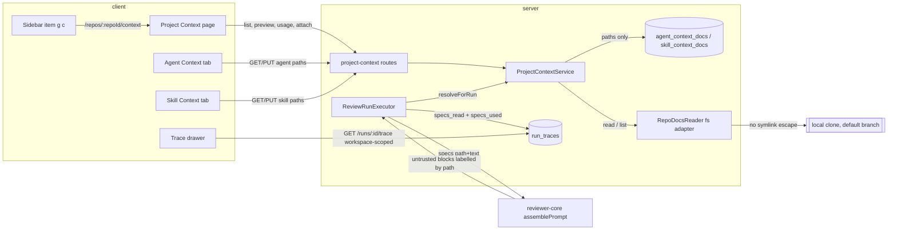

# Project Context (discovery, attachment, run-time injection, trace) — Implementation Plan

Date: 2026-10-03 · Branch: feature/l05-project-context · Status: draft

## Goal
Authors can browse every markdown document under the configured spec/docs/insights
roots (plus every `INSIGHTS.md`) of the active repository, see each one's token
cost, and attach documents to agents and skills. Every review run then reads the
attached documents from the PR's repository (default branch, last sync), puts them
into the prompt's `## Project context` section as path-labelled untrusted blocks
within a 4,000-token-per-document / 12,000-token-per-section budget, and records
in the trace which documents were read, their tokens and the full text sent.

## Context
- Request: one plan covering SPEC-01-project-context (`specs/01-project-context-2026-10-03.md`, packages server + client) and SPEC-02-context-injection (`specs/02-context-injection-2026-10-03.md`, packages server + reviewer-core + client; depends on SPEC-01). Both `Status: approved`, `## Open questions: none`.
- Revision 1 (2026-10-03): the user accepted R1 (sidebar item, now T010) and R5 (done outside this plan: `scripts/lint-plan.mjs` handles several specs).
- Both specs reuse AC numbers, so every citation below carries the spec prefix: "SPEC-01 AC20", "SPEC-02 AC8".
- INSIGHTS entries that apply (quoted in the tasks they constrain):
  - server/INSIGHTS.md — 2026-09-22 `setSkills` transaction template; 2026-09-22 new module needing another module's service trips `no-circular`; 2026-09-22 helpers↔repository row-type cycle in a new module; 2026-09-30 type-only cross-module import fails `no-cross-module-imports`; 2026-09-26 a new `executeRuns` step must be mocked in `appWith`; 2026-09-19 `waitForPrRuns` returns on timeout; 2026-09-29 a `running` run inserted before `buildApp()` is reaped; 2026-09-29 `^[\w.-]+\/[\w.-]+$` is not a traversal guard; 2026-09-25 `truncateSampleFile` cuts mid-codepoint; 2026-09-21 half the modules skip the documented anatomy; 2026-09-22 testcontainers flakiness.
  - client/INSIGHTS.md — 2026-09-26 `fireEvent` only (no user-event); 2026-09-21 `@messages/…` alias; 2026-09-21 `vi.mock` with alias paths; 2026-09-22 `Markdown` styles via `.dd-md`; 2026-09-22 `nav.ts` is editable config (a nav item is a data edit only; check `shell.json` `nav.*` first); 2026-09-23 active repo comes from `dd-repo`, not the last `/repos/:id`; 2026-09-21 `Modal` is not portaled; 2026-09-19 border shorthand vs `borderColor`; 2026-09-19 token counts through `formatTokenCount`; 2026-10-03 dot reporter.
  - INSIGHTS.md (root) — 2026-09-19 diff only the touched contract files; 2026-09-26 `typecheck` never covers `test/`; 2026-09-21 reviewer-core needs `node_modules` for a server typecheck; 2026-09-21 `zod/v4` imports compile.
- Spec invariants that apply: `server/specs/skills.md` S2 (active skill = on at both levels, `agent_skills.order`), S7 (workspace scoping → 404), S8 (best-effort enrichment); `server/specs/review-flow.md` "What one run does" step 1 (enrichment never fails a run) and invariant 6 (content-free `prompt.assembled`); `reviewer-core/specs/review-contract.md` (every optional slot omit-when-empty, purity rules, `INJECTION_GUARD` is a contract).
- Closest existing features followed: agent↔skill links (`server/src/modules/agents/repository.ts` `setSkills` / `activeSkillLinks`, `GET/PUT /agents/:id/skills`), skill blocks in the run (`server/src/modules/reviews/run-executor.ts` `buildSkillBlocks`, `skills_used` in `prompt_assembly`), the intent layer's narrow `IntentDeps` built by `server/src/platform/container.ts`, the agent editor Skills tab (`client/src/app/(shell)/agents/[id]/_components/AgentEditor/_components/SkillsTab/`), the Conventions page route shape and its repo-scoped nav item (`client/src/app/(shell)/repos/[repoId]/conventions/`, `href: "/repos/:repoId/conventions"` in `client/src/vendor/ui/nav.ts`).

## Requirements review
- **Already there:** the `## Project context` slot (`reviewer-core/src/prompt.ts`), rendered after `## Repo skeleton` and before `## Callers of changed symbols`, omit-when-empty (part of SPEC-02 AC5, SPEC-02 AC7); `wrapUntrusted` already rewrites a literal `</untrusted>` (SPEC-02 AC6 — kept, now pinned by a test); `PromptAssembly.specs` already stores the rendered section text and `PromptBlock` already offers copy and fullscreen (base for SPEC-02 AC13); `RunTrace.specs_read` exists (paths only); `POST /skills/tokens` and `container.tokenizer` give the single token counter (SPEC-01 AC17); `client/messages/en/shell.json` already holds the placeholder `nav.context: "Project Context"` (used by the command palette via `t("nav.<key>")`), so the sidebar item needs no i18n edit; `resolveHref` already replaces `:repoId` with the active repo id (`"_"` when none) in the sidebar `NavItem`, the `g`-shortcut handler and the command palette.
- **Contradictory with existing behaviour:** SPEC-02 AC15 says a cross-workspace run answers "not found", but `GET /runs/:id/trace` today ignores the workspace (`server/src/modules/reviews/routes.ts:128-133` calls `getRunTrace(runId)` with no `workspaceId`; `run_traces` has no `workspace_id`). T006 scopes it through `agent_runs.workspace_id`.
- **Missing in code (planned):** the untrusted label is `spec-<i>`, not the path (SPEC-02 AC5 → T003); no per-document token count or truncated flag in the trace (SPEC-02 AC11 → T001, T015); no truncate capability on `Tokenizer` (solved with a pure prefix search over `count`, T005); no path guard or symlink check on `GitClient.readFile` (new `RepoDocsReader` port, T004); no attachment tables (T002); no sidebar entry for the page (T010, accepted R1); no server route behind the client's placeholder `useContextFiles` (`GET /repos/:id/context`) — left untouched, new routes live under `/repos/:id/context/docs` so they cannot collide.
- **Unclear, settled as Assumptions below:** what the 12,000-token cap measures; what M is in "N of M attached"; when "the attachment list as it stood when the run started" is read for queued agents; case sensitivity of `.md` and root names; which folders discovery skips; very large files; maximum list length.
- **SPEC-01 coverage:** AC1 T005·T009·T014·T010 · AC2 T005·T010 · AC3 T009·T014·T010 · AC4 T009·T010·T011·T012 · AC5 T008·T010·T011·T012 · AC6 T009·T010·T011·T012 · AC7 T009·T010 · AC8 T011·T012 · AC9 T014·T011 · AC10 T002·T014 · AC11 T008·T011 · AC12 T011 · AC13 T009·T011 · AC14 T012·T014 · AC15 T014·T010 · AC16 T009·T014·T010 · AC17 T005·T008·T009 · AC18 T005·T008 · AC19 T009·T011·T012 · AC20 T005·T014 · AC21 T009·T011·T012 · AC22 T014 · AC23 T009·T014 · AC24 T009·T011 · AC25 T012.
- **SPEC-02 coverage:** AC1 T009·T015 · AC2 T009 · AC3 T009 · AC4 T005·T009 · AC5 T003·T015 · AC6 T003 · AC7 T003·T015 · AC8 T004·T009·T015 · AC9 T005·T009·T015 · AC10 T005·T009·T015 · AC11 T001·T015 · AC12 T013 · AC13 T013 · AC14 T001·T013 · AC15 T006.

## Assumptions
- A1 — Navigation: the sidebar gets `{ key: "context", label: "Project Context", icon: "FileText", href: "/repos/:repoId/context", gKey: "c" }` in the WORKSPACE group after Pull Requests, plus a `g c` row in `SHORTCUTS` (`c` is unused by every other `gKey`). The page lives at `/repos/:repoId/context`; both Context tabs keep an "Open Project Context" link to it, because an author editing an agent or skill otherwise has to leave the editor to find a document's details.
- A2 — The 12,000-token cap (SPEC-01 AC24, SPEC-02 AC10) is applied to the sum of the per-document token counts (each already capped at 4,000); the heading and `<untrusted>` wrappers are not counted. This is the only definition both the agent tab and the run can share exactly.
- A3 — Token counts are measured on the document text (after truncation), with `container.tokenizer.count` (js-tiktoken `cl100k_base`), never on the wrapped block, so the listing, the tabs and the trace show the same number for the same text.
- A4 — "N of M attached" (SPEC-01 AC12): N = the agent's own attached paths, M = all documents found in the repository (the listing's `total` without a filter), so it stays meaningful past the 500-row cap.
- A5 — "As it stood when the run started" (SPEC-02 AC1): the attachment list is read once per agent run, at the start of that run's `runOneAgent`, before the model call; later edits never reach it.
- A6 — Discovery matches `.md` and root folder names case-sensitively, skips `.git` and `node_modules` (hidden folders such as `.devdigest/` ARE walked), never follows symlinks while walking, and sorts paths with plain string order.
- A7 — The reader reads at most 512 KiB of a file; a longer file is clipped at a UTF-8 boundary and is always marked truncated (4,000 tokens is far below 512 KiB of text).
- A8 — Search roots come from `PROJECT_CONTEXT_ROOTS` (comma-separated folder names, default `specs,docs,insights`) in `server/src/platform/config.ts`.
- A9 — An attachment list holds at most 200 paths of at most 500 characters each; duplicates in a PUT keep the first position.
- A10 — The Project Context page keeps the selected document in component state, not in the URL (adding a query parameter would change `client/specs/pages.md`, which this plan does not edit).

## Recommendations
- R2 — Update `client/specs/pages.md` (route table: `/repos/:repoId/context`; `?tab=` gains `context` on the agent editor and the skill detail) and `server/specs/skills.md` (attachments, no version bump) after the feature ships — why: those are URL and behaviour contracts · cost: a spec edit the user must request (planner rule: specs are not task files).
- R3 — Cache the per-document token count by `(clone path, path, mtime, size)` — why: the listing reads and counts up to 500 files per request · cost: an in-memory cache with invalidation on resync; not needed until a real repository shows it is slow.
- R4 — Remove the dead `useContextFiles` / `useReindexContext` hooks and the `SpecFile` / `IndexStatus` placeholders once retrieval (chunks, reindex) is planned or dropped — why: they call routes that do not exist · cost: touches `client/src/lib/hooks/core.ts` and `client/src/lib/types.ts`; out of scope here.
- R6 — One e2e flow (attach a document on the agent Context tab, reload, see it ticked) — why: the only cross-package journey not covered by an integration test · cost: needs a seeded clone with a `docs/` file on the hermetic stack.

## Scope
- In: discovery + listing + preview + usage + attach/detach/reorder for agents and skills (SPEC-01 AC1–AC25); the Project Context page with its sidebar item and `g c` shortcut (accepted R1); run-time reading, budget, prompt section with path labels, Live Log lines, trace records and trace UI (SPEC-02 AC1–AC15); scoping `GET /runs/:id/trace` by workspace.
- Out (spec non-goals and this plan): automatic selection, chunking/embeddings/reindex, editing/creating/uploading documents, coverage score, editing roots from the UI, versioning attachments, reading from the PR head/base, findings/grounding/score changes, spec file edits (R2).

## Design

Rings (onion-architecture §2, §4):
- **Contracts (core)** — `server/src/vendor/shared/contracts/project-context.ts` (new) + its client twin; `trace.ts` gains `SpecUsed`. The new port `RepoDocsReader` goes into `server/src/vendor/shared/adapters.ts` (§4: an interface to an external system lives in the port catalogue). The client copy of `adapters.ts` is NOT changed: it already lacks server-only ports (`CommitFile`, `CommitFilesPayload`, the `openrouter` provider id) and no client file imports a port; `precheck` will report `contract-copy` for it, which is expected.
- **Infrastructure** — `server/src/adapters/repo-docs/fs.ts` (new, the only file doing filesystem I/O for this feature: walk without following symlinks, `realpath` containment check, 512 KiB cap, fatal UTF-8 decode); `MockRepoDocsReader` in `server/src/adapters/mocks.ts`; `server/src/modules/project-context/repository.ts` (new; Drizzle queries over the two new tables plus tenancy lookups on `agents`, `skills`, `repos`); `server/src/db/schema/project-context.ts` (new).
- **Domain (pure)** — `server/src/modules/project-context/helpers.ts` + `constants.ts` (new): `isDocPath`, `docTypeFor` (innermost root), `isAttachablePath` (SPEC-01 AC20), `truncateToTokens` (prefix binary search over an injected `count`), `orderAndDedupe`, `planSection` (12,000 cap, "that document and every later one"). One rule set, used by the listing, the tabs and the run.
- **Application** — `server/src/modules/project-context/service.ts` (new) with a narrow structural `ProjectContextDeps` (`repo`, `reader`, `count`, `roots`, `clonePathFor`, `activeSkills`), built by the container exactly like `IntentService` so `container.ts` ↔ service forms no cycle. The run executor reaches it only as `container.projectContext.resolveForRun(...)` (no cross-module import).
- **Presentation** — `server/src/modules/project-context/routes.ts` (new), registered in `server/src/modules/index.ts`.
- **Engine** — `reviewer-core` stays pure: `PromptParts.specs` / `ReviewInput.specs` become `ProjectSpec[]` (`{ path, content }`, resolved text); the label is the path, attribute-escaped inside `wrapUntrusted` (existing labels contain no escapable character, so every other section stays byte-identical).
- **Client** — data hooks in `client/src/lib/hooks/project-context.ts` (new); shared, domain-aware pieces used by three routes in `client/src/components/project-context/` (new; precedent `client/src/components/findings-preview`); the page under `client/src/app/(shell)/repos/[repoId]/context/` and its sidebar item (a data edit in `client/src/vendor/ui/nav.ts`; `NavItem`, `useGlobalShortcuts` and `useShellCommands` already render every `NAV` item through `resolveHref`); one `ContextTab` folder per editor; trace changes in the existing `RunTraceDrawer`.

### Contracts
New file, both copies: `server/src/vendor/shared/contracts/project-context.ts` (new) and `client/src/vendor/shared/contracts/project-context.ts` (new), exported from `server/src/vendor/shared/index.ts` and `client/src/vendor/shared/index.ts` (identical today):
- `ContextDoc = { path: string, type: string, tokens: number | null, truncated: boolean }` (`tokens` null when the file could not be read).
- `ContextDocList = { repo: { id, full_name }, status: 'ok' | 'not_cloned', roots: string[], documents: ContextDoc[] (≤500, path order), total: number (all matches) }`.
- `ContextDocContent = { path: string, content: string }`.
- `AttachedDoc = { path: string, type: string | null, found: boolean, tokens: number | null, truncated: boolean }`; `InheritedDoc = AttachedDoc & { skill_id: string, skill_name: string }`.
- `AgentContextDocs = { repo: { id, full_name, cloned: boolean }, own: AttachedDoc[], inherited: InheritedDoc[], total_tokens: number, cap_tokens: number, left_out: string[] }`.
- `SkillContextDocs = { repo: { id, full_name, cloned: boolean }, own: AttachedDoc[], total_tokens: number }`.
- `PutContextDocsBody = { paths: string[] (max 200, each 1–500 chars) }`, `AttachContextDocBody = { path: string }`, `ContextDocPaths = { paths: string[] }`.
- `ContextDocUsage = { agents: { id, name }[], skills: { id, name }[] }`.

Changed, both copies: `server/src/vendor/shared/contracts/trace.ts` and `client/src/vendor/shared/contracts/trace.ts` — new `SpecUsed = { path: string, tokens: int, truncated: boolean }`; `PromptAssembly` gains `specs_used: z.array(SpecUsed).nullish()` and `specs_tokens: z.number().int().nullish()` (the S9 `skills_used` precedent). `RunTrace.specs_read` stays `string[]` (paths), so every stored trace still parses (SPEC-02 AC14).

Port (server copy only, see Design): `RepoDocsReader { listMarkdown(root): Promise<string[] | null>; read(root, path): Promise<{ ok: true, text, clipped } | { ok: false, reason: 'missing' | 'outside_clone' | 'not_utf8' | 'unreadable' }> }`; `null` from `listMarkdown` and a missing root on `read` mean "not cloned".

Endpoints (all workspace-scoped; another workspace's id → 404):

| Method | Path | Body / query | Returns |
|---|---|---|---|
| GET | `/repos/:id/context/docs` | `?q=` | `ContextDocList` |
| GET | `/repos/:id/context/docs/content` | `?path=` | `ContextDocContent` (422 on a non-attachable path, 404 when missing / not cloned) |
| GET | `/context-docs/usage` | `?path=` | `ContextDocUsage` |
| GET | `/agents/:id/context-docs` | `?repo_id=` | `AgentContextDocs` |
| PUT | `/agents/:id/context-docs` | `PutContextDocsBody` | `ContextDocPaths` |
| POST | `/agents/:id/context-docs` | `AttachContextDocBody` (append if absent) | `ContextDocPaths` |
| GET | `/skills/:id/context-docs` | `?repo_id=` | `SkillContextDocs` |
| PUT | `/skills/:id/context-docs` | `PutContextDocsBody` | `ContextDocPaths` |
| POST | `/skills/:id/context-docs` | `AttachContextDocBody` | `ContextDocPaths` |

### Database
New file `server/src/db/schema/project-context.ts`, exported from `server/src/db/schema.ts` (barrel + `schema` object). Migration only from `cd server && pnpm run db:generate` (adds two tables, drops nothing, so drizzle-kit asks no rename question).
- `agent_context_docs`: `workspace_id uuid NOT NULL → workspaces.id ON DELETE CASCADE`, `agent_id uuid NOT NULL → agents.id ON DELETE CASCADE`, `path text NOT NULL`, `position integer NOT NULL`, `created_at timestamptz NOT NULL DEFAULT now()`; PK `(agent_id, path)`; index `agent_context_docs_ws_path_idx (workspace_id, path)` for the usage query.
- `skill_context_docs`: same with `skill_id uuid NOT NULL → skills.id ON DELETE CASCADE`; PK `(skill_id, path)`; index `skill_context_docs_ws_path_idx (workspace_id, path)`.
- Only the path is stored, never text (SPEC-01 AC10). No version column is touched (SPEC-01 AC22).

## Global constraints
- Zod 3 only (`^3.24`); never `zod/v4`, `zod/mini`, `z.strictObject`, top-level `z.email()`.
- No do-not-touch path: `server/src/db/migrations/**` only through `pnpm run db:generate`; `client/src/vendor/ui/**` stays untouched except `client/src/vendor/ui/nav.ts` (data registry, edited by T010 only).
- Tests per `TESTING.md`: typological — one happy path plus the edge that matters; DB-backed tests are `*.it.test.ts`; client tests use `fireEvent`.
- Document text never appears in a server log line, a `prompt.assembled` record or an error message; logs carry paths, counts, sizes and reason codes only.
- Every new user-facing string goes through next-intl; the `context` namespace keys are all added by T008; `client/messages/en/shell.json` is not edited (its `nav.context` placeholder already exists).
- Project context is best-effort: no failure to list, read or render documents fails a run.

## Tasks

### Wave 0 — foundation (sequential)

#### T001 — Shared contracts: project-context payloads and per-document trace records
- Area: backend
- Agent: implementer
- Depends on: —
- Files (exclusive):
  - `server/src/vendor/shared/contracts/project-context.ts` (new)
  - `client/src/vendor/shared/contracts/project-context.ts` (new)
  - `server/src/vendor/shared/index.ts` (modified)
  - `client/src/vendor/shared/index.ts` (modified)
  - `server/src/vendor/shared/contracts/trace.ts` (modified)
  - `client/src/vendor/shared/contracts/trace.ts` (modified)
  - `server/test/contracts.test.ts` (modified)
- Skills: zod → Schema Definition, Type Inference, Object Schemas (Zod 3 caveat); typescript-expert → Code Review Checklist; onion-architecture → §2 rings table, §4 Where does X go
- Rules (applied by the agent instead of loading the skills; 5–15 lines):
  - Contracts import only `zod` and sibling contract files; no server, client or Drizzle import — onion-architecture §2 (Contracts + ports row)
  - A schema the client also reads lives in `vendor/shared/contracts/` and the client twin gets the identical text — onion-architecture §4 Where does X go
  - Export every schema together with its `z.infer` type of the same name, as the existing contracts do — zod §type-export-schemas-and-types
  - New fields on a stored jsonb document (`specs_used`, `specs_tokens`) are `.nullish()`, never required, so traces written before them still parse — zod §object-optional-vs-nullable
  - Use `z.enum([...])` for the fixed `status` set (`'ok' | 'not_cloned'`) — zod §schema-use-enums
  - Put length limits on the request schemas (`paths` max 200, each string min 1 max 500) at definition time — zod §schema-string-validations
  - Integer counts use `z.number().int()`; nullable counts are `.nullable()` where the key is always present — zod §schema-use-primitives-correctly
  - No `any`, no unchecked `as` casts in the new files — typescript-expert §Code Review Checklist
  - Zod 3 API only; no Zod-4-only helpers (`zod/mini`, `z.strictObject`, top-level `z.email()`) — zod §Schema Definition (Zod 3 subset, routing.md Zod 3 caveat)
- Steps:
  1. Test first in `server/test/contracts.test.ts`: (a) a `RunTrace` without `specs_used` / `specs_tokens` (the shape of a pre-feature trace, e.g. the existing fixture with `specs_read: ['specs/security-baseline.md']`) still parses; (b) a trace with `prompt_assembly.specs_used: [{ path: 'docs/api.md', tokens: 4000, truncated: true }]` parses and keeps order; (c) `PutContextDocsBody` rejects 201 paths and an empty string.
  2. Write `contracts/project-context.ts` with the shapes in Design › Contracts; add `export * from './contracts/project-context.js';` to both `index.ts` files.
  3. Add `SpecUsed`, `specs_used`, `specs_tokens` to `PromptAssembly` in both `trace.ts` copies (keep the two existing comment differences as they are).
  4. Diff only the touched pairs: `for f in contracts/project-context.ts contracts/trace.ts index.ts; do diff -q server/src/vendor/shared/$f client/src/vendor/shared/$f; done` — only `contracts/trace.ts` may differ, and only in its two pre-existing comments.
- Acceptance criteria:
  - SPEC-02 AC11: the trace contract can carry, per document, path, token count and truncated flag, in an ordered array.
  - SPEC-02 AC14: a trace stored before this feature (no `specs_used`) still parses through `RunTrace`.
  - Both contract copies export the same project-context schemas; `trace.ts` copies differ only in the two pre-existing comments.
- Verify (one line per touched package; add task-specific checks below it):
  - `scripts/verify-task.sh server server/src/vendor/shared/contracts/project-context.ts server/src/vendor/shared/index.ts server/src/vendor/shared/contracts/trace.ts server/test/contracts.test.ts`
  - `scripts/verify-task.sh client client/src/vendor/shared/contracts/project-context.ts client/src/vendor/shared/index.ts client/src/vendor/shared/contracts/trace.ts`
  - `for f in contracts/project-context.ts index.ts; do diff -q server/src/vendor/shared/$f client/src/vendor/shared/$f; done` (silent)
- Constraints (quoted, not just referenced — the agent does not read the whole INSIGHTS file):
  - "`diff -r` over the two `vendor/shared` copies is NOT a drift gate." — Rule: after changing a contract, diff ONLY the files you touched — `for f in findings.ts platform.ts; do diff -q server/src/vendor/shared/contracts/$f client/src/vendor/shared/contracts/$f; done` — and expect that check to be silent. — `INSIGHTS.md` (2026-09-19)
  - "The installed zod 3.25 exports `zod/v4`, so the 'Zod 3, not 4' rule is not enforced by the compiler." — Rule: treat any `zod/v4`, `zod/mini` or `@zod/*` import as a violation. — `INSIGHTS.md` (2026-09-21)
  - "`typecheck` in `server/` and `reviewer-core/` never type-checks `test/`" — Rule: after writing or editing tests, type-check them separately with a scratch tsconfig that `extends` the package one, keeps `src/**` and adds `test/**`. — `INSIGHTS.md` (2026-09-26)
  - SPEC-02 Non-functional › Contract reach: "traces already stored must still parse".

#### T002 — DB schema: agent and skill context-document tables + generated migration
- Area: backend
- Agent: implementer
- Depends on: —
- Files (exclusive):
  - `server/src/db/schema/project-context.ts` (new)
  - `server/src/db/schema.ts` (modified)
  - `server/src/db/migrations/0016_*.sql` (generated by `pnpm run db:generate`)
  - `server/src/db/migrations/meta/_journal.json` (generated by db:generate)
  - `server/src/db/migrations/meta/0016_snapshot.json` (generated by db:generate)
- Skills: postgresql-table-design → Core Rules, Constraints, Indexing; drizzle-orm-patterns → references/schema-definition.md (Composite Primary Key, Indexes and Constraints); onion-architecture → §2 rings table
- Rules (applied by the agent instead of loading the skills; 5–15 lines):
  - Both tables carry `workspace_id uuid NOT NULL` referencing `workspaces.id` with `onDelete: 'cascade'` — postgresql-table-design §Constraints (+ server/CLAUDE.md tenancy convention)
  - Owner FKs (`agent_id` → `agents.id`, `skill_id` → `skills.id`) are NOT NULL with `onDelete: 'cascade'`, declared with arrow functions — drizzle-orm-patterns §Constraints and Warnings
  - The primary key is the composite `(agent_id, path)` / `(skill_id, path)` via `primaryKey({ columns: [...] })`, which also enforces one row per path — drizzle-orm-patterns §references/schema-definition.md Composite Primary Key
  - Add the B-tree index `(workspace_id, path)` on each table for the usage lookup; the PK already covers the by-owner reads (leftmost prefix) — postgresql-table-design §Indexing
  - `path text NOT NULL`, `position integer NOT NULL`, `created_at` via the shared `now()` helper (`timestamptz NOT NULL DEFAULT now()`); no `varchar(n)`, no `timestamp` without zone — postgresql-table-design §Core Rules / §Data Types
  - Store the path only, never document text — postgresql-table-design §Core Rules (normalize; no redundant copies) + SPEC-01 AC10
  - Export the new tables from the `db/schema.ts` barrel and add them to the `schema` object; nothing else imports the schema file directly — onion-architecture §2 (Infrastructure row)
  - Generate the migration with `pnpm run db:generate`; never write or edit SQL under `src/db/migrations/` — onion-architecture §2 (+ server/CLAUDE.md Non-default conventions)
- Steps:
  1. Acceptance check first (no unit test fits a schema file; the tables are exercised by T014's and T015's `.it.test.ts`): after generating, a second `pnpm run db:generate` must report no schema changes.
  2. Write `server/src/db/schema/project-context.ts` (`agentContextDocs`, `skillContextDocs`) importing `agents` from `./agents`, `skills` from `./skills`, `workspaces` from `./core`, `now` from `./_shared`.
  3. Export from `server/src/db/schema.ts` and add both to `schema`.
  4. `cd server && pnpm run db:generate`; check the SQL creates exactly the two tables, two FKs each to the owner plus workspace, the composite PKs and the two indexes.
- Acceptance criteria:
  - SPEC-01 AC10: the attachment tables hold a repository-relative `path` column and no text column.
  - One new migration exists; a repeated `pnpm run db:generate` produces nothing new.
- Verify (one line per touched package; add task-specific checks below it):
  - `scripts/verify-task.sh server server/src/db/schema/project-context.ts server/src/db/schema.ts`
  - `cd server && pnpm run db:generate` (second run: no new migration file)
- Constraints (quoted, not just referenced — the agent does not read the whole INSIGHTS file):
  - "A single `pnpm db:generate` that both DROPS a column and ADDS several new ones on the same table triggers an interactive 'is this a rename?' prompt" — Rule: split the change into two `db:generate` passes … Never try to answer the prompt; restructure the schema edit instead. — `server/INSIGHTS.md` (2026-09-22) (this task only adds tables; if a prompt appears, something else changed — stop and report)
  - "Grepping `pgTable('name'` silently UNDERCOUNTS the schema." — Rule: to enumerate tables, match BOTH shapes … or read the barrel `src/db/schema.ts` and each file's exports. — `server/INSIGHTS.md` (2026-09-20)
  - server/CLAUDE.md: "The schema already contains every table. The empty ones belong to later course lessons — do not 'clean them up'." (`code_chunks.source docs|spec` stays untouched.)

### Wave 1 — parallel

#### T003 [P] — reviewer-core: project-context documents labelled by path
- Area: backend
- Agent: implementer
- Depends on: —
- Files (exclusive):
  - `reviewer-core/src/prompt.ts` (modified)
  - `reviewer-core/src/review/run.ts` (modified)
  - `reviewer-core/src/index.ts` (modified)
  - `reviewer-core/test/prompt.test.ts` (modified)
  - `server/test/prompt-structured.test.ts` (modified)
  - `server/test/prompt-callers.test.ts` (modified)
  - `server/test/prompt-log.test.ts` (modified)
- Skills: onion-architecture → §2 note on reviewer-core; reviewer-core/CLAUDE.md; typescript-expert → Code Review Checklist; security → Agentic AI Security, A05 Injection
- Rules (applied by the agent instead of loading the skills; 5–15 lines):
  - reviewer-core receives resolved text only (`ProjectSpec { path; content }`) and does no filesystem, DB or env access — onion-architecture §2 (reviewer-core is the purest ring)
  - Every optional slot stays omit-when-empty: `specs` undefined or `[]` yields messages byte-identical to today — onion-architecture §2 (+ reviewer-core/CLAUDE.md Non-default conventions)
  - Each document is wrapped with `wrapUntrusted(<path>, content)`; the label is escaped for an XML attribute (`&` `"` `<` `>`) inside `wrapUntrusted`, which leaves every existing static label byte-identical — security §A05 Injection
  - Keep the `</untrusted>` neutralisation in `wrapUntrusted` and pin it with a test using a document whose text contains `</untrusted>` — security §Agentic AI Security (ASI01 Goal Hijacking)
  - Do not edit `INJECTION_GUARD` and add no keyword/denylist scanning of document text — onion-architecture §2 note on reviewer-core (+ reviewer-core/CLAUDE.md)
  - `sections` meta for `specs` stays content-free: `items` = document count, `itemDetail` measured on each document's content — onion-architecture §2 (+ review-contract.md promptMeasure)
  - Export the new `ProjectSpec` type from `src/index.ts` with `type` — typescript-expert §Code Review Checklist (Module System)
  - No `any` and no non-null assertions on parsed input in changed code — typescript-expert §Code Review Checklist (Type Safety)
- Steps:
  1. Tests first in `reviewer-core/test/prompt.test.ts`: (a) two specs render `<untrusted source="docs/api.md">` and `<untrusted source="specs/a&quot;b.md">` in order inside `## Project context`, after `## Repo skeleton`, before `## Callers of changed symbols`; (b) a document containing `</untrusted>` cannot close its block; (c) `specs: []` and `specs: undefined` give messages identical to a call without the key; update the existing `allSlots` fixture to objects.
  2. Change `PromptParts.specs` and `ReviewInput.specs` to `ProjectSpec[]`; render labels from `path`; pass `content` strings as `entries`.
  3. Update the three server tests that build `specs: ['…']` to `specs: [{ path: 'specs/security-baseline.md', content: '…' }]` and keep their assertions (the `CANARY_SPEC_TEXT` must still never reach the log record).
- Acceptance criteria:
  - SPEC-02 AC5: each document sits in its own untrusted block whose `source` attribute is its repository-relative path, in one `## Project context` section after the repo skeleton and before the callers.
  - SPEC-02 AC6: a document containing `</untrusted>` stays inside its block.
  - SPEC-02 AC7: with no documents the assembled prompt is byte-identical to the prompt without the slot.
- Verify (one line per touched package; add task-specific checks below it):
  - `scripts/verify-task.sh reviewer-core reviewer-core/src/prompt.ts reviewer-core/src/review/run.ts reviewer-core/src/index.ts reviewer-core/test/prompt.test.ts`
  - `scripts/verify-task.sh server server/test/prompt-structured.test.ts server/test/prompt-callers.test.ts server/test/prompt-log.test.ts`
- Constraints (quoted, not just referenced — the agent does not read the whole INSIGHTS file):
  - reviewer-core/CLAUDE.md: "`INJECTION_GUARD` in `src/prompt.ts` is the single trusted defense against prompt injection. Do **not** add keyword or denylist scanning of untrusted text."
  - reviewer-core/CLAUDE.md: "Optional prompt slots (`skills`, `memory`, `specs`, `callers`, `repoMap`, `prDescription`) must stay omit-when-empty."
  - "`server` typecheck fails inside `../reviewer-core` when reviewer-core has no `node_modules`." — Rule: before trusting a server typecheck in a new checkout, run `npm install` in `reviewer-core/` as well. — `INSIGHTS.md` (2026-09-21)
  - "`typecheck` in `server/` and `reviewer-core/` never type-checks `test/`" — Rule: after writing or editing tests, type-check them separately with a scratch tsconfig. — `INSIGHTS.md` (2026-09-26)

#### T004 [P] — RepoDocsReader port, filesystem adapter and mock
- Area: backend
- Agent: implementer
- Depends on: —
- Files (exclusive):
  - `server/src/vendor/shared/adapters.ts` (modified)
  - `server/src/adapters/repo-docs/fs.ts` (new)
  - `server/src/adapters/mocks.ts` (modified)
  - `server/test/repo-docs-fs.test.ts` (new)
- Skills: onion-architecture → §4, §5 Infrastructure, §11; security → Framework Security Quirks, File Upload Security (path traversal), A05; typescript-expert → Code Review Checklist
- Rules (applied by the agent instead of loading the skills; 5–15 lines):
  - The interface `RepoDocsReader` goes in `vendor/shared/adapters.ts`; the implementation in `adapters/repo-docs/fs.ts`; a `MockRepoDocsReader` in `adapters/mocks.ts` — onion-architecture §11 (new external system → port + mock)
  - The adapter imports only node built-ins and `@devdigest/shared`; never a service, route, module or the container — onion-architecture §5 Infrastructure
  - `listMarkdown` walks with `readdir({ withFileTypes: true })`, skips every symlink entry, skips `.git` and `node_modules`, returns posix repo-relative paths of files ending `.md`, sorted, and `null` when the root does not exist — onion-architecture §5 Infrastructure (pattern of `modules/repo-intel/pipeline/walk.ts`)
  - `read` rejects absolute paths, `..` segments, NUL and backslash before touching the disk, then resolves `realpath(root/path)` and requires it to start with `realpath(root) + sep`; otherwise `reason: 'outside_clone'` — security §File Upload Security (validate `path.resolve()` stays inside the directory)
  - Never `path.join(root, userPath)` without that containment check — security §Framework Security Quirks (path.join allows traversal)
  - Read at most 512 KiB; when clipped, drop an incomplete trailing UTF-8 sequence, then decode with `new TextDecoder('utf-8', { fatal: true })`; a decode error is `reason: 'not_utf8'`, ENOENT is `'missing'`, anything else `'unreadable'` — security §A05 Injection (untrusted file content)
  - Errors and results never carry file content in a message — security §A09 Logging and Alerting
  - Discriminated union results (`ok: true | false`), no thrown errors for expected failures — typescript-expert §Code Review Checklist (Error Handling Patterns)
  - The client copy `client/src/vendor/shared/adapters.ts` is NOT edited (server-only port; the client copy already omits server-only ports) — onion-architecture §4 (ports are a server concern)
- Steps:
  1. Test first, `server/test/repo-docs-fs.test.ts` (hermetic, `mkdtemp` under `os.tmpdir()`): a tree with `docs/a.md`, `.devdigest/specs/b.md`, `node_modules/x/docs/c.md`, a symlink `docs/evil.md → <outside file>`, a Latin-1 `docs/bin.md`; assert `listMarkdown` returns `['.devdigest/specs/b.md', 'docs/a.md', 'docs/bin.md']` (no symlink, no node_modules), `read('docs/evil.md')` → `outside_clone`, `read('docs/bin.md')` → `not_utf8`, `read('docs/none.md')` → `missing`, `read('../x.md')` → `outside_clone`, missing root → `listMarkdown` null.
  2. Add the port and its result types to `server/src/vendor/shared/adapters.ts`.
  3. Implement `FsRepoDocsReader` in `server/src/adapters/repo-docs/fs.ts`.
  4. Add `MockRepoDocsReader({ cloned = true, files: Record<string, string | { reason } > })` to `server/src/adapters/mocks.ts`.
- Acceptance criteria:
  - SPEC-02 AC8: a missing, unreadable, non-UTF-8 or outside-the-clone document yields a distinct reason code and no text.
  - Discovery returns the inputs SPEC-01 AC1 filters (every `.md` under the clone, symlinks and `.git`/`node_modules` excluded).
- Verify (one line per touched package; add task-specific checks below it):
  - `scripts/verify-task.sh server server/src/vendor/shared/adapters.ts server/src/adapters/repo-docs/fs.ts server/src/adapters/mocks.ts server/test/repo-docs-fs.test.ts`
- Constraints (quoted, not just referenced — the agent does not read the whole INSIGHTS file):
  - "`truncateSampleFile`'s byte cap is NOT strict, despite its comment." — Rule: do not … rely on C1's per-file cap as an exact bound … Fixing it means backing off to a codepoint boundary before `toString`. — `server/INSIGHTS.md` (2026-09-25) (do the backing-off here)
  - "`^[\w.-]+\/[\w.-]+$` is NOT a path-traversal guard for `owner/name`." — Rule: dot-only segments need an explicit check; never re-derive the short form. — `server/INSIGHTS.md` (2026-09-29)
  - SPEC-02 Untrusted inputs: "Symlinks and paths that resolve outside the local copy at read time — not read; logged with a reason (AC8)."
  - Root `CLAUDE.md`: "Contracts have one canonical home: `server/src/vendor/shared`." (client copy intentionally unchanged for this server-only port; `precheck` `contract-copy` is expected.)

#### T005 [P] — Pure rules: discovery, type tag, attachable path, truncation, ordering and budget
- Area: backend
- Agent: implementer
- Depends on: —
- Files (exclusive):
  - `server/src/modules/project-context/helpers.ts` (new)
  - `server/src/modules/project-context/constants.ts` (new)
  - `server/test/project-context-helpers.test.ts` (new)
- Skills: onion-architecture → §2, §5 Domain, §8; security → A05, Framework Security Quirks; typescript-expert → Code Review Checklist
- Rules (applied by the agent instead of loading the skills; 5–15 lines):
  - Helpers are pure TypeScript: no I/O, no `process.env`, no Drizzle/Fastify/container import; the token counter arrives as a `count: (text: string) => number` parameter — onion-architecture §5 Domain
  - `helpers.ts` declares the row shapes it needs locally (no import from `./repository.js`) — onion-architecture §3 (+ INSIGHTS constraint below)
  - `constants.ts` holds `DEFAULT_ROOTS = ['specs','docs','insights']`, `MAX_LISTED_DOCS = 500`, `DOC_TOKEN_CAP = 4000`, `SECTION_TOKEN_CAP = 12000`, `MAX_ATTACHED_PATHS = 200`, `MAX_PATH_LENGTH = 500` — onion-architecture §4 (constants beside their module)
  - `isDocPath(path, roots)`: ends with `.md` and some directory segment equals a root, or the basename is exactly `INSIGHTS.md`; `docTypeFor` returns the innermost root segment, else `'insights'` — onion-architecture §5 Domain
  - `isAttachablePath` rejects absolute paths, any `..` or `.` segment, empty segments, backslash, NUL, length > 500, and anything `isDocPath` rejects — security §Framework Security Quirks (path traversal)
  - `truncateToTokens(text, max, count)` returns `{ text, tokens, truncated }`; when over `max` it binary-searches the longest prefix with `count(prefix) ≤ max` and never cuts a surrogate pair — onion-architecture §5 Domain
  - `orderAndDedupe(own, skills[])` concatenates agent paths then each skill's paths in the given order and keeps each path's first position — onion-architecture §5 Domain
  - `planSection(entries, cap)` keeps entries while the running sum stays ≤ cap and returns the first entry that would exceed it plus every later one as `leftOut` — onion-architecture §5 Domain
  - Unit tests need no DB, no container — onion-architecture §8 Testing by ring
  - No `any`; exhaustive handling of the reason union — typescript-expert §Code Review Checklist
- Steps:
  1. Tests first, `server/test/project-context-helpers.test.ts`: `docs/specs/x.md` → `specs` (EC3); `server/INSIGHTS.md` → `insights` (EC4); `notes/x.md` is not a doc; `../../etc/passwd.md`, `/abs/path.md`, `specs/notes.txt`, `specs/./a.md` rejected (EC11); 10,000-token text truncates to ≤ 4,000 tokens with `truncated: true` (EC6, with a char-length counter); dedupe keeps the agent position (EC7); `planSection([5000, 4000, 2000, 3000, 1000], 12000)` keeps the first three and leaves out the last two (EC13, EC14).
  2. Implement `constants.ts` and `helpers.ts`.
- Acceptance criteria:
  - SPEC-01 AC1 / SPEC-01 AC2: path matching and innermost-root type tag behave as specified, `INSIGHTS.md` outside every root is `insights`.
  - SPEC-01 AC17 / SPEC-01 AC18: a document is counted with the injected counter and as at most 4,000 tokens, flagged truncated when cut.
  - SPEC-01 AC20: the four rejected path shapes of EC11 fail `isAttachablePath`.
  - SPEC-02 AC4, SPEC-02 AC9, SPEC-02 AC10: dedupe at first position, 4,000-token cut, 12,000-token cap leaving out the document and every later one.
- Verify (one line per touched package; add task-specific checks below it):
  - `scripts/verify-task.sh server server/src/modules/project-context/helpers.ts server/src/modules/project-context/constants.ts server/test/project-context-helpers.test.ts`
- Constraints (quoted, not just referenced — the agent does not read the whole INSIGHTS file):
  - "Copying `agents/helpers.ts`'s `import type {XRow} from './repository.js'` shape into a NEW module trips `arch:check`'s `no-circular` rule." — Rule: in a new module, declare the row shape `helpers.ts` needs as a local structural interface. — `server/INSIGHTS.md` (2026-09-22)
  - "`^[\w.-]+\/[\w.-]+$` is NOT a path-traversal guard for `owner/name`." — Rule: dot-only segments need an explicit negative check. — `server/INSIGHTS.md` (2026-09-29)
  - SPEC-01 AC2: "`docs/specs/x.md` → `specs`, and `insights` for an `INSIGHTS.md` file outside every search root."
  - SPEC-02 AC10: "leave out that document and every later one".

#### T006 [P] — Scope `GET /runs/:id/trace` by workspace
- Area: backend
- Agent: implementer
- Depends on: —
- Files (exclusive):
  - `server/src/modules/reviews/repository/run.repo.ts` (modified)
  - `server/src/modules/reviews/repository.ts` (modified)
  - `server/src/modules/reviews/service.ts` (modified)
  - `server/src/modules/reviews/routes.ts` (modified)
  - `server/test/runs-get.it.test.ts` (modified)
- Skills: onion-architecture → §5 Presentation/Application/Infrastructure, §11; drizzle-orm-patterns → references/queries-joins-aggregations.md (Joins); fastify-best-practices → rules/routes.md, rules/error-handling.md; security → A01
- Rules (applied by the agent instead of loading the skills; 5–15 lines):
  - `getRunTrace(db, workspaceId, runId)` joins `run_traces` to `agent_runs` on `run_id` and filters `agent_runs.workspace_id = workspaceId`; the join IS the tenancy boundary — drizzle-orm-patterns §references/queries-joins-aggregations.md Joins
  - Every repository read of a domain table takes `workspaceId` — onion-architecture §5 Infrastructure
  - Patch the `getRunTrace` signature on the facade `repository.ts` AND in `repository/run.repo.ts` in the same change — onion-architecture §5 Infrastructure (+ INSIGHTS constraint)
  - The route resolves `workspaceId` with `getContext`, calls one service method and throws `NotFoundError` when nothing comes back; no `reply.code()` — fastify-best-practices §rules/error-handling.md Async Error Handling
  - Another workspace's run id answers 404 exactly like an unknown id (no existence leak) — security §A01 Broken Access Control
  - Service methods take `workspaceId` explicitly and pass it down — onion-architecture §5 Application
  - The integration test is `*.it.test.ts` and drives the route through `app.inject` — onion-architecture §8 Testing by ring
- Steps:
  1. Test first in `server/test/runs-get.it.test.ts`: insert a `run_traces` row for the existing own done run and for `foreignRunId`; `GET /runs/<own>/trace` → 200, `GET /runs/<foreign>/trace` → 404.
  2. Change `run.repo.ts` `getRunTrace`, the facade, `ReviewService.getRunTrace(workspaceId, runId)` and the route.
- Acceptance criteria:
  - SPEC-02 AC15: a trace of a run in another workspace answers "not found" and reveals no document.
- Verify (one line per touched package; add task-specific checks below it):
  - `scripts/verify-task.sh server --it server/src/modules/reviews/repository/run.repo.ts server/src/modules/reviews/repository.ts server/src/modules/reviews/service.ts server/src/modules/reviews/routes.ts server/test/runs-get.it.test.ts`
- Constraints (quoted, not just referenced — the agent does not read the whole INSIGHTS file):
  - "`completeAgentRun`'s value type is declared TWICE." — Rule: when extending any repository facade method, patch BOTH declarations. — `server/INSIGHTS.md` (2026-09-19)
  - "A `status: 'running'` run inserted before `buildApp()` comes back as `failed`." — Rule: in a `*.it.test.ts`, insert any `running` run AFTER `buildApp()` has resolved. — `server/INSIGHTS.md` (2026-09-29)
  - "`pnpm exec vitest run .it.test` is flaky in a sandboxed shell" — Rule: set `TESTCONTAINERS_RYUK_DISABLED=true` for the run, `docker rm -f` any leaked container, and just retry on `CONNECT_TIMEOUT` / `Failed to connect to Reaper`. — `server/INSIGHTS.md` (2026-09-22, Confidence: low)

#### T007 [P] — Client data layer: project-context hooks and cache keys
- Area: frontend
- Agent: implementer
- Depends on: T001
- Files (exclusive):
  - `client/src/lib/hooks/project-context.ts` (new)
  - `client/src/lib/hooks/project-context.test.tsx` (new)
  - `client/src/lib/hooks/keys.ts` (modified)
  - `client/src/lib/hooks/index.ts` (modified)
- Skills: frontend-ui-architecture → §3, §4, §6; react-best-practices → Data Fetching, State Management; react-testing-library → Mocking Strategies, Async Testing; client/docs/ui-architecture.md (cache keys, error-UX taxonomy)
- Rules (applied by the agent instead of loading the skills; 5–15 lines):
  - All requests go through `api` from `src/lib/api.ts`; no `fetch` anywhere — frontend-ui-architecture §4 Where business logic lives
  - Every cache key comes from `keys.ts`: add `contextDocs(repoId, q)`, `contextDoc(repoId, path)`, `contextDocUsage(path)`, `contextDocUsageAll()`, `agentContextDocs(agentId, repoId)`, `agentContextDocsAll()`, `skillContextDocs(skillId, repoId)` — frontend-ui-architecture §3 Where does X go (query keys stay with the feature data layer)
  - Hooks: `useContextDocs`, `useContextDoc`, `useContextDocUsage`, `useAgentContextDocs`, `useSetAgentContextDocs`, `useAttachDocToAgent`, `useSkillContextDocs`, `useSetSkillContextDocs`, `useAttachDocToSkill`; queries are `enabled` only when every id is present — react-best-practices §Data Fetching
  - Query strings are built with `URLSearchParams` (`q`, `path`, `repo_id`), never string concatenation of raw input — security §A05 Injection (URLs built from input)
  - `useSetAgentContextDocs` updates `own` optimistically and rolls back on error, like `useSetAgentSkills`; on settle it invalidates `agentContextDocs(agentId, *)` and `contextDocUsageAll()` — frontend-ui-architecture §4 Where business logic lives (server state lives in its cache)
  - `useSetSkillContextDocs` / `useAttachDocToSkill` also invalidate `agentContextDocsAll()` because inherited documents changed — frontend-ui-architecture §4 Where business logic lives (invalidate the cache, never mirror it)
  - Mutation hooks never copy server state into `useState` — react-best-practices §Derive, Don't Store
  - Tests mock the module with its alias (`vi.mock("@/lib/api", …)`) and wrap hooks in a fresh `QueryClientProvider` — react-testing-library §Mocking Strategies
- Steps:
  1. Test first, `client/src/lib/hooks/project-context.test.tsx`: `useContextDocs("r1", "api docs")` calls `api.get("/repos/r1/context/docs?q=api+docs")`; `useSetAgentContextDocs("a1","r1").mutate(["docs/a.md"])` calls `api.put("/agents/a1/context-docs", { paths: ["docs/a.md"] })` and then invalidates the agent context key (assert with `waitFor` on a second `api.get`).
  2. Add the keys, the hooks file and `export * from "./project-context";` to the barrel.
- Acceptance criteria:
  - SPEC-01 AC9 / SPEC-01 AC14 data path: a save sends the full ordered `paths` list; SPEC-01 AC19: after a change the agent/skill context query is refetched without a reload.
- Verify (one line per touched package; add task-specific checks below it):
  - `scripts/verify-task.sh client client/src/lib/hooks/project-context.ts client/src/lib/hooks/project-context.test.tsx client/src/lib/hooks/keys.ts client/src/lib/hooks/index.ts`
- Constraints (quoted, not just referenced — the agent does not read the whole INSIGHTS file):
  - "Moving a component folder breaks `vi.mock("../../…/lib/hooks/x")` in its test" — Rule: mock module paths with the alias (`vi.mock("@/lib/hooks/reviews", …)`). — `client/INSIGHTS.md` (2026-09-21)
  - "A green client vitest run is mostly noise with the default reporter." — Rule: in agent verification steps run `pnpm exec vitest run <files> --reporter=dot --silent`. — `client/INSIGHTS.md` (2026-10-03)
  - client/CLAUDE.md: "All data goes through `src/lib/hooks/*` on top of `src/lib/api.ts`."
  - `client/src/lib/hooks/keys.ts` header: "The array VALUES are part of the cache contract … never change a shape here without changing every reader and invalidator with it." (add keys only; change none)

#### T008 [P] — Client shared project-context components + `context` i18n namespace
- Area: frontend
- Agent: implementer
- Depends on: T001
- Files (exclusive):
  - `client/src/components/project-context/helpers.ts` (new)
  - `client/src/components/project-context/helpers.test.ts` (new)
  - `client/src/components/project-context/DocTypeTag.tsx` (new)
  - `client/src/components/project-context/TokenEstimate.tsx` (new)
  - `client/src/components/project-context/DocPreview.tsx` (new)
  - `client/src/components/project-context/AttachableDocList.tsx` (new)
  - `client/src/components/project-context/AttachableDocList.test.tsx` (new)
  - `client/src/components/project-context/styles.ts` (new)
  - `client/src/components/project-context/index.ts` (new)
  - `client/messages/en/context.json` (modified)
- Skills: frontend-ui-architecture → §3, §4, §5, §6; react-best-practices → Component Design, Key Prop Patterns, Accessibility, Conditional Rendering; react-testing-library → Query Priority, Anti-Patterns; security → A05 (XSS)
- Rules (applied by the agent instead of loading the skills; 5–15 lines):
  - Pure list logic lives in `helpers.ts` with no React import: `mergeRows(docs, attached)` (attached first in saved order, `not found` rows kept), `toggleAttached`, `moveAttached(paths, path, -1|1)`, `reorderAttached(paths, from, to)` — frontend-ui-architecture §4 Where business logic lives
  - The folder exposes its surface through a named-export `index.ts` (no `export *`); consumers import `@/components/project-context` — frontend-ui-architecture §6 Import rules
  - `DocPreview` renders `<Markdown>` from `@devdigest/ui` (react-markdown without raw HTML) and never uses `dangerouslySetInnerHTML` — security §A05 Injection (XSS)
  - `AttachableDocList` is presentational (props: rows, onChange(paths), onPreview(path), labels by key) and calls no data hook — react-best-practices §Component Design
  - Each checkbox has an accessible name containing the path (`t("docs.tab.attachLabel", { path })`); up/down buttons give a keyboard alternative to dragging, each with an `aria-label` — react-best-practices §Accessibility
  - The type tag shows its name as text, never colour alone — react-best-practices §Accessibility
  - `TokenEstimate` prints "≈ N tokens" through `formatTokenCount`, adds a "truncated" text badge when flagged, and an em dash when `tokens` is null — react-best-practices §Conditional Rendering
  - List keys are the document path, never the index — react-best-practices §Key Prop Patterns
  - Add every `docs.*` key listed in Steps to `context.json`; keep every existing key (placeholders for later lessons) — frontend-ui-architecture §3 Where does X go (strings in the i18n catalog)
  - Tests query by role and label; interactions use `fireEvent` — react-testing-library §Query Priority
- Steps:
  1. Tests first: `helpers.test.ts` (merge order with a not-found attached path; toggle appends at the end; move up/down no-op at the ends; reorder before target) and `AttachableDocList.test.tsx` (checkbox named "Attach docs/api.md" calls `onChange` with the appended list; "Move docs/b.md up" reorders; a not-found row shows "not found" and can be unticked).
  2. Add to `client/messages/en/context.json` an object `docs` with: `page.crumb`, `page.heading` ("Project context in {repo}"), `page.subtitle`, `filterPlaceholder` ("Filter by path…"), `moreNotListed` ("{count} more documents not listed — use the filter to find them"), `notCloned` ("Repository not cloned yet — documents appear once its local copy exists."), `empty` ("No markdown documents found under {roots}, and no INSIGHTS.md file."), `noMatches`, `tokens` ("≈ {count} tokens"), `truncated`, `notFound`, `preview`, `closePreview`, `selectPrompt`, `usedBy` ("Used by {agents} agents · {skills} skills"), `attachTo` ("Attach to…"), `attachAgents`, `attachSkills`, `attachedTo`, `loadError`, `previewError`, `tab.title`, `tab.repoLabel` ("Documents in {repo}"), `tab.attachedCount` ("{attached} of {total} attached"), `tab.total` ("Total ≈ {tokens} tokens"), `tab.untrustedNote` ("Injected as an untrusted block"), `tab.openPage` ("Open Project Context"), `tab.attachLabel` ("Attach {path}"), `tab.dragHandle`, `tab.moveUp` ("Move {path} up"), `tab.moveDown`, `tab.inheritedTitle`, `tab.inheritedFrom` ("from {skill}"), `tab.capWarning` ("Over the {cap}-token project context cap — left out of the prompt: {paths}"), `tab.noRepo`, `skillTab.title` ("Project context to use"), `skillTab.inheritNote` ("Any agent using this skill inherits these documents."), `skillTab.serializesAs` ("Serializes as").
  3. Implement the components and `styles.ts`.
- Acceptance criteria:
  - SPEC-01 AC5: the preview renders read-only markdown; raw HTML and `<script>` in the text are not rendered as elements (EC9).
  - SPEC-01 AC11: reorder by drag and by up/down produces the new saved order.
  - SPEC-01 AC17 / SPEC-01 AC18: each row shows "≈ N tokens" and "truncated" when flagged.
- Verify (one line per touched package; add task-specific checks below it):
  - `scripts/verify-task.sh client client/src/components/project-context/helpers.ts client/src/components/project-context/helpers.test.ts client/src/components/project-context/DocTypeTag.tsx client/src/components/project-context/TokenEstimate.tsx client/src/components/project-context/DocPreview.tsx client/src/components/project-context/AttachableDocList.tsx client/src/components/project-context/AttachableDocList.test.tsx client/src/components/project-context/styles.ts client/src/components/project-context/index.ts`
  - `node -e "JSON.parse(require('fs').readFileSync('client/messages/en/context.json','utf8'))"`
- Constraints (quoted, not just referenced — the agent does not read the whole INSIGHTS file):
  - "`@testing-library/user-event` is NOT installed; component tests use `fireEvent`." — Rule: use `fireEvent` from `@testing-library/react`. — `client/INSIGHTS.md` (2026-09-26)
  - "`messages/*.json` sits outside `src/`, so `@/` cannot import it; use `@messages/…`." — Rule: import message bundles as `@messages/en/<ns>.json`. — `client/INSIGHTS.md` (2026-09-21)
  - "`Markdown` (`@devdigest/ui`) only styles `p`/`strong`/`code`/`a`" — Rule: extend via `.dd-md { ... }` rules in `globals.css`, never by editing the vendored component. — `client/INSIGHTS.md` (2026-09-22) (headings/lists are already styled there; do not edit `Markdown.tsx`)
  - "`@devdigest/ui` `Modal` is not portaled: clicks inside it bubble to the parent that renders it." — Rule: any other `Modal` placed under a clickable ancestor must stop click propagation itself. — `client/INSIGHTS.md` (2026-09-21)
  - "Mixing the `border` shorthand with a `borderColor` override is a runtime error in dev." — Rule: any style whose variant changes ONE border facet is all-longhand. — `client/INSIGHTS.md` (2026-09-19) (drag-over row style)
  - "A missing number renders as an em dash" — Rule: route … token counts through `formatTokenCount`. — `client/INSIGHTS.md` (2026-09-19)
  - client/CLAUDE.md: "Message namespaces exist for features that are not built yet … do not delete them." (keep the existing `context.json` keys)

### Wave 2 — parallel

#### T009 [P] — Server ProjectContextService, repository and container wiring
- Area: backend
- Agent: implementer
- Depends on: T001, T002, T004, T005
- Files (exclusive):
  - `server/src/modules/project-context/repository.ts` (new)
  - `server/src/modules/project-context/service.ts` (new)
  - `server/src/platform/container.ts` (modified)
  - `server/src/platform/config.ts` (modified)
  - `server/test/project-context-service.test.ts` (new)
- Skills: onion-architecture → §3, §5 Application/Infrastructure, §6, §7, §11; drizzle-orm-patterns → references/queries-joins-aggregations.md, references/transactions.md; zod → Parsing (config); security → A01, A09
- Rules (applied by the agent instead of loading the skills; 5–15 lines):
  - `ProjectContextService` takes a narrow structural `ProjectContextDeps` (`repo`, `reader: RepoDocsReader`, `count`, `roots`, `clonePathFor(repoRef)`, `activeSkills(agentId) → {id,name}[]`) and never imports `Container`; the container builds it in `get projectContext()` — onion-architecture §5 Application
  - The container adds `ContainerOverrides.repoDocs` and `projectContext`, a lazy `get repoDocs()` (`FsRepoDocsReader`) and wires `activeSkills` from `this.agentsRepo.activeSkillLinks` (canonical "active" rule, no second copy) — onion-architecture §5 Composition root
  - No import of another module's folder (agents, skills, repos); cross-module data arrives through deps — onion-architecture §3 The dependency rule
  - Every repository method takes `workspaceId` and scopes by it; owner lookups (`agentInWorkspace`, `skillInWorkspace`, `repoInWorkspace`) return `undefined` for a foreign id — onion-architecture §5 Infrastructure
  - `replaceAgentDocs` / `replaceSkillDocs` delete-then-insert inside one `db.transaction`, every statement on `tx`; `appendAgentDoc` / `appendSkillDoc` read `max(position)` and insert with `onConflictDoNothing` inside one transaction — onion-architecture §6 Transactions
  - The service validates every path with `isAttachablePath` before any write and throws `ValidationError` (nothing stored); unknown or foreign owner → `NotFoundError` — onion-architecture §7 Errors
  - `resolveForRun(workspaceId, agentId, repoRef)` reads attachments once, returns early without touching the reader when there are none, orders with `orderAndDedupe`, reads each doc, maps empty/whitespace to `empty`, truncates to 4,000, applies `planSection(12,000)`, and returns `{ docs[{path,content,tokens,truncated}], skipped[{path,reason}] }` — onion-architecture §5 Application (read → pure decision → result)
  - Listing: filter with `isDocPath`, then case-insensitive `q` over all matches, `total` = all matches, count tokens only for the first 500 — onion-architecture §5 Application
  - `PROJECT_CONTEXT_ROOTS` is parsed once in `config.ts` (comma list, trimmed, plain folder names, default `specs,docs,insights`) — zod §parse-validate-early
  - Log lines and thrown messages carry paths, counts and reason codes only, never document text — security §A09 Logging and Alerting
  - Unit tests use `MockRepoDocsReader` and an in-memory fake repo, no Postgres — onion-architecture §8 Testing by ring
- Steps:
  1. Test first, `server/test/project-context-service.test.ts` (fake repo + `MockRepoDocsReader` + char-count counter): listing with 501 matches returns 500 rows and `total: 501`, and `q` finds the 501st (EC5); not cloned → `status: 'not_cloned'`; agent view lists own docs, then inherited docs of active skills only with `skill_name`, `found: false` for a missing path, `total_tokens` counting each path once (EC7) and `left_out` over 12,000 (EC14); `resolveForRun` orders agent → skills in skill order, dedupes, skips `missing` / `outside_clone` / `not_utf8` / `empty` / `not_cloned` / `over_cap` with reasons, truncates a 10,000-token doc to 4,000 with `truncated: true`, and touches no file when nothing is attached; `setAgentDocs` with `../x.md` throws `ValidationError` and calls no repo write.
  2. Implement `repository.ts` (methods named in Rules plus `agentDocPaths`, `skillDocPathsFor(skillIds)`, `usage(workspaceId, path)`), `service.ts` (list, content, usage, agent view, skill view, set/append for both owners, `resolveForRun`), the config field and the container getter.
- Acceptance criteria:
  - SPEC-01 AC1, SPEC-01 AC3, SPEC-01 AC4, SPEC-01 AC6, SPEC-01 AC7: listing data (roots, `total`, 500 cap, `q` over all, `not_cloned`) as specified.
  - SPEC-01 AC13, SPEC-01 AC19, SPEC-01 AC21, SPEC-01 AC24: agent view with inherited docs of active skills only, distinct total, `found:false`, `left_out`.
  - SPEC-01 AC16, SPEC-01 AC23: usage counts agents and skills with that path in the caller's workspace; foreign ids are not found.
  - SPEC-01 AC17: tokens come from the injected container tokenizer.
  - SPEC-02 AC1, SPEC-02 AC2, SPEC-02 AC3, SPEC-02 AC4, SPEC-02 AC8, SPEC-02 AC9, SPEC-02 AC10: `resolveForRun` reads from the PR repo's clone at run start, includes active skills only, orders, dedupes, skips with a reason, truncates and caps.
- Verify (one line per touched package; add task-specific checks below it):
  - `scripts/verify-task.sh server server/src/modules/project-context/repository.ts server/src/modules/project-context/service.ts server/src/platform/container.ts server/src/platform/config.ts server/test/project-context-service.test.ts`
- Constraints (quoted, not just referenced — the agent does not read the whole INSIGHTS file):
  - "A NEW module that needs another module's SERVICE (not just its repository) trips `arch:check`'s `no-circular` the moment `container.ts` is taught to construct it." — Rule: don't add a container facade for another module's service … retype its parameter from `Container` to a minimal structural interface so the function never imports `Container` at all. — `server/INSIGHTS.md` (2026-09-22)
  - "A TYPE-ONLY import of another module's `types.ts` also fails `no-cross-module-imports`" — Rule: NEVER plan a cross-module import, type-only included; check with `pnpm run arch:check`. — `server/INSIGHTS.md` (2026-09-30)
  - "The codebase's first `db.transaction()` now exists: `AgentsRepository.setSkills`." — Rule: when converting a delete-then-reinsert to a transaction, copy this shape rather than re-deriving it. — `server/INSIGHTS.md` (2026-09-22)
  - "Half the modules do NOT follow the documented routes → service → repository anatomy." — Rule: new code follows the documented anatomy. — `server/INSIGHTS.md` (2026-09-21)
  - `server/specs/skills.md` S2: "Prompt = system prompt + the skills that are on at both levels, in `agent_skills.order`."
  - SPEC-01 Non-functional › Logging: "Document text never appears in server log lines; logs carry paths, counts and sizes only."

#### T010 [P] — Client Project Context page + sidebar item
- Area: frontend
- Agent: implementer
- Depends on: T007, T008
- Files (exclusive):
  - `client/src/app/(shell)/repos/[repoId]/context/page.tsx` (new)
  - `client/src/app/(shell)/repos/[repoId]/context/_components/ProjectContextView/ProjectContextView.tsx` (new)
  - `client/src/app/(shell)/repos/[repoId]/context/_components/ProjectContextView/ProjectContextView.test.tsx` (new)
  - `client/src/app/(shell)/repos/[repoId]/context/_components/ProjectContextView/index.ts` (new)
  - `client/src/app/(shell)/repos/[repoId]/context/_components/ProjectContextView/styles.ts` (new)
  - `client/src/app/(shell)/repos/[repoId]/context/_components/ProjectContextView/_components/DocDetail/DocDetail.tsx` (new)
  - `client/src/app/(shell)/repos/[repoId]/context/_components/ProjectContextView/_components/DocDetail/index.ts` (new)
  - `client/src/vendor/ui/nav.ts` (modified — data registry only; TOUCHABLE exception)
- Skills: frontend-ui-architecture → §3, §4, §6, §7; next-best-practices → RSC Boundaries, Directives, Functions (useParams); react-best-practices → Component Design, Derive Don't Store, Conditional Rendering, Accessibility; react-testing-library → Query Priority, Mocking Strategies, Async Testing
- Rules (applied by the agent instead of loading the skills; 5–15 lines):
  - `page.tsx` is a thin server component that only renders `<ProjectContextView />`, as `conventions/page.tsx` does — frontend-ui-architecture §7 Next.js App Router (routes are thin)
  - `"use client"` sits on `ProjectContextView.tsx` and `DocDetail.tsx` only; `repoId` comes from `useParams` — next-best-practices §Directives
  - Data only through T007 hooks (`useContextDocs`, `useContextDoc`, `useContextDocUsage`, `useAttachDocToAgent`, `useAttachDocToSkill`) plus existing `useAgents` / `useSkills`; no `fetch` — frontend-ui-architecture §4 Where business logic lives
  - Loading, error, `not_cloned`, empty (naming `roots`), no-matches and list states are early returns in that order — react-best-practices §Conditional Rendering
  - The ">500" message uses `total - documents.length` computed in render, not stored — react-best-practices §Derive, Don't Store
  - Filter text is component state passed to `useContextDocs(repoId, q)` through `useDeferredValue`; matching itself is server-side — react-best-practices §State Management
  - "Attach to…" is a native `<select>` (agents and skills in `<optgroup>`s) with an accessible label; picking calls the append mutation, never a full-list PUT — react-best-practices §Accessibility
  - Shared pieces come from `@/components/project-context` (`DocTypeTag`, `TokenEstimate`, `DocPreview`); `DocDetail` stays local to this route — frontend-ui-architecture §6 Import rules
  - Sidebar item = a pure data edit in `nav.ts`: add `{ key: "context", label: "Project Context", icon: "FileText", href: "/repos/:repoId/context", gKey: "c" }` to the WORKSPACE group after `pulls`, and `{ keys: "g c", label: "Go to Project Context", group: "Navigation" }` to `SHORTCUTS`; no handler, sidebar or palette code changes (they already map every `NAV` item through `resolveHref`) — frontend-ui-architecture §3 Where does X go (config in its registry)
  - The item's `key` is `context` so the command palette label resolves to the existing `shell.nav.context`; `client/messages/en/shell.json` is not edited — frontend-ui-architecture §3 Where does X go (strings in the i18n catalog, reuse the placeholder)
  - Tests mock `@/lib/hooks/project-context` and `@/lib/hooks` with the alias and render with `NextIntlClientProvider` messages `context` + `shell` — react-testing-library §Mocking Strategies
- Steps:
  1. Test first, `ProjectContextView.test.tsx`: rows show path, type tag text and "≈ … tokens"; with `total: 501` the "1 more documents not listed" message shows; `status: 'not_cloned'` shows the not-cloned message instead of a list; zero documents shows the empty state naming `specs, docs, insights`; selecting a row shows `DocPreview`, "Used by 2 agents · 1 skills" and picking an agent in "Attach to…" calls the agent append mutation with that path. Add one `describe("sidebar item")` block importing `NAV` and `resolveHref` from `@devdigest/ui`: the `context` item exists with `gKey: "c"`, no other item uses `"c"`, and `resolveHref(item.href, "r1")` is `/repos/r1/context`.
  2. Implement page, view, `DocDetail` and styles; breadcrumb via `useCrumb` with the repo name from `useActiveRepo`.
  3. Edit `client/src/vendor/ui/nav.ts` (data only) as in Rules.
- Acceptance criteria:
  - SPEC-01 AC1 / SPEC-01 AC2: the page lists each document with its repository-relative path and type tag.
  - SPEC-01 AC3: over 500 documents, a message states how many more were not listed; the filter still reaches them.
  - SPEC-01 AC4: typing in the filter shows only paths containing the text, ignoring case (EC13: empty list while set).
  - SPEC-01 AC5: selecting a document shows its read-only rendered preview.
  - SPEC-01 AC6 / SPEC-01 AC7: "not cloned yet" message; empty state names the roots.
  - SPEC-01 AC15: "Attach to…" appends to the chosen agent or skill, leaving an existing attachment where it is (EC12).
  - SPEC-01 AC16: "Used by N agents · M skills" for the selected document.
  - The sidebar shows "Project Context" under WORKSPACE, linking to `/repos/<active repo>/context`; `g c` and the command palette ("Go to Project Context") reach the same page.
- Verify (one line per touched package; add task-specific checks below it):
  - `scripts/verify-task.sh client "client/src/app/(shell)/repos/[repoId]/context/page.tsx" "client/src/app/(shell)/repos/[repoId]/context/_components/ProjectContextView/ProjectContextView.tsx" "client/src/app/(shell)/repos/[repoId]/context/_components/ProjectContextView/ProjectContextView.test.tsx" "client/src/app/(shell)/repos/[repoId]/context/_components/ProjectContextView/index.ts" "client/src/app/(shell)/repos/[repoId]/context/_components/ProjectContextView/styles.ts" "client/src/app/(shell)/repos/[repoId]/context/_components/ProjectContextView/_components/DocDetail/DocDetail.tsx" "client/src/app/(shell)/repos/[repoId]/context/_components/ProjectContextView/_components/DocDetail/index.ts" client/src/vendor/ui/nav.ts`
  - `git diff --stat -- client/src/vendor/ui` lists only `nav.ts`
- Constraints (quoted, not just referenced — the agent does not read the whole INSIGHTS file):
  - "`src/vendor/ui/nav.ts` is config, not vendored component code: it IS meant to be edited despite sitting under the do-not-touch `src/vendor/ui/**` path." — Rule: a new nav item/shortcut is a `nav.ts` data edit only — do not add per-shortcut handler code, and check `messages/en/shell.json`'s `nav.*` keys before adding a new one (a placeholder is often already there). — `client/INSIGHTS.md` (2026-09-22) (`nav.context` is already there)
  - "Supersedes the low-confidence TS2344 entry below: stale `.next/types` is confirmed" — Rule: after moving or renaming any `page.tsx`/route folder, regenerate the route types (`rm -rf .next/types && pnpm exec next typegen`) before trusting `pnpm typecheck`. — `client/INSIGHTS.md` (2026-09-21) (a new route folder can trip the same stale list)
  - "`@testing-library/user-event` is NOT installed; component tests use `fireEvent`." — Rule: use `fireEvent` from `@testing-library/react`. — `client/INSIGHTS.md` (2026-09-26)
  - "Moving a component folder breaks `vi.mock("../../…/lib/hooks/x")` in its test" — Rule: mock module paths with the alias. — `client/INSIGHTS.md` (2026-09-21)
  - "Visiting `/repos/:id` does NOT make that repo the active one elsewhere." — Rule: in e2e/demo scripts that visit off-path pages, set `localStorage.setItem('dd-repo', <id>)` first. — `client/INSIGHTS.md` (2026-09-23) (`resolveHref` fills `:repoId` from the active repo, `"_"` when there is none — the `repos/[repoId]/layout.tsx` guard handles that)
  - Do-not-touch: every other file under `client/src/vendor/ui/**` stays unchanged (root `CLAUDE.md`; `nav.ts` is the only TOUCHABLE exception).

#### T011 [P] — Agent editor Context tab
- Area: frontend
- Agent: implementer
- Depends on: T007, T008
- Files (exclusive):
  - `client/src/app/(shell)/agents/[id]/_components/AgentEditor/constants.ts` (modified)
  - `client/src/app/(shell)/agents/[id]/_components/AgentEditor/AgentEditor.tsx` (modified)
  - `client/src/app/(shell)/agents/[id]/_components/AgentEditorView/AgentEditorView.tsx` (modified)
  - `client/src/app/(shell)/agents/[id]/_components/AgentEditor/_components/ContextTab/ContextTab.tsx` (new)
  - `client/src/app/(shell)/agents/[id]/_components/AgentEditor/_components/ContextTab/ContextTab.test.tsx` (new)
  - `client/src/app/(shell)/agents/[id]/_components/AgentEditor/_components/ContextTab/index.ts` (new)
  - `client/src/app/(shell)/agents/[id]/_components/AgentEditor/_components/ContextTab/styles.ts` (new)
  - `client/messages/en/agents.json` (modified)
- Skills: frontend-ui-architecture → §3, §4, §6; react-best-practices → Component Design, Derive Don't Store, Key Prop Patterns, Accessibility, Conditional Rendering; next-best-practices → Directives; react-testing-library → Query Priority, Mocking Strategies
- Rules (applied by the agent instead of loading the skills; 5–15 lines):
  - Add `{ key: "context", labelKey: "editor.tabs.context", icon: "FileText" }` to `TABS` and `"context"` to `VALID_TABS` in `AgentEditorView.tsx`; `AgentEditor` renders `<ContextTab key={agent.id} agentId={agent.id} />` for it — frontend-ui-architecture §3 Where does X go (constants beside their consumer)
  - The repository is `useActiveRepo()` (`repoId`, `activeRepo.full_name`); with no repository the tab shows `docs.tab.noRepo` and makes no request — react-best-practices §Conditional Rendering
  - Data: `useContextDocs(repoId, q)` for the selectable list, `useAgentContextDocs(agentId, repoId)` for own/inherited/total/left_out, `useSetAgentContextDocs` for every tick, untick and reorder (full ordered `paths`) — frontend-ui-architecture §4 Where business logic lives
  - Rows come from `mergeRows(listing.documents, own)`; "N of M" uses `own.length` and the unfiltered `total`; nothing derived is put in `useState` — react-best-practices §Derive, Don't Store
  - Inherited documents render below the own list, read-only (no checkbox), each with "from <skill name>" — react-best-practices §Component Design
  - The cap warning renders only when `left_out.length > 0` and names every left-out path — react-best-practices §Conditional Rendering
  - Preview opens `DocPreview` for the clicked path; the header shows "Documents in <repo>", the total ("Total ≈ N tokens"), the untrusted note and a text link to `/repos/<repoId>/context` — react-best-practices §Accessibility
  - Keys are paths; inherited rows use `${skill_id}:${path}` — react-best-practices §Key Prop Patterns
  - `"use client"` stays on the tab component tree only (the editor is already a client subtree) — next-best-practices §Directives
  - Tests mock `@/lib/hooks/project-context` and `@/lib/repo-context` by alias; messages `agents` + `context` via `@messages/…` — react-testing-library §Mocking Strategies
- Steps:
  1. Test first, `ContextTab.test.tsx`: header names the repo and shows "1 of 3 attached"; ticking "Attach docs/b.md" calls the set mutation with `["docs/a.md","docs/b.md"]`; "Move docs/b.md up" sends the swapped order; a not-found attached path shows "not found" and unticking removes it; inherited rows show "from Security Rubric" with no checkbox; `left_out: ["docs/big.md"]` shows the cap warning naming it.
  2. Add `editor.tabs.context: "Context"` to `client/messages/en/agents.json`; wire constants, `AgentEditor`, `AgentEditorView`; implement the tab.
- Acceptance criteria:
  - SPEC-01 AC4: the tab filter narrows the list by path, ignoring case.
  - SPEC-01 AC5: Preview shows the rendered document.
  - SPEC-01 AC6: not-cloned repository shows the message instead of a list.
  - SPEC-01 AC8: the tab lists the active repository's documents and names it (EC2 after a switch).
  - SPEC-01 AC9: ticking/unticking saves the agent's attachments (persist after reload through the server).
  - SPEC-01 AC11: drag and up/down reorder save the new order.
  - SPEC-01 AC12: "N of M attached" is shown.
  - SPEC-01 AC13: active skills' documents are listed read-only below, marked with the skill name (EC8: disabled skills absent — server-side).
  - SPEC-01 AC19: the total updates in the same view after a change, counting each distinct document once.
  - SPEC-01 AC21: a missing attached path stays listed as "not found" and can be detached.
  - SPEC-01 AC24: over 12,000 tokens a warning names the documents left out.
- Verify (one line per touched package; add task-specific checks below it):
  - `scripts/verify-task.sh client "client/src/app/(shell)/agents/[id]/_components/AgentEditor/constants.ts" "client/src/app/(shell)/agents/[id]/_components/AgentEditor/AgentEditor.tsx" "client/src/app/(shell)/agents/[id]/_components/AgentEditorView/AgentEditorView.tsx" "client/src/app/(shell)/agents/[id]/_components/AgentEditor/_components/ContextTab/ContextTab.tsx" "client/src/app/(shell)/agents/[id]/_components/AgentEditor/_components/ContextTab/ContextTab.test.tsx" "client/src/app/(shell)/agents/[id]/_components/AgentEditor/_components/ContextTab/index.ts" "client/src/app/(shell)/agents/[id]/_components/AgentEditor/_components/ContextTab/styles.ts" client/messages/en/agents.json`
- Constraints (quoted, not just referenced — the agent does not read the whole INSIGHTS file):
  - "Visiting `/repos/:id` does NOT make that repo the active one elsewhere." — Rule: in e2e/demo scripts that visit off-path pages, set `localStorage.setItem('dd-repo', <id>)` first. — `client/INSIGHTS.md` (2026-09-23) (the tab follows `useActiveRepo`, nothing else)
  - "`@testing-library/user-event` is NOT installed; component tests use `fireEvent`." — Rule: use `fireEvent` from `@testing-library/react`. — `client/INSIGHTS.md` (2026-09-26)
  - "`messages/*.json` sits outside `src/`, so `@/` cannot import it; use `@messages/…`." — Rule: import message bundles as `@messages/en/<ns>.json`. — `client/INSIGHTS.md` (2026-09-21)
  - `client/specs/pages.md` URL contract: "An unrecognised value reads as 'no filter', never as 'show nothing'" — `?tab=context` must be in `VALID_TABS`, anything else still falls back to `config`.

#### T012 [P] — Skill detail Context tab ("Project context to use")
- Area: frontend
- Agent: implementer
- Depends on: T007, T008
- Files (exclusive):
  - `client/src/app/(shell)/skills/_components/SkillsView/_components/SkillDetail/constants.ts` (modified)
  - `client/src/app/(shell)/skills/_components/SkillsView/_components/SkillDetail/SkillDetail.tsx` (modified)
  - `client/src/app/(shell)/skills/_components/SkillsView/_components/SkillDetail/_components/ContextTab/ContextTab.tsx` (new)
  - `client/src/app/(shell)/skills/_components/SkillsView/_components/SkillDetail/_components/ContextTab/ContextTab.test.tsx` (new)
  - `client/src/app/(shell)/skills/_components/SkillsView/_components/SkillDetail/_components/ContextTab/index.ts` (new)
  - `client/src/app/(shell)/skills/_components/SkillsView/_components/SkillDetail/_components/ContextTab/styles.ts` (new)
  - `client/messages/en/skills.json` (modified)
- Skills: frontend-ui-architecture → §3, §4, §6; react-best-practices → Component Design, Derive Don't Store, Conditional Rendering, Accessibility; react-testing-library → Query Priority, Mocking Strategies
- Rules (applied by the agent instead of loading the skills; 5–15 lines):
  - Add `{ key: "context", labelKey: "detail.tabs.context", icon: "FileText" }` to `TABS` (VALID_TABS derives from it); `SkillDetail` renders `<ContextTab key={skill.id} skillId={skill.id} />` — frontend-ui-architecture §3 Where does X go
  - The section title is "Project context to use" with the inherit note; repository from `useActiveRepo()`; no repository → `docs.tab.noRepo`, no request — react-best-practices §Conditional Rendering
  - Data: `useContextDocs(repoId, q)`, `useSkillContextDocs(skillId, repoId)`, `useSetSkillContextDocs` sending the full ordered `paths` on every tick/untick/reorder — frontend-ui-architecture §4 Where business logic lives
  - The list reuses `AttachableDocList` and `mergeRows`; no duplicated list logic — frontend-ui-architecture §6 Import rules
  - The "Serializes as" box is a `<pre>` whose text is computed in render: `"## Project context"` followed by one saved path per line in saved order; heading only when nothing is attached — react-best-practices §Derive, Don't Store
  - Total "≈ N tokens" from `total_tokens`; not-found attached paths remain listed — react-best-practices §Component Design
  - The "Open Project Context" link is text, not an icon-only control — react-best-practices §Accessibility
  - Tests mock hooks and repo context by alias; messages `skills` + `context` via `@messages/…`; interactions with `fireEvent` — react-testing-library §Mocking Strategies
- Steps:
  1. Test first, `ContextTab.test.tsx`: the section title "Project context to use" and the inherit note render; ticking a document sends the appended `paths`; up/down reorder sends the new order; the "Serializes as" box shows `## Project context` then `docs/a.md` and `docs/b.md` in saved order; with nothing attached the box shows the heading only (EC15).
  2. Add `detail.tabs.context: "Context"` to `client/messages/en/skills.json`; wire constants and `SkillDetail`; implement the tab.
- Acceptance criteria:
  - SPEC-01 AC4 / SPEC-01 AC5 / SPEC-01 AC6: filter, preview and not-cloned state work on the skill tab.
  - SPEC-01 AC8: the tab lists the active repository's documents and names it.
  - SPEC-01 AC14: tick, untick and reorder save the skill's attachments in the order shown.
  - SPEC-01 AC19: the total updates after a change without a reload.
  - SPEC-01 AC21: a missing attached path shows "not found" and can be detached.
  - SPEC-01 AC25: the "Serializes as" box shows `## Project context` followed by the attached paths in saved order.
- Verify (one line per touched package; add task-specific checks below it):
  - `scripts/verify-task.sh client "client/src/app/(shell)/skills/_components/SkillsView/_components/SkillDetail/constants.ts" "client/src/app/(shell)/skills/_components/SkillsView/_components/SkillDetail/SkillDetail.tsx" "client/src/app/(shell)/skills/_components/SkillsView/_components/SkillDetail/_components/ContextTab/ContextTab.tsx" "client/src/app/(shell)/skills/_components/SkillsView/_components/SkillDetail/_components/ContextTab/ContextTab.test.tsx" "client/src/app/(shell)/skills/_components/SkillsView/_components/SkillDetail/_components/ContextTab/index.ts" "client/src/app/(shell)/skills/_components/SkillsView/_components/SkillDetail/_components/ContextTab/styles.ts" client/messages/en/skills.json`
- Constraints (quoted, not just referenced — the agent does not read the whole INSIGHTS file):
  - "Visiting `/repos/:id` does NOT make that repo the active one elsewhere." — Rule: … do not count on a prior `/repos/:id` visit. — `client/INSIGHTS.md` (2026-09-23)
  - "`@testing-library/user-event` is NOT installed; component tests use `fireEvent`." — Rule: use `fireEvent` from `@testing-library/react`. — `client/INSIGHTS.md` (2026-09-26)
  - `server/specs/skills.md` S4: "Toggling `enabled` alone does not bump the version." — attachments likewise never touch the skill's version badge (SPEC-01 AC22 is enforced server-side, T014).

#### T013 [P] — Trace drawer: Specs read with tokens, Project context block
- Area: frontend
- Agent: implementer
- Depends on: T001
- Files (exclusive):
  - `client/src/app/(shell)/repos/[repoId]/pulls/[number]/_components/RunTraceDrawer/_components/TraceBody/TraceBody.tsx` (modified)
  - `client/src/app/(shell)/repos/[repoId]/pulls/[number]/_components/RunTraceDrawer/helpers.ts` (modified)
  - `client/src/app/(shell)/repos/[repoId]/pulls/[number]/_components/RunTraceDrawer/RunTraceDrawer.test.tsx` (modified)
  - `client/messages/en/runs.json` (modified)
- Skills: frontend-ui-architecture → §3, §4; react-best-practices → Conditional Rendering, Key Prop Patterns, Derive Don't Store; react-testing-library → Query Priority, Async Testing
- Rules (applied by the agent instead of loading the skills; 5–15 lines):
  - A pure `specsReadRows(trace)` in `RunTraceDrawer/helpers.ts`: `prompt_assembly.specs_used` when non-empty (path, tokens, truncated), else legacy `specs_read` paths with no tokens, else `[]` — frontend-ui-architecture §4 Where business logic lives
  - Treat absent and empty `specs_used` the same (`?? []`), as `skills_used` is treated today — react-best-practices §Derive, Don't Store
  - "Specs read" renders each row as mono path + "≈ N tokens" (via `formatTokenCount`) + a "truncated" text badge when flagged, and `trace.config.none` when there are no rows — react-best-practices §Conditional Rendering
  - The `PromptBlock` for `prompt_assembly.specs` keeps rendering only when `specs != null`, now labelled "Project context — attached specs (untrusted)" with meta "+N tokens · K documents" from `specs_tokens` / `specs_used` — react-best-practices §Conditional Rendering
  - Row keys are the document path — react-best-practices §Key Prop Patterns
  - Change the value of `trace.prompt.specs` and add `trace.prompt.specsMeta`, `trace.config.specTokens`, `trace.config.truncated` in `runs.json`; remove no key — frontend-ui-architecture §3 Where does X go (strings in the i18n catalog)
  - Tests assert on visible text by role/text, with `fireEvent` to expand the section — react-testing-library §Query Priority
- Steps:
  1. Test first in `RunTraceDrawer.test.tsx`: (a) the existing fixture (`specs_read: []`, no `specs_used`, `specs: null`) renders "Specs read: none" and no project-context block (EC15); (b) a fixture with `specs_used: [{ path: "docs/api.md", tokens: 4000, truncated: true }]`, `specs_tokens: 4000` and `specs: "<untrusted source=\"docs/api.md\">…"` shows `docs/api.md`, "≈ 4,000 tokens", "truncated", and after expanding Prompt assembly a block titled "Project context — attached specs (untrusted)" with its Copy control.
  2. Implement the helper, `TraceBody` changes and `runs.json` keys.
- Acceptance criteria:
  - SPEC-02 AC12: the Configuration card lists, under "Specs read", each recorded document with path, token count and "truncated" where it applies, and "none" when nothing was recorded.
  - SPEC-02 AC13: Prompt assembly shows "Project context — attached specs (untrusted)" that expands to the full text sent and offers copy.
  - SPEC-02 AC14: a pre-feature trace renders "Specs read: none" and no project-context section.
- Verify (one line per touched package; add task-specific checks below it):
  - `scripts/verify-task.sh client "client/src/app/(shell)/repos/[repoId]/pulls/[number]/_components/RunTraceDrawer/_components/TraceBody/TraceBody.tsx" "client/src/app/(shell)/repos/[repoId]/pulls/[number]/_components/RunTraceDrawer/helpers.ts" "client/src/app/(shell)/repos/[repoId]/pulls/[number]/_components/RunTraceDrawer/RunTraceDrawer.test.tsx" client/messages/en/runs.json`
- Constraints (quoted, not just referenced — the agent does not read the whole INSIGHTS file):
  - "A missing number renders as an em dash, never as `$0.00`." — Rule: route every USD value through `formatUsd` (and token counts through `formatTokenCount`). — `client/INSIGHTS.md` (2026-09-19)
  - "`@testing-library/user-event` is NOT installed; component tests use `fireEvent`." — Rule: use `fireEvent` from `@testing-library/react`. — `client/INSIGHTS.md` (2026-09-26)
  - SPEC-02 Non-functional › Contract reach: "traces already stored must still parse" — the drawer must not assume `specs_used` exists.

### Wave 3 — integration

#### T014 [P] — Project-context routes, module registration and integration test
- Area: backend
- Agent: implementer
- Depends on: T009
- Files (exclusive):
  - `server/src/modules/project-context/routes.ts` (new)
  - `server/src/modules/index.ts` (modified)
  - `server/test/project-context.it.test.ts` (new)
- Skills: fastify-best-practices → rules/routes.md, rules/schemas.md, rules/error-handling.md, rules/plugins.md; onion-architecture → §5 Presentation, §8; zod → Parsing & Validation; security → A01, A05
- Rules (applied by the agent instead of loading the skills; 5–15 lines):
  - The module is one default-exported plugin in `routes.ts` registered with one import + one entry in `modules/index.ts` — fastify-best-practices §rules/plugins.md (+ server/CLAUDE.md module convention)
  - Declare zod `params` (`IdParams`), `querystring` (`q` optional ≤ 200 chars; `path` 1–500; `repo_id` uuid) and `body` (`PutContextDocsBody`, `AttachContextDocBody` from `@devdigest/shared`) on each route; never parse `req.body` by hand — fastify-best-practices §rules/schemas.md Request Validation Parts
  - Each handler: `getContext` → one `app.container.projectContext` call → return the DTO; no `container.db`, no `drizzle-orm` import — onion-architecture §5 Presentation
  - Not found / foreign workspace → throw `NotFoundError`; a non-attachable path → `ValidationError` (422) from the service; never `reply.code()` in a handler — fastify-best-practices §rules/error-handling.md Async Error Handling
  - Every route resolves the workspace; an agent, skill or repo of another workspace answers 404 and reveals no list — security §A01 Broken Access Control
  - The integration test is `*.it.test.ts`, builds the app with `overrides.repoDocs = new MockRepoDocsReader(...)`, and drives routes with `app.inject` — onion-architecture §8 Testing by ring
- Steps:
  1. Test first, `server/test/project-context.it.test.ts` (seeded workspace + a second workspace inserted directly): listing returns `docs/specs/api.md` typed `specs` and `server/INSIGHTS.md` typed `insights`; `PUT /agents/:id/context-docs` then `GET` returns the order; `POST` of an already attached path keeps its position (EC12); `PUT` with `../../etc/passwd.md`, `/abs/path.md`, `specs/notes.txt` → 422 and the stored list is unchanged (EC11); agent and skill `version` unchanged after PUTs; `GET /context-docs/usage?path=` counts 1 agent · 1 skill; an agent/skill/repo id of the other workspace → 404 on GET and PUT; skill PUT/GET round-trips the order.
  2. Implement `routes.ts`; register in `modules/index.ts`.
- Acceptance criteria:
  - SPEC-01 AC1 / SPEC-01 AC3: the listing route returns path, type, tokens; `total` and the 500 cap reach the client.
  - SPEC-01 AC9 / SPEC-01 AC14: PUT saves the agent's / skill's ordered attachments; GET returns them after a new request.
  - SPEC-01 AC10: only paths are stored and returned.
  - SPEC-01 AC15: POST appends after existing attachments and leaves an existing one in place.
  - SPEC-01 AC16: usage route counts agents and skills.
  - SPEC-01 AC20: invalid paths answer 422 and store nothing.
  - SPEC-01 AC22: agent and skill version numbers are unchanged by attachment changes.
  - SPEC-01 AC23: another workspace's agent, skill or repository answers 404.
- Verify (one line per touched package; add task-specific checks below it):
  - `scripts/verify-task.sh server --it server/src/modules/project-context/routes.ts server/src/modules/index.ts server/test/project-context.it.test.ts`
- Constraints (quoted, not just referenced — the agent does not read the whole INSIGHTS file):
  - server/CLAUDE.md: "Validation is schema-first. Declare zod `params`/`body` on the route … Invalid input is rejected with 422 before the handler runs."
  - "Half the modules do NOT follow the documented routes → service → repository anatomy." — Rule: new code follows the documented anatomy. — `server/INSIGHTS.md` (2026-09-21)
  - "`pnpm exec vitest run .it.test` is flaky in a sandboxed shell" — Rule: set `TESTCONTAINERS_RYUK_DISABLED=true`, `docker rm -f` leaked containers, retry on `CONNECT_TIMEOUT`. — `server/INSIGHTS.md` (2026-09-22, Confidence: low)
  - `server/specs/skills.md` S7: "Every read and write is scoped by `workspace_id`; a skill from another workspace → 404."

#### T015 [P] — Run executor: read attached documents, prompt them, record them in the trace
- Area: backend
- Agent: implementer
- Depends on: T001, T003, T009
- Files (exclusive):
  - `server/src/modules/reviews/run-executor.ts` (modified)
  - `server/test/reviews.it.test.ts` (modified)
- Skills: onion-architecture → §3, §5 Application, §7, §8; security → Agentic AI Security, A09; typescript-expert → Code Review Checklist
- Rules (applied by the agent instead of loading the skills; 5–15 lines):
  - Add a private `buildProjectContext(workspaceId, agent.id, repo, runLog)` modelled on `buildSkillBlocks`: it calls `this.container.projectContext.resolveForRun(...)` once at the start of `runOneAgent` and returns `undefined` on any error after one `runLog.info` line — onion-architecture §5 Application (+ review-flow "enrichment never fails a run")
  - The executor imports nothing from `modules/project-context/**`; it uses the container facade only — onion-architecture §3 The dependency rule
  - Write one `runLog.info` line per skipped document, naming its path and reason (`not found`, `outside repository`, `not valid UTF-8`, `unreadable`, `empty`, `repository not cloned`, `over the 12,000-token project context cap`), and one summary line with count and tokens — security §A09 Logging and Alerting (paths and reasons only, never text)
  - Pass `specs: docs.map(({ path, content }) => ({ path, content }))` to `reviewPullRequest` only when at least one document was read (`...(x ? { specs } : {})`), so an empty result keeps the prompt byte-identical — security §Agentic AI Security (untrusted text only through the delimited slot)
  - Trace: `specs_read` = read paths in prompt order; `prompt_assembly.specs_used` = `[{ path, tokens, truncated }]` and `specs_tokens` = their sum, `null` when nothing was read; `traceFromBuffer` keeps `specs_read: []` — onion-architecture §5 Application
  - Never put document text into a `logger.*` call or the `prompt.assembled` record — security §A09 Logging and Alerting
  - No `any`; narrow the `resolveForRun` result type, no non-null assertions — typescript-expert §Code Review Checklist
- Steps:
  1. Test first in `server/test/reviews.it.test.ts`: extend `appWith` with `repoDocs: new MockRepoDocsReader({ files: { 'docs/rules.md': 'module api/ must not import db/', 'docs/empty.md': '   ' } })`; insert `agent_context_docs` rows directly for the test agent (`docs/rules.md` position 0, `docs/missing.md` 1, `docs/empty.md` 2); run a review, `waitForPrRuns`, assert the run is terminal; then assert the trace has `specs_read: ['docs/rules.md']`, `prompt_assembly.specs_used[0]` `{ path: 'docs/rules.md', truncated: false }` with `tokens > 0`, `prompt_assembly.specs` containing `<untrusted source="docs/rules.md">`, and Live Log lines naming `docs/missing.md` and `docs/empty.md`; the existing tests (no attachments) still pass unchanged.
  2. Implement `buildProjectContext`, the `reviewPullRequest` argument and the trace fields.
- Acceptance criteria:
  - SPEC-02 AC1: documents are read at run start from the PR repository's local copy.
  - SPEC-02 AC5: the prompt section carries each document in a block labelled with its path.
  - SPEC-02 AC7: a run with no readable document sends the unchanged prompt (existing tests stay green; `specs` omitted).
  - SPEC-02 AC8: a missing or empty document is left out with one Live Log line naming its path and reason, and the run completes `done`.
  - SPEC-02 AC9 / SPEC-02 AC10: truncation and cap outcomes from `resolveForRun` reach the prompt and the Live Log.
  - SPEC-02 AC11: the saved trace lists each added document with path, token count and truncated flag, in prompt order.
- Verify (one line per touched package; add task-specific checks below it):
  - `scripts/verify-task.sh server --it server/src/modules/reviews/run-executor.ts server/test/reviews.it.test.ts`
- Constraints (quoted, not just referenced — the agent does not read the whole INSIGHTS file):
  - "A new enrichment step in `executeRuns` silently makes REAL network and LLM calls in `reviews.it.test.ts`, and blows its 10s budget." — Rule: when a step is added to `executeRuns`, extend `appWith` in the same change with an override for every client it can reach (`llm.<provider>`, `github`, `webFetch`, or `intent` itself). — `server/INSIGHTS.md` (2026-09-26) (here: `repoDocs`)
  - "`waitForPrRuns` returns on TIMEOUT, it does not throw." — Rule: after `waitForPrRuns`, ASSERT the statuses are terminal before asserting on anything the executor writes. — `server/INSIGHTS.md` (2026-09-19)
  - "Test fire-and-forget review behaviour by INSERTING runs, not by running one." — Rule: split these — creation-time facts in the run-the-review test, derived behaviour in a direct-insert `.it.test.ts`. — `server/INSIGHTS.md` (2026-09-19) (attachments are inserted directly; one run asserts the trace)
  - `server/specs/review-flow.md` invariant 6: the `prompt.assembled` record never carries "a secret, diff line or spec/skill body".
  - server/CLAUDE.md: "repo-intel enrichment is best-effort by design … It never fails the run" — the same holds for project context (SPEC-02 Non-functional › Degradation).

### Wave 4 — docs

#### T016 — Docs: API map, environment, route map, prompt section
- Area: backend
- Agent: doc-writer
- Depends on: T010, T014, T015
- Files (exclusive):
  - `server/README.md` (modified)
  - `client/README.md` (modified)
  - `docs/agent-prompts/README.md` (modified)
  - `reviewer-core/docs/pipeline.md` (modified)
- Steps:
  1. `server/README.md`: add the nine project-context endpoints to "API map (starter)" and `PROJECT_CONTEXT_ROOTS` to "Environment".
  2. `client/README.md`: add `/repos/:repoId/context` (sidebar "Project Context", `g c`) and the two Context tabs to "UI route map".
  3. `docs/agent-prompts/README.md` and `reviewer-core/docs/pipeline.md`: the `## Project context` section now holds attached documents, one `<untrusted source="<path>">` block each, 4,000 tokens per document, 12,000 per section.
- Acceptance criteria:
  - Each changed document describes the shipped behaviour only; no spec file under `specs/` or `<pkg>/specs/` is edited (R2 stays with the user).
- Verify:
  - `grep -n "context-docs" server/README.md` and `grep -n "PROJECT_CONTEXT_ROOTS" server/README.md` print matches
  - `grep -n "/context" client/README.md` prints the new route

## Ownership check
| File | Task |
|---|---|
| `server/src/vendor/shared/contracts/project-context.ts` | T001 |
| `client/src/vendor/shared/contracts/project-context.ts` | T001 |
| `server/src/vendor/shared/index.ts` | T001 |
| `client/src/vendor/shared/index.ts` | T001 |
| `server/src/vendor/shared/contracts/trace.ts` | T001 |
| `client/src/vendor/shared/contracts/trace.ts` | T001 |
| `server/test/contracts.test.ts` | T001 |
| `server/src/db/schema/project-context.ts` | T002 |
| `server/src/db/schema.ts` | T002 |
| `server/src/db/migrations/0016_*.sql` | T002 |
| `server/src/db/migrations/meta/_journal.json` | T002 |
| `server/src/db/migrations/meta/0016_snapshot.json` | T002 |
| `reviewer-core/src/prompt.ts` | T003 |
| `reviewer-core/src/review/run.ts` | T003 |
| `reviewer-core/src/index.ts` | T003 |
| `reviewer-core/test/prompt.test.ts` | T003 |
| `server/test/prompt-structured.test.ts` | T003 |
| `server/test/prompt-callers.test.ts` | T003 |
| `server/test/prompt-log.test.ts` | T003 |
| `server/src/vendor/shared/adapters.ts` | T004 |
| `server/src/adapters/repo-docs/fs.ts` | T004 |
| `server/src/adapters/mocks.ts` | T004 |
| `server/test/repo-docs-fs.test.ts` | T004 |
| `server/src/modules/project-context/helpers.ts` | T005 |
| `server/src/modules/project-context/constants.ts` | T005 |
| `server/test/project-context-helpers.test.ts` | T005 |
| `server/src/modules/reviews/repository/run.repo.ts` | T006 |
| `server/src/modules/reviews/repository.ts` | T006 |
| `server/src/modules/reviews/service.ts` | T006 |
| `server/src/modules/reviews/routes.ts` | T006 |
| `server/test/runs-get.it.test.ts` | T006 |
| `client/src/lib/hooks/project-context.ts` | T007 |
| `client/src/lib/hooks/project-context.test.tsx` | T007 |
| `client/src/lib/hooks/keys.ts` | T007 |
| `client/src/lib/hooks/index.ts` | T007 |
| `client/src/components/project-context/helpers.ts` | T008 |
| `client/src/components/project-context/helpers.test.ts` | T008 |
| `client/src/components/project-context/DocTypeTag.tsx` | T008 |
| `client/src/components/project-context/TokenEstimate.tsx` | T008 |
| `client/src/components/project-context/DocPreview.tsx` | T008 |
| `client/src/components/project-context/AttachableDocList.tsx` | T008 |
| `client/src/components/project-context/AttachableDocList.test.tsx` | T008 |
| `client/src/components/project-context/styles.ts` | T008 |
| `client/src/components/project-context/index.ts` | T008 |
| `client/messages/en/context.json` | T008 |
| `server/src/modules/project-context/repository.ts` | T009 |
| `server/src/modules/project-context/service.ts` | T009 |
| `server/src/platform/container.ts` | T009 |
| `server/src/platform/config.ts` | T009 |
| `server/test/project-context-service.test.ts` | T009 |
| `client/src/app/(shell)/repos/[repoId]/context/page.tsx` | T010 |
| `client/src/app/(shell)/repos/[repoId]/context/_components/ProjectContextView/ProjectContextView.tsx` | T010 |
| `client/src/app/(shell)/repos/[repoId]/context/_components/ProjectContextView/ProjectContextView.test.tsx` | T010 |
| `client/src/app/(shell)/repos/[repoId]/context/_components/ProjectContextView/index.ts` | T010 |
| `client/src/app/(shell)/repos/[repoId]/context/_components/ProjectContextView/styles.ts` | T010 |
| `client/src/app/(shell)/repos/[repoId]/context/_components/ProjectContextView/_components/DocDetail/DocDetail.tsx` | T010 |
| `client/src/app/(shell)/repos/[repoId]/context/_components/ProjectContextView/_components/DocDetail/index.ts` | T010 |
| `client/src/vendor/ui/nav.ts` | T010 |
| `client/src/app/(shell)/agents/[id]/_components/AgentEditor/constants.ts` | T011 |
| `client/src/app/(shell)/agents/[id]/_components/AgentEditor/AgentEditor.tsx` | T011 |
| `client/src/app/(shell)/agents/[id]/_components/AgentEditorView/AgentEditorView.tsx` | T011 |
| `client/src/app/(shell)/agents/[id]/_components/AgentEditor/_components/ContextTab/ContextTab.tsx` | T011 |
| `client/src/app/(shell)/agents/[id]/_components/AgentEditor/_components/ContextTab/ContextTab.test.tsx` | T011 |
| `client/src/app/(shell)/agents/[id]/_components/AgentEditor/_components/ContextTab/index.ts` | T011 |
| `client/src/app/(shell)/agents/[id]/_components/AgentEditor/_components/ContextTab/styles.ts` | T011 |
| `client/messages/en/agents.json` | T011 |
| `client/src/app/(shell)/skills/_components/SkillsView/_components/SkillDetail/constants.ts` | T012 |
| `client/src/app/(shell)/skills/_components/SkillsView/_components/SkillDetail/SkillDetail.tsx` | T012 |
| `client/src/app/(shell)/skills/_components/SkillsView/_components/SkillDetail/_components/ContextTab/ContextTab.tsx` | T012 |
| `client/src/app/(shell)/skills/_components/SkillsView/_components/SkillDetail/_components/ContextTab/ContextTab.test.tsx` | T012 |
| `client/src/app/(shell)/skills/_components/SkillsView/_components/SkillDetail/_components/ContextTab/index.ts` | T012 |
| `client/src/app/(shell)/skills/_components/SkillsView/_components/SkillDetail/_components/ContextTab/styles.ts` | T012 |
| `client/messages/en/skills.json` | T012 |
| `client/src/app/(shell)/repos/[repoId]/pulls/[number]/_components/RunTraceDrawer/_components/TraceBody/TraceBody.tsx` | T013 |
| `client/src/app/(shell)/repos/[repoId]/pulls/[number]/_components/RunTraceDrawer/helpers.ts` | T013 |
| `client/src/app/(shell)/repos/[repoId]/pulls/[number]/_components/RunTraceDrawer/RunTraceDrawer.test.tsx` | T013 |
| `client/messages/en/runs.json` | T013 |
| `server/src/modules/project-context/routes.ts` | T014 |
| `server/src/modules/index.ts` | T014 |
| `server/test/project-context.it.test.ts` | T014 |
| `server/src/modules/reviews/run-executor.ts` | T015 |
| `server/test/reviews.it.test.ts` | T015 |
| `server/README.md` | T016 |
| `client/README.md` | T016 |
| `docs/agent-prompts/README.md` | T016 |
| `reviewer-core/docs/pipeline.md` | T016 |

Singletons: lockfiles and `package.json` — none touched (no new dependency); DB schema + migration — T002 only; `client/src/vendor/ui/nav.ts` — T010 only; `client/messages/en/*.json` — `context.json` T008, `agents.json` T011, `skills.json` T012, `runs.json` T013, `shell.json` owned by no task (its `nav.context` placeholder is reused unchanged); no `coupled-files.md` pair is touched.

## Risks
- `precheck` reports `contract-copy` (MAJOR) for `server/src/vendor/shared/adapters.ts` → expected: the client copy deliberately omits server-only ports (see Design); the reviewer records the reason.
- Changing `PromptParts.specs` from `string[]` to `ProjectSpec[]` breaks any caller still passing strings → T003 updates every caller found (`reviewer-core/test/prompt.test.ts`, `server/test/prompt-*.test.ts`; `run-executor.ts` passed none); a later CI runner (L06) must pass objects.
- Listing cost on large repositories (reads and counts up to 500 files per request) → bounded by the 500 cap and the 512 KiB read cap; R3 if it proves slow.
- T015 and T014 both create attachments in their tests but by different means (direct insert vs route) → no runtime dependency inside Wave 3; in single-agent mode the order T014 → T015 is also safe.
- With no repository at all, `resolveHref` turns the sidebar link into `/repos/_/context` → the existing `repos/[repoId]/layout.tsx` guard renders its not-found state, as it already does for Pull Requests and Conventions.
- `client/specs/pages.md` and `server/specs/skills.md` will lag the shipped behaviour (`?tab=context`, the new route, attachments) → R2; flagged for the user.
- The prompt label change alters the bytes of every run that has documents attached; runs without documents are byte-identical (T003 test pins this).

## Open questions
- none
